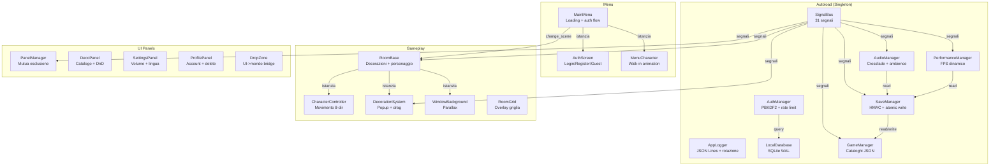

# Mini Cozy Room — Consolidated Project Report

> **Progetto**: Mini Cozy Room — Desktop Companion
> **Motore**: Godot Engine 4.6 (GDScript, GL Compatibility renderer)
> **Team**: Renan Augusto Macena (Architect/Lead), Cristian (CI/CD/Assets), Elia (Database/Cloud)
> **Deadline**: 22 Aprile 2026
> **Data report**: 9 Aprile 2026
> **Versione**: Consolidamento di AUDIT_REPORT, SPRINT_AUDIT_REPORT, architecture-review-2026-04-08, SPRINT_TASKS, SPRINT_UX_PERFECTION_PLAN

---

## Indice

- [PARTE I: PANORAMICA PROGETTO](#parte-i-panoramica-progetto)
  - [1. Executive Summary](#1-executive-summary)
  - [2. Stack e Struttura](#2-stack-e-struttura)
  - [3. Metriche Codebase](#3-metriche-codebase)
  - [3.1. Metodologia di Audit](#31-metodologia-di-audit)
- [PARTE II: ARCHITETTURA](#parte-ii-architettura)
  - [4. Diagramma Sistemi](#4-diagramma-sistemi)
  - [5. Ordine Autoload](#5-ordine-autoload)
  - [6. Flusso Dati](#6-flusso-dati)
  - [7. Mappa Segnali](#7-mappa-segnali)
  - [8. Flusso Avvio](#8-flusso-avvio)
  - [9. Flusso Salvataggio](#9-flusso-salvataggio)
  - [10. Flusso Decorazioni](#10-flusso-decorazioni)
- [PARTE III: STATO COMPONENTI](#parte-iii-stato-componenti)
  - [11. Matrice Componenti](#11-matrice-componenti)
  - [12. Cosa Funziona Oggi](#12-cosa-funziona-oggi)
- [PARTE IV: ANALISI CODICE (RIGA PER RIGA)](#parte-iv-analisi-codice-riga-per-riga)
  - [13. Autoload](#13-autoload)
  - [14. Menu](#14-menu)
  - [15. Gameplay / Room](#15-gameplay--room)
  - [16. UI](#16-ui)
  - [17. Utility e Main](#17-utility-e-main)
  - [18. Dati, Database e CI/CD](#18-dati-database-e-cicd)
- [PARTE V: DIAGNOSI BUG RUNTIME (8 Aprile 2026)](#parte-v-diagnosi-bug-runtime-8-aprile-2026)
  - [19. TL;DR](#19-tldr)
  - [20. Bug per Bug — Root Cause](#20-bug-per-bug--root-cause)
  - [21. Best Practices (Ricerca Web)](#21-best-practices-ricerca-web)
- [PARTE VI: REGISTRO AUDIT COMPLETO](#parte-vi-registro-audit-completo)
  - [22. Panoramica 12 Pass](#22-panoramica-12-pass)
  - [23. Risultati per Pass](#23-risultati-per-pass)
  - [23.1. Observability Gaps](#231-observability-gaps)
  - [23.2. Frontend Completion Matrix](#232-frontend-completion-matrix)
  - [23.3. Dependency Hygiene](#233-dependency-hygiene)
  - [23.4. Governance Files](#234-governance-files)
  - [24. Findings Consolidati](#24-findings-consolidati)
- [PARTE VII: PIANO UX](#parte-vii-piano-ux)
  - [25. Stato Attuale vs Target](#25-stato-attuale-vs-target)
  - [26. Fix Critici (P0)](#26-fix-critici-p0)
  - [27. Fix Prioritari (P1)](#27-fix-prioritari-p1)
  - [28. Fix Standard (P2)](#28-fix-standard-p2)
  - [29. Matrice Accettazione](#29-matrice-accettazione)
- [PARTE VIII: ESECUZIONE SPRINT](#parte-viii-esecuzione-sprint)
  - [29.1. Sprint Schedule (5 Giorni)](#291-sprint-schedule-5-giorni)
  - [30. Sprint Tasks (6-11 Aprile)](#30-sprint-tasks-6-11-aprile)
  - [30.1. Addon Cleanup](#301-addon-cleanup)
  - [31. Piano Intervento PR (Post-Sprint)](#31-piano-intervento-pr-post-sprint)
  - [31.1. Piano Esecuzione Fasi (SPRINT_AUDIT)](#311-piano-esecuzione-fasi-sprint_audit)
  - [31.2. Protocollo di Validazione](#312-protocollo-di-validazione)
  - [31.3. v1.0 Feature Matrix](#313-v10-feature-matrix)
  - [31.4. Supabase Integration Criteria](#314-supabase-integration-criteria)
  - [32. Cose che NON Faremo](#32-cose-che-non-faremo)
  - [33. Domande Aperte](#33-domande-aperte)
  - [33.1. Piano di Stabilizzazione](#331-piano-di-stabilizzazione)
  - [33.2. Piano di Polishing](#332-piano-di-polishing)
- [PARTE IX: BUILD E DEPLOYMENT](#parte-ix-build-e-deployment)
  - [34. Export Windows (.exe)](#34-export-windows-exe)
  - [35. Inno Setup (Installer)](#35-inno-setup-installer)
  - [36. Export Android (APK)](#36-export-android-apk)
  - [37. Export HTML5 (Web)](#37-export-html5-web)
- [PARTE X: TROUBLESHOOTING](#parte-x-troubleshooting)
  - [38. Problemi Editor](#38-problemi-editor)
  - [39. Problemi Runtime](#39-problemi-runtime)
  - [40. Problemi Build](#40-problemi-build)
- [PARTE XI: STATISTICHE](#parte-xi-statistiche)
- [PARTE XII: GUIDE OPERATIVE](#parte-xii-guide-operative)
  - [41. Guida Frontend — Il Gioco](#41-guida-frontend--il-gioco)
  - [42. Guida Godot Editor](#42-guida-godot-editor)
- [APPENDICI](#appendici)
  - [A. Glossario Tecnico](#a-glossario-tecnico)
  - [B. Schema Database](#b-schema-database)
  - [C. Signal Registry](#c-signal-registry)
  - [D. File Inventory](#d-file-inventory)
  - [E. Correzioni tra Documenti](#e-correzioni-tra-documenti)
  - [F. Environment Variable Reference](#f-environment-variable-reference)
  - [G. Module Coverage Matrix](#g-module-coverage-matrix)
  - [H. Ordine di Lettura per Nuovi Sviluppatori](#h-ordine-di-lettura-per-nuovi-sviluppatori)
  - [I. Comandi Utili](#i-comandi-utili)
  - [J. Link Documentazione Godot](#j-link-documentazione-godot)
  - [K. Changelog Audit](#k-changelog-audit)

---

# PARTE I: PANORAMICA PROGETTO

## 1. Executive Summary

Mini Cozy Room e' un **desktop companion** 2D in pixel art sviluppato con Godot 4.6 (GDScript). L'utente arreda una stanza virtuale con decorazioni, ascolta musica ambient e personalizza il proprio personaggio. L'applicazione e' progettata per restare aperta in background consumando poche risorse (15 FPS quando non in focus).

**Verdetto complessivo**: il core game loop e' funzionale e ben strutturato. Il codebase dimostra buona disciplina ingegneristica: separazione autoload/signal-bus, save atomiche con HMAC, SQL parametrizzato, CI/CD professionale.

| Dimensione | Rating | Note |
|-----------|--------|-------|
| Architettura | ★★★★☆ | Clean autoload/signal-bus, buona separazione |
| Qualita' Codice | ★★★★☆ | Stile consistente, cleanup in `_exit_tree()`, type annotations |
| Sicurezza | ★★★★☆ | HMAC, SQL parametrizzato, rate limiting, PBKDF2 |
| Osservabilita' | ★★★☆☆ | Logging JSON strutturato, ma nessuna metrica |
| Test Coverage | ☆☆☆☆☆ | Zero test automatizzati |
| CI/CD | ★★★★☆ | 5-job lint+validation, 2-target export |
| UX | ★★★☆☆ | Core funziona, ma singolo personaggio, singola stanza, no tutorial |
| Integrita' Dati | ★★★★☆ | Atomic writes, backup rotation, HMAC, FK enforcement |
| Performance | ★★★★☆ | FPS dinamico, pixel-perfect, resource loading efficiente |
| Documentazione | ★★★★☆ | README completi per modulo, doc comments inline, `.env.example` |

**Rischi principali prima della consegna:**
1. Zero test coverage
2. Floor bounds inesistenti (decorazioni/player fuori stanza)
3. Pet con una sola animazione
4. Nessun tutorial first-run

---

## 2. Stack e Struttura

```
Motore:       Godot Engine 4.6
Linguaggio:   GDScript
Renderer:     GL Compatibility (OpenGL 3.3 / WebGL 2.0)
Database:     SQLite via godot-sqlite GDExtension (WAL mode)
Risoluzione:  1280 x 720 (stretch mode: canvas_items)
Target:       Windows, Web (HTML5), Android (pianificato)
CI/CD:        GitHub Actions (5 job validazione + 2 job build)
```

```
Projectwork/
+-- .github/workflows/
|   +-- ci.yml              # 5 job paralleli: lint, JSON, sprite, xref, DB
|   +-- build.yml           # Export Windows + HTML5
+-- ci/                     # 4 script Python di validazione
+-- v1/
    +-- project.godot
    +-- export_presets.cfg
    +-- data/               # 4 cataloghi JSON
    +-- scripts/
    |   +-- autoload/       # 7 singleton
    |   +-- systems/        # PerformanceManager
    |   +-- menu/           # MainMenu, AuthScreen, MenuCharacter
    |   +-- rooms/          # RoomBase, CharacterController, DecorationSystem, etc.
    |   +-- ui/             # PanelManager, DecoPanel, SettingsPanel, etc.
    |   +-- utils/          # Constants, Helpers
    |   +-- main.gd
    +-- scenes/             # 42 file .tscn
    +-- assets/             # ~490 asset
    +-- addons/             # godot-sqlite, virtual_joystick
    +-- tests/              # VUOTO (1 .uid stub)
```

---

## 3. Metriche Codebase

| Metrica | Valore |
|---------|--------|
| Script GDScript | 36 |
| LOC (GDScript) | 5.289 |
| Scene (.tscn) | 42 |
| Asset | ~490 |
| Cataloghi JSON | 4 |
| Script validazione CI | 4 |
| Test funzionali | 0 |
| Regole GDLint | 48 |

**Script principali per LOC:**

| Script | LOC | Ruolo |
|--------|-----|-------|
| `local_database.gd` | 542 | SQLite CRUD, migrazioni, transazioni |
| `save_manager.gd` | 516 | JSON persistence, HMAC, atomic writes |
| `audio_manager.gd` | 345 | Crossfade, playlist, ambience |
| `logger.gd` | 236 | JSON Lines logging, rotazione |
| `decoration_system.gd` | 226 | Click popup, drag, rotate, scale |
| `auth_screen.gd` | 234 | Login/register/guest UI |
| `main_menu.gd` | 223 | Loading, auth flow, transizioni |

**Cataloghi dati:**

| File | Contenuto |
|------|-----------|
| `decorations.json` | 69 decorazioni, 11 categorie |
| `characters.json` | 1 personaggio (`male_old`), 8 direzioni |
| `rooms.json` | 1 stanza (`cozy_studio`), 3 temi colore |
| `tracks.json` | 2 tracce musicali, 0 ambience |

---

## 3.1. Metodologia di Audit

### Processo

Questo audit segue un processo sistematico in 5 fasi:

```
Fase 1: Mappatura         -> Esplorazione completa del repository (file, cartelle, asset)
Fase 2: Lettura           -> Lettura riga per riga di ogni script GDScript (24 file)
Fase 3: Verifica fix      -> Controllo di tutte le correzioni dal primo audit
Fase 4: Nuovi problemi    -> Identificazione di problemi non presenti nel primo audit
Fase 5: Documentazione    -> Stesura del report con classificazione e guide operative
```

### Criteri di Valutazione

Ogni script viene valutato su 8 dimensioni:

1. **Correttezza**: Il codice fa quello che dovrebbe? Ci sono edge case non gestiti?
2. **Sicurezza**: Ci sono vulnerabilita' (SQL injection, path traversal, input non validato)?
3. **Robustezza**: Come si comporta in caso di errore? (file mancanti, null reference, rete assente)
4. **Performance**: Ci sono operazioni costose nel main thread? Memory leak?
5. **Manutenibilita'**: Il codice e' leggibile? Le responsabilita' sono ben separate?
6. **Accoppiamento**: I sistemi comunicano tramite SignalBus o con riferimenti diretti?
7. **Cleanup**: `_exit_tree()` disconnette i segnali? I tween vengono killati?
8. **Completezza**: Le feature dichiarate sono effettivamente implementate?

### Stato Fix Precedenti

Il primo audit (21 Marzo 2026) aveva identificato:
- **7 problemi CRITICI** (C1-C7): tutti corretti
- **29 problemi ALTI** (A1-A29): tutti corretti
- **11 problemi ARCHITETTURALI** (AR1-AR11): la maggior parte corretti

Il secondo audit ri-verifica ognuna di queste fix e cerca nuovi problemi.

---

# PARTE II: ARCHITETTURA

## 4. Diagramma Sistemi



**Catena dipendenze autoload:**

```
SignalBus -> AppLogger -> LocalDatabase -> AuthManager -> GameManager -> SaveManager -> AudioManager -> PerformanceManager
```

---

## 5. Ordine Autoload

Definito in `project.godot`. **L'ordine e' critico.**

| # | Nome | Path | Ruolo |
|---|------|------|-------|
| 1 | SignalBus | `autoload/signal_bus.gd` | Hub segnali (deve essere primo) |
| 2 | AppLogger | `autoload/logger.gd` | Logging disponibile per tutti |
| 3 | LocalDatabase | `autoload/local_database.gd` | DB pronto prima di auth/save |
| 4 | AuthManager | `autoload/auth_manager.gd` | Autenticazione |
| 5 | GameManager | `autoload/game_manager.gd` | Carica cataloghi JSON |
| 6 | SaveManager | `autoload/save_manager.gd` | Carica salvataggi |
| 7 | AudioManager | `autoload/audio_manager.gd` | Audio, legge stato da Save |
| 8 | PerformanceManager | `systems/performance_manager.gd` | FPS e posizione finestra |

---

## 6. Flusso Dati

```
JSON Catalogs ------> GameManager (in-memory)
                          |
User Input --> UI Panels -+---> SignalBus --> SaveManager --> JSON file (atomic)
                          |                       +----> SQLite (transactional)
                          +---> Room/Character nodes
```

---

## 7. Mappa Segnali

```
Categoria           Segnale                        Emesso da               Ricevuto da
---------           -------                        ---------               -----------
Room                room_changed(id)               SaveManager             RoomBase
                    theme_changed(theme)            SaveManager             RoomBase

Character           character_changed(id)           SaveManager             RoomBase
                    character_direction(dir)        CharacterController     (non usato)

Music               track_changed(path)             UI/DecoPanel            AudioManager
                    ambience_toggled(id,on)          UI                      AudioManager

Decoration          decoration_placed(data)         DropZone                RoomBase
                    decoration_removed(idx)         DecorationSystem        RoomBase
                    decoration_updated()            DecorationSystem        SaveManager
                    edit_mode_changed(on)           DecoPanel               CharacterCtrl, RoomGrid

UI                  panel_opened(name)              PanelManager            (logging)
                    panel_closed(name)              PanelManager            (logging)

Save/Load           save_requested()                Vari sistemi            SaveManager
                    load_completed()                SaveManager             AudioManager, PerfMgr

Auth                auth_state_changed(state)       AuthManager             ProfilePanel, MainMenu
                    logout_requested()              ProfilePanel            AuthManager
```

31 segnali totali dichiarati. I segnali `decoration_selected`, `decoration_deselected`, `decoration_rotated`, `decoration_scaled`, `outfit_changed`, `sync_started`, `sync_completed` sono predisposti per funzionalita' future.

---

## 8. Flusso Avvio

```
AVVIO GODOT ENGINE
    |
    v
1. SignalBus -> 2. AppLogger -> 3. LocalDatabase -> 4. AuthManager
    |
    v
5. GameManager -> 6. SaveManager -> 7. AudioManager -> 8. PerformanceManager
    |
    v
SCENA PRINCIPALE: MainMenu
    |
    v
Loading Screen (SubViewport overlay)
  1. Mostra sfondo + barra progresso
  2. GameManager carica cataloghi
  3. SaveManager carica salvataggio
  4. SignalBus.load_completed.emit()
    |
    v
Auth Check --> Account esiste? --> NO --> AuthScreen (login/register/guest)
    |                                        |
   SI                                   auth_completed
    |                                        |
    v                                        v
Walk-in Animation --> Bottoni Menu --> SCENA GAMEPLAY: main.tscn
```

---

## 9. Flusso Salvataggio

```
Evento trigger (auto-save 60s / modifica deco / chiusura app)
    |
    v
SaveManager.save_game()
  1. Controlla _is_saving (guard re-entrancy)
  2. Raccoglie stato da tutti i sistemi
  3. Calcola HMAC-SHA256
  4. Serializza in JSON
    |
    v
Atomic Write
  1. Scrivi su file .tmp
  2. Se esiste .save, rinomina in .save.bak
  3. Rinomina .tmp in .save
    |
    v
Database Sync
  1. BEGIN TRANSACTION
  2. upsert_character()
  3. _save_inventory() (DELETE + INSERT)
  4. COMMIT (o ROLLBACK su errore)
```

**Cosa viene salvato** (`save_data.json`):
- version, last_saved, account, settings, room, character, music_state
- character_data, inventory_data, decorations[], hmac

**Misure di integrita' verificate:**
- HMAC-SHA256 (tamper detection)
- `integrity.key` generata con `Crypto.generate_random_bytes(32)`
- Atomic write (temp -> rename)
- Backup rotation (primary -> backup)
- Fallback a backup su corruzione
- Type validation con `typeof()` su ogni campo
- Range clamping (volumes 0-1, stress 0-100, coins >= 0)

---

## 10. Flusso Decorazioni

```
PIAZZAMENTO:
  1. Utente apre DecoPanel (bottone HUD)
  2. Catalogo mostra 69 decorazioni in 11 categorie collassabili
  3. Utente trascina decorazione dal pannello
  4. set_drag_forwarding() crea preview semi-trasparente
  5. Drop su DropZone (Control overlay)
  6. DropZone valida: Dictionary con "item_id"? Zona corretta (wall/floor)?
  7. Emette SignalBus.decoration_placed(item_id, position)
  8. RoomBase crea: Sprite2D + StaticBody2D + CollisionShape + DecorationSystem

INTERAZIONE:
  Click su decorazione:
  - Popup con bottoni [R] Rotate 90 | [F] Flip | [S] Scale (0.25x-3x) | [X] Delete (solo edit mode)
  - Popup su CanvasLayer (layer 100) per input GUI
  Drag (solo edit mode): threshold 5px, snap griglia 64px, clamp viewport

DELETE:
  - Rimuove da SaveManager.decorations[]
  - queue_free() sullo sprite
  - Emette decoration_removed + save_requested
```

---

# PARTE III: STATO COMPONENTI

## 11. Matrice Componenti

| Componente | File | Stato | Test | Note |
|-----------|-------|-------|------|------|
| **SignalBus** | `signal_bus.gd` | Production | None | 31 segnali, zero emitter orfani |
| **AppLogger** | `logger.gd` | Production | None | JSON Lines, rotazione 5 MB |
| **LocalDatabase** | `local_database.gd` | Production | None | 5 tabelle, FK, WAL, migrazioni |
| **AuthManager** | `auth_manager.gd` | Production | None | Guest + user/pass, rate limiting |
| **GameManager** | `game_manager.gd` | Production | None | Validazione cataloghi on load |
| **SaveManager** | `save_manager.gd` | Production | None | HMAC, atomic writes, migrazione v1-v5 |
| **AudioManager** | `audio_manager.gd` | Production | None | Crossfade, 3 playlist modes |
| **PerformanceManager** | `performance_manager.gd` | Production | None | FPS cap, window pos persistence |
| **DecorationSystem** | `decoration_system.gd` | Production | None | Click popup, drag/rotate/scale/delete |
| **RoomBase** | `room_base.gd` | Production | None | Decoration spawning, character hot-swap |
| **PanelManager** | `panel_manager.gd` | Production | None | Mutua esclusione, fade, scene cache |
| **MainMenu** | `main_menu.gd` | Production | None | Loading screen, auth flow |
| **AuthScreen** | `auth_screen.gd` | Production | None | Login/register/guest con validazione |
| **DecoPanel** | `deco_panel.gd` | Production | None | Drag-and-drop catalog, category accordion |
| **SettingsPanel** | `settings_panel.gd` | Production | None | Volume sliders, language selector |
| **ProfilePanel** | `profile_panel.gd` | Production | None | Account info, delete character/account |
| **CharacterController** | `character_controller.gd` | Production | None | WASD 8-dir, collision avoidance |
| **DropZone** | `drop_zone.gd` | Production | None | Wall/floor placement validation |
| **WindowBackground** | `window_background.gd` | Production | None | Parallax forest, mouse depth |
| **RoomGrid** | `room_grid.gd` | Production | None | Edit-mode grid overlay |
| **Supabase Client** | `supabase_client.gd` | Missing | None | Solo `.uid` stub — Phase 4 |
| **Env Loader** | `env_loader.gd` | Missing | None | Solo `.uid` stub — Phase 4 |
| **Shop Panel** | `shop_panel.gd` | Missing | None | Solo `.uid` stub — futuro |

---

## 12. Cosa Funziona Oggi

**Feature verificate funzionanti:**
- Room rendering con 3 temi colore (Modern, Natural, Pink)
- 69 decorazioni in 11 categorie, drag-and-drop dal catalogo
- Interazione decorazioni: rotate 90, flip, scale (7 step: 0.25x-3x), delete (edit mode)
- Movimento personaggio WASD/frecce con 8 direzioni e collision avoidance
- Audio crossfade dual-player con sequential/shuffle/repeat
- Guest mode con auto-login, username+password con rate limiting
- Migrazione save v1->v2->v3->v4->v5
- Parallax foresta con mouse-tracked depth

**Postura sicurezza:**

| Controllo | Implementazione | Verdetto |
|-----------|----------------|----------|
| SQL injection | Bindings parametrizzati ovunque | Mitigato |
| Path traversal | Blocco path non-`res://`/`user://` | Mitigato |
| Save tampering | HMAC-SHA256 su load | Mitigato |
| Password storage | PBKDF2 (10K iter, salt random) | Adeguato |
| Rate limiting | 5 tentativi -> 5 min lockout | Adeguato |
| Timing attack | Stesso errore per user/pass invalidi | Nessun user enumeration |
| Audio DoS | Limite 50 MB su import esterni | Prevenuto |

**CI Pipeline (5 job paralleli):**

| Job | Valida |
|-----|--------|
| `lint` | GDScript lint + format (gdtoolkit 4.x) |
| `validate-json` | Struttura cataloghi JSON, campi required, duplicati |
| `validate-sprites` | Esistenza file sprite per tutti i riferimenti catalogo |
| `validate-crossrefs` | Coerenza Constants <-> cataloghi |
| `validate-db` | Sintassi SQL via SQLite in-memory |

**Build Pipeline:** Windows + HTML5 via `barichello/godot-ci:4.6`.

---

# PARTE IV: ANALISI CODICE (RIGA PER RIGA)

Ogni script valutato su: correttezza, sicurezza, robustezza, performance, accoppiamento, cleanup.

## 13. Autoload

### 13.1 signal_bus.gd (58 righe)

| Aspetto | Valutazione |
|---------|-------------|
| Correttezza | OK — pure dichiarazioni |
| Accoppiamento | ECCELLENTE — punto centrale di disaccoppiamento |

**Verdetto**: NESSUN PROBLEMA. Design pulito.

---

### 13.2 game_manager.gd (130 righe)

| Aspetto | Valutazione | Note |
|---------|-------------|------|
| Correttezza | OK | Caricamento e validazione corretti |
| Robustezza | BUONA | Gestisce file mancanti, JSON malformato |
| Accoppiamento | MEDIO | Vedi N-AR1 |
| Cleanup | RISOLTO | `_exit_tree()` aggiunto |

**Fix verificate:** AR1 (`_request_save()` ora emette via SignalBus), N-Q5 (`_exit_tree()` aggiunto).

**Problema residuo — N-AR1 (ARCHITETTURALE):**
SaveManager scrive direttamente nelle variabili di GameManager in `_apply_save_data()`. Viola incapsulamento.

---

### 13.3 save_manager.gd (490 righe)

Script piu' complesso del progetto. Gestisce persistence JSON, HMAC, atomic writes, auto-save, migrazioni.

| Aspetto | Valutazione |
|---------|-------------|
| Correttezza | BUONA |
| Sicurezza | BUONA — HMAC-SHA256, nessun path traversal |
| Robustezza | BUONA — atomic write, race condition guard, backup fallback |
| Accoppiamento | MEDIO — legge/scrive direttamente da altri autoload |
| Cleanup | BUONA — `_exit_tree()` disconnette 3 segnali |

**Fix verificate:** `_is_saving` flag, atomic write, migrazione v1-v5, `typeof()` validation, `_exit_tree()`.
**Fix N-Q6 (RISOLTO):** Variabili rese private con getter/mutator.
**Problema residuo — N-AR2:** Accoppiamento bidirezionale SaveManager <-> GameManager.

---

### 13.4 local_database.gd (593 righe)

| Aspetto | Valutazione |
|---------|-------------|
| Correttezza | BUONA — query parametrizzate, transazioni |
| Sicurezza | BUONA — `_execute_bound()` previene SQL injection, WAL mode |
| Robustezza | BUONA — ROLLBACK su errore, `_is_open` guard |
| Cleanup | BUONA — `_exit_tree()` disconnette, `close()` su WM_CLOSE |

**Fix verificate:** A24 (transazioni), A25 (`_save_inventory` ritorna bool), A26 (`is_open()`), C3/C4 (schema FK).
**Fix N-DB1 (RISOLTO):** Tabelle morte rimosse.
**Fix N-DB2 (RISOLTO):** Indici FK aggiunti.
**Fix N-DB3 (RISOLTO):** `_last_select_error` flag aggiunto.

---

### 13.5 audio_manager.gd (345 righe)

| Aspetto | Valutazione |
|---------|-------------|
| Correttezza | BUONA |
| Sicurezza | BUONA — path protection, file size limit 50MB |
| Cleanup | BUONA — `_exit_tree()` pulisce ambience player |

**Problema residuo — N-AR3:** Lettura diretta da SaveManager (`music_state`, `settings`).

---

### 13.6 auth_manager.gd (186 righe)

| Aspetto | Valutazione |
|---------|-------------|
| Sicurezza | BUONA — PBKDF2 10K iter, salt random, rate limiting |
| Robustezza | BUONA — validazione input, migrazione hash legacy |

**Fix N-Q3 (RISOLTO):** `clean_name` usato correttamente in `register()`.

---

### 13.7 logger.gd (236 righe)

| Aspetto | Valutazione |
|---------|-------------|
| Correttezza | BUONA — formattazione, rotazione |
| Robustezza | BUONA — buffer retention 100 messaggi |

**Problema residuo — N-Q4 (BASSO):** Flush sincrono, teorico. In pratica non impatta.

---

### 13.8 performance_manager.gd (66 righe)

| Aspetto | Valutazione |
|---------|-------------|
| Correttezza | BUONA — FPS switching, validazione posizione |
| Cleanup | BUONA — `_exit_tree()` disconnette 3 segnali |

**Problema residuo — N-AR4:** Lettura diretta da SaveManager.

---

### Riepilogo Autoload

```
+------------------------+--------+----------+-----------+--------------+----------+
| Script                 | Righe  | Corrett. | Sicurezza | Accoppiamento| Cleanup  |
+------------------------+--------+----------+-----------+--------------+----------+
| signal_bus.gd          |   58   |   OK     |    OK     |  ECCELLENTE  |   N/A    |
| game_manager.gd        |  130   |   OK     |    OK     |    MEDIO     |  BUONA   |
| save_manager.gd        |  490   |  BUONA   |   BUONA   |    MEDIO     |  BUONA   |
| local_database.gd      |  593   |  BUONA   |   BUONA   |     OK       |  BUONA   |
| audio_manager.gd       |  345   |  BUONA   |   BUONA   |    MEDIO     |  BUONA   |
| auth_manager.gd        |  186   |  MEDIO   |   BUONA   |     OK       |   N/A    |
| logger.gd              |  236   |  BUONA   |    OK     |     OK       |  BUONA   |
| performance_manager.gd |   66   |  BUONA   |    OK     |    MEDIO     |  BUONA   |
+------------------------+--------+----------+-----------+--------------+----------+
```

---

## 14. Menu

### 14.1 main_menu.gd (223 righe)

**NESSUN PROBLEMA RESIDUO.** Script ben scritto con cleanup eccellente.
- `_exit_tree()` disconnette 7 segnali, killa 2 tween
- Transition guard con `_transitioning` flag
- Null check su tutti gli `instantiate()`

### 14.2 auth_screen.gd (222 righe)

**Fix N-Q1 (RISOLTO):** Aggiunto `_exit_tree()`, guard `_finishing`, tween tracking.

### 14.3 menu_character.gd (86 righe)

**Fix N-Q2 (RISOLTO):** `_walk_tween` come member variable con kill in `_exit_tree()`.
**Problema residuo — N-P4 (POLISHING):** Posizioni hardcoded (530px). Dovrebbero usare `get_viewport_rect().size`.

---

## 15. Gameplay / Room

### 15.1 room_base.gd (143 righe)

| Aspetto | Valutazione |
|---------|-------------|
| Robustezza | BUONA — null check texture, `call_deferred` |
| Cleanup | BUONA — `_exit_tree()` disconnette 3 segnali |

**Problema residuo — N-AR5:** Accesso diretto a `SaveManager.decorations`.
**Problema residuo — N-P3 (POLISHING):** Collision shape usa dimensione raw texture (funziona perche' eredita scala).

### 15.2 character_controller.gd (88 righe)

**NESSUN PROBLEMA RESIDUO.** 8 direzioni, null check su `_anim`, collision mask cambia in edit mode.

### 15.3 decoration_system.gd (228 righe)

**Problema residuo — N-AR6:** Accesso diretto a `SaveManager.decorations` in `_remove_from_room()`.

### 15.4 window_background.gd (72 righe) — OK, nessun problema.
### 15.5 room_grid.gd (45 righe) — OK, nessun problema.

---

## 16. UI

### 16.1 panel_manager.gd (143 righe) — NESSUN PROBLEMA. Scene cache, mutua esclusione, cleanup.
### 16.2 deco_panel.gd (197 righe) — NESSUN PROBLEMA.
### 16.3 settings_panel.gd (151 righe)

**Fix N-AR7 (RISOLTO):** Lingua ora usa `SignalBus.settings_updated.emit()`.

### 16.4 profile_panel.gd (181 righe)

**Problema residuo — N-AR8:** Chiamata diretta a `LocalDatabase.get_coins()`.

### 16.5 drop_zone.gd (55 righe) — NESSUN PROBLEMA.

---

## 17. Utility e Main

### 17.1 main.gd (84 righe) — NESSUN PROBLEMA.
### 17.2 constants.gd (51 righe) — NESSUN PROBLEMA.
### 17.3 helpers.gd (49 righe) — NESSUN PROBLEMA. 5 funzioni pure, `array_to_vec2` gestisce input invalido.

---

## 18. Dati, Database e CI/CD

**JSON** — Tutti strutturalmente corretti, validati da CI.

**Schema Database** — 5 tabelle attive (accounts, characters, inventario, rooms, sync_queue) + tabelle morte rimosse. FK con CASCADE, WAL mode, indici FK.

**CI** — 5 job paralleli OK. `concurrency` group per cancellare run obsolete. Timeout 3-5 min.

**Build** — Fix N-BD1 (RISOLTO): Godot 4.5->4.6 in build.yml. Fix N-BD4 (RISOLTO): icon.ico generato. Fix N-BD5 (RISOLTO): versione 1.0.0 impostata.

**Problema residuo — N-BD3 (MEDIO):** Nessun preset Android in `export_presets.cfg`.

---

# PARTE V: DIAGNOSI BUG RUNTIME (8 Aprile 2026)

## 19. TL;DR

Tre dei sette bug riportati (**#1 decor invisibile, #5 player fuori stanza, #6 oggetti fuori stanza**) sono **lo stesso bug**: nel codice **non esiste alcun concetto di "floor bounds"**. Tutto viene clampato contro `Constants.VIEWPORT_WIDTH/HEIGHT` (schermo intero). Il poligono `FloorBounds` in `main.tscn` **non viene letto da nessuno**.

Gli altri quattro:
- **#2 pet slitta dormendo:** una sola animazione (`default`) per tutti gli stati
- **#3 categorie "bloccate":** confusione UX (`+` letto come lucchetto) o mouse_filter
- **#4 character giallo flicker:** da investigare (solo 1 character in catalogo)
- **#7 edit mode non funziona:** downstream di #1/#6 (decorazioni fuori floor = non cliccabili)

---

## 20. Bug per Bug — Root Cause

### #1 + #5 + #6 — Floor bounds inesistenti (CRITICO)

**Codice rilevante:**
- `helpers.gd:18-27` — `clamp_to_viewport` clampa a `Constants.VIEWPORT_WIDTH/HEIGHT` (schermo intero, non pavimento)
- `drop_zone.gd:39-40` — al drop, clampa contro `size` del Control (viewport)
- `decoration_system.gd:60-62` — durante drag, idem
- `room_base.gd:102-103` — al `_reload_decorations`, idem

**Cosa NON esiste:**
- Nessun riferimento a `FloorBounds` in nessun `.gd`
- Nessuna funzione `clamp_to_floor()` o `is_inside_floor()`
- Nessun uso di `Geometry2D.is_point_in_polygon()`

**Conseguenza:** Player cammina fuori stanza. Decorazioni piazzate fuori floor visibile. Bug "Excellent!" senza decor visibile.

### #2 — Pet con una sola animazione

`SpriteFrames` in `cat_void.tscn` definisce **una sola animation** (`default`, 5 frame walk). L'FSM in `pet_controller.gd` ha 5 stati ma **ogni stato chiama `_play_anim("default")`** (righe 55, 79, 110, 119, 151). Lo stato SLEEP imposta `velocity = Vector2.ZERO` ma l'animazione mostra walking -> l'utente percepisce "sleep + slide".

**Falsa pista del primo agente:** sosteneva che `d4ae6c0` avesse rimosso `collision_mask`. **Falso** — `collision_mask = 1` e' impostato a runtime in `pet_controller.gd:29`.

### #3 — Categorie decor "bloccate"

In `deco_panel.gd:74-98` i bottoni header usano `text = "+ %s"` / `"- %s"`. **Nessun `disabled = true`, nessun lock check.** Ipotesi: UX (il `+` sembra un lucchetto) o mouse_filter del parent.

### #4 — Character giallo flicker

`characters.json` definisce **1 solo character** (`male_old`). `CHARACTER_SCENES` mappa 3 scene. Da investigare: UI selezione, AnimationTree, sprite swap senza guard.

### #7 — Edit mode non funziona

Edit mode funziona tecnicamente (`is_decoration_mode` letto correttamente). Ma le decorazioni sono fuori floor visibile (downstream di #1/#6) -> non cliccabili.

---

## 21. Best Practices (Ricerca Web)

### Confinare movimento in area arbitraria
1. **Static collision walls** (StaticBody2D + CollisionPolygon2D) lungo perimetro floor — pattern piu' Godot-idiomatic
2. **Validation pre-movimento:** `Geometry2D.is_point_in_polygon(target_pos, floor_polygon)` per drag&drop
3. **NON usare `clamp()` su rect** per stanze non rettangolari — e' il bug attuale
4. **Caveat:** `is_point_in_polygon()` ha edge case sui bordi (godot#81042). Usare margine 1-2px.

### Drag&drop placement (Sims-like)
- 3 funzioni canoniche: `_get_drag_data`, `_can_drop_data`, `_drop_data` (gia' usate)
- Snap to grid: `pos.snapped(Vector2.ONE * tile_size)` (gia' fatto)
- **Validation in `_can_drop_data`:** deve rifiutare drop fuori floor. **Attualmente non lo fa.**

### Build mode pattern (Sims 4)
- **Tool separati**, non un unico flag globale: Select, Sledgehammer (delete), Design (skin), Move. Noi abbiamo solo un flag `is_decoration_mode` + popup multi-azione. E' OK per scopo limitato.
- **Undo/redo** per session: nice-to-have non urgente.
- **Catalogo**: organizzare per categoria visibile (room/funzione). Gia' fatto in `deco_panel.gd`.
- Plugin di riferimento: [GridBuilding di Chris' Tutorials](https://chris-tutorials.itch.io/grid-building-godot) — non lo useremo, ma il modello (validation rules estensibile) e' la baseline da imitare.

### FSM per pet/NPC
Pattern canonico ([GDQuest](https://www.gdquest.com/tutorial/godot/design-patterns/finite-state-machine/)):
- **Stati come nodi** con `enter()`, `exit()`, `update()`, `physics_update()`. Solo lo stato attivo riceve tick.
- **Transizioni via signal** (`finished.emit(NEXT_STATE)`).
- **Velocity gestita per stato**: lo stato IDLE/SLEEP fa `velocity = Vector2.ZERO` in `enter()` (una volta), non a ogni frame.
- **Animation per stato**: `enter()` chiama `anim.play("sleep")`. Mai chiamare `play()` ogni frame senza guard.

Il nostro `pet_controller.gd` e' gia' strutturato come FSM monolitico con `match _state`. Funzionalmente OK, ma tutti gli stati suonano la stessa animazione (`default`) -> bug #2.

### Evitare flicker
Cause comuni di flicker idle<->walk ([godot#91115](https://github.com/godotengine/godot/issues/91115)):
1. **Transizioni AnimationTree con condizioni opposte non mutuamente esclusive**: `is_moving == true` e `is_moving == false` valutate nello stesso frame.
2. **`play()` chiamato ogni frame** anche quando l'animazione e' gia' attiva -> reset al frame 0.
3. **Direction sprite swap senza guard**: cambiare `texture` ogni frame anche se la direzione e' la stessa.

**Workaround universale:** guard `if anim_name != _last_anim` (gia' in `pet_controller.gd:214`). Va replicato nel character.

### Sources

- [GDQuest — Finite State Machine in Godot 4](https://www.gdquest.com/tutorial/godot/design-patterns/finite-state-machine/)
- [KidsCanCode — Grid-based movement Godot 4](https://kidscancode.org/godot_recipes/4.x/2d/grid_movement/index.html)
- [Godot Forum — keep player inside defined area](https://forum.godotengine.org/t/how-to-keep-player-inside-a-defined-area/93783)
- [GitHub godot#91115 — Sprite Flicker in Animation Tree](https://github.com/godotengine/godot/issues/91115)
- [GitHub godot#81042 — is_point_in_polygon edge cases](https://github.com/godotengine/godot/issues/81042)
- [Chris' Tutorials — GridBuilding plugin](https://chris-tutorials.itch.io/grid-building-godot)
- [The Sims Wiki — Build Mode 4](https://sims.fandom.com/wiki/Build_mode_(The_Sims_4))
- [dev.to — Drag and Drop in Godot 4.x](https://dev.to/pdeveloper/godot-4x-drag-and-drop-5g13)

---

# PARTE VI: REGISTRO AUDIT COMPLETO

## 22. Panoramica 12 Pass

| Pass | Dominio | File Auditati | Findings |
|------|---------|---------------|----------|
| 1 | Security | 4 | 2 (SEC-01, SEC-02) |
| 2 | Database | 1 | 2 (BUG-05, DATA-01) |
| 3 | Correctness | 5 | 4 (BUG-01 - BUG-04) |
| 4 | State Management | 3 | 2 (ARCH-01, ARCH-02) |
| 5 | Resilience | 2 | 0 — atomic writes solide |
| 6 | Observability | 1 | 5 gap identificati |
| 7 | Performance | 3 | 2 (PERF-01, PERF-02) |
| 8 | Architecture | All | 1 (ARCH-03) |
| 9 | Configuration | 3 | 0 — separazione pulita |
| 10 | Frontend UX | 8 | 9 feature incomplete |
| 11 | CI/CD | 6 | 0 — pipeline matura |
| 12 | Dependencies | 7 | 2 addon non usati |

---

## 23. Risultati per Pass

### Security (Pass 1)

| Check | Risultato |
|-------|-----------|
| SQL injection | PASS — 18 query con binding |
| Password plaintext | PASS — mai in log/storage |
| PBKDF2 iterations | PASS — 10.000 |
| Salt uniqueness | PASS — 16 byte random per password |
| Timing attack | PASS — stesso messaggio errore |
| Path traversal (audio) | PASS — solo `res://` e `user://` |
| HMAC key storage | WARN — `user://integrity.key` leggibile da processi locali |

### Database (Pass 2)

| Check | Risultato |
|-------|-----------|
| FK enforcement | PASS — `PRAGMA foreign_keys=ON` |
| WAL mode | PASS |
| Index coverage | PASS — 3 indici FK |
| Migration safety | PASS — introspection `sqlite_master`, `ADD COLUMN` idempotente |
| Transaction boundaries | PASS — `BEGIN/COMMIT/ROLLBACK` |
| Inventory write | WARN — DELETE+INSERT loop O(n), non batched (BUG-05) |

### Correctness (Pass 3)

| Check | Risultato |
|-------|-----------|
| Character scene mapping | FAIL — solo `male_old` (BUG-01, **RISOLTO nello sprint**) |
| Menu char randomization | FAIL — hardcoded `[0]` (BUG-02) |
| Profile panel lifecycle | FAIL — non tracciato per Escape (BUG-03, **RISOLTO**) |
| Crossfade double-advance | WARN — (BUG-04, **RISOLTO**) |
| Decoration persistence | PASS |
| Scale cycling | PASS |
| Rotation wrapping | PASS |

### Resilience (Pass 5) — Tutto PASS

### Performance (Pass 7)

| Check | Risultato |
|-------|-----------|
| FPS management | PASS — 60/15 FPS |
| Decoration input | WARN — O(n) `_unhandled_input` (PERF-01) |
| Parallax overhead | WARN — `_process` senza visibility gate (PERF-02, **RISOLTO**) |
| Resource loading | PASS — scene cache |
| Tween cleanup | PASS |
| Memory leaks | PASS |

---

## 24. Findings Consolidati

### Fix dal primo audit (21 Marzo 2026) — TUTTI VERIFICATI

7 CRITICI (C1-C7), 29 ALTI (A1-A29), 11 ARCHITETTURALI (AR1-AR11) — tutti corretti.

### 23.1. Observability Gaps

| Gap | Stato Attuale | Raccomandazione |
|-----|---------------|-----------------|
| Structured error codes | None — errori come stringhe libere | Definire enum error code in `Constants` |
| Metrics | None | Aggiungere telemetria frame-time, save-time, decoration-count |
| Crash reporting | Solo Godot crash log | Implementare `_notification(NOTIFICATION_CRASH)` handler |
| Debug overlay | None | Aggiungere pannello F3 con FPS, decorazioni attive, stato save |
| Log level configuration | Compile-time via `_min_level` | Aggiungere toggle runtime (settings panel o debug key) |

### 23.2. Frontend Completion Matrix

| Feature | Stato | Mancante |
|---------|-------|----------|
| Room customization | Working | Solo 1 tipo stanza |
| Decoration system | Working | No undo/redo |
| Character selection | Stub | Solo `male_old` wired; female/male .tscn esistono ma irraggiungibili |
| Outfit system | Stub | `current_outfit_id` esiste ma nessuna UI |
| Shop / economy | Stub | `shop_panel.gd.uid` esiste, coins tracciati ma inutilizzabili |
| Ambience sounds | Partial | Sistema funziona ma `tracks.json` ha array ambience vuoto |
| Localization | Partial | Selettore lingua funziona, ma nessuna stringa tradotta |
| Cloud sync | Stub | Tabella `sync_queue` esiste, `supabase_client.gd` mancante |
| Tutorial / onboarding | Missing | Nessuna guida first-run |
| Pomodoro / tools | Removed | Migrazione v3->v4 cancella sezione `tools` |
| Pet interaction | Stub | `cat_void.tscn` esiste ma nessun behavior script |

### 23.3. Dependency Hygiene

| Dipendenza | Tipo | Versione | Rischio |
|------------|------|----------|---------|
| Godot Engine | Runtime | 4.6 stable | Basso — LTS-class release |
| godot-sqlite GDExtension | Addon | v4.7 | Basso — attivamente mantenuto |
| virtual_joystick | Addon | Sconosciuta | Basso — nessun aggiornamento necessario |
| gdterm | Addon | Sconosciuta | Medio — non usato in produzione |
| py4godot | Addon | Sconosciuta | Medio — non usato in produzione |
| gdtoolkit | CI only | >=4, <5 | Basso — range fissato |
| Python 3.12 | CI only | 3.12 | Basso |
| barichello/godot-ci | CI only | 4.6 | Basso — container deterministico |

> **gdterm** e **py4godot** sono presenti in `v1/addons/` ma non referenziati in alcuno script. Aggiungono peso all'export. **Rimossi nello sprint Day 1.**

### 23.4. Governance Files

| File | Stato | Note |
|------|-------|------|
| `README.md` | Present | Buona struttura, tabella stato sistemi |
| `v1/README.md` | Present | Documentazione tecnica dettagliata |
| `.gitignore` | Present | Root + v1 level |
| `.gitattributes` | Present | LFS tracking |
| `LICENSE` | Inline only | Copyright notice in README; nessun file LICENSE standalone |
| `CHANGELOG.md` | Missing | Nessun change log |
| `CONTRIBUTING.md` | Missing | Nessuna guida contributi |

---

### Findings ancora aperti

| ID | Severita' | Script | Descrizione | Effort | Stato |
|----|-----------|--------|-------------|--------|-------|
| **FLOOR-BOUNDS** | CRITICO | helpers/drop_zone/decoration_system/room_base | Nessun concetto di floor bounds — player e decorazioni fuori stanza | 6-8h | APERTO |
| **PET-ANIM** | ALTO | pet_controller.gd / cat_void.tscn | Una sola animazione per tutti gli stati | 4-5h | APERTO |
| TEST-01 | CRITICO | Progetto | Zero test coverage | 3-5 giorni | APERTO |
| N-BD3 | MEDIO | export_presets.cfg | Nessun preset Android | 1h | APERTO |
| BUG-05 | MEDIO | local_database.gd | Inventory save non batched O(n) | 1h | APERTO |
| N-AR1 | ARCH | save_manager.gd | SaveManager scrive in GameManager direttamente | 2h | APERTO |
| N-AR2 | ARCH | save_manager.gd | Accoppiamento bidirezionale SM <-> GM | 2h | APERTO |
| N-AR3 | ARCH | audio_manager.gd | Lettura diretta da SaveManager | 1h | APERTO |
| N-AR4 | ARCH | performance_manager.gd | Lettura diretta da SaveManager | 1h | APERTO |
| N-AR5 | ARCH | room_base.gd | Accesso diretto a SaveManager.decorations | 1h | APERTO |
| N-AR6 | ARCH | decoration_system.gd | Accesso diretto a SaveManager.decorations | 1h | APERTO |
| N-AR8 | ARCH | profile_panel.gd | Chiamata diretta a LocalDatabase | 30min | APERTO |
| ARCH-02 | BASSO | game_manager.gd | Comparazione fragile path scena | 30min | APERTO |
| SEC-01 | BASSO | auth_manager.gd | `_LEGACY_SALT` hardcoded (legacy migration) | 10min | APERTO |
| SEC-02 | BASSO | profile_panel.gd | Username in log su delete | 10min | APERTO |
| DATA-01 | BASSO | decorations.json | `placement_type` non enforced | 1h | APERTO |
| PERF-01 | BASSO | decoration_system.gd | O(n) input processing | 2-4h | APERTO |
| N-Q4 | BASSO | logger.gd | Flush sincrono (teorico) | — | APERTO |
| DOC-01 | BASSO | v1/ | TECHNICAL_GUIDE.md potrebbe non riflettere lo stato attuale | 1h | APERTO |
| N-P1 | POLISHING | tracks.json | Solo 2 tracce audio | 1-2h | APERTO |
| N-P3 | POLISHING | room_base.gd | Collision shape doc | — | APERTO |
| N-P4 | POLISHING | menu_character.gd | Posizioni hardcoded | 30min | APERTO |

**Effort totale stimato per remediation: ~3-4 settimane** (incluso setup infrastruttura test)

### Findings risolti (dal secondo audit + sprint)

| ID | Descrizione | Quando |
|----|-------------|--------|
| N-BD1 | Godot 4.5->4.6 in build.yml | 3 Apr |
| N-Q3 | `clean_name` in auth_manager | commit 953ad1e |
| N-DB2 | Indici FK aggiunti | 3 Apr |
| N-DB3 | `_select()` ritorno ambiguo | 3 Apr |
| N-Q6 | Stato pubblico mutabile SaveManager | 3 Apr |
| N-BD4 | Icon.ico generato | 3 Apr |
| N-BD5 | Versione 1.0.0 impostata | 3 Apr |
| N-AR7 | settings_panel lingua via SignalBus | commit 953ad1e |
| N-Q1 | auth_screen `_exit_tree()` + tween | 3 Apr |
| N-Q2 | menu_character tween tracking | 3 Apr |
| N-Q5 | game_manager `_exit_tree()` | 3 Apr |
| N-DB1 | Tabelle morte rimosse | 3 Apr |
| BUG-01 | Character scenes wired | Sprint Day 1 |
| BUG-03 | Profile panel Escape | Sprint Day 1 |
| BUG-04 | Audio crossfade double-advance | Sprint Day 1 |
| PERF-02 | window_background visibility gate | Sprint Day 1 |

---

# PARTE VII: PIANO UX

## 25. Stato Attuale vs Target

| # | Dimensione | Attuale | Target | Gap Analysis | Priorita' |
|---|-----------|---------|--------|-------------|-----------|
| 1 | First Launch Experience | ★★★☆☆ | ★★★★★ | No tutorial mission. Player dropped into room with zero guidance. | **P0** |
| 2 | Room Customization | ★★★★☆ | ★★★★★ | Placement type validation missing (wall vs floor). Decorations can be placed in wrong zones. | P1 |
| 3 | Audio Experience | ★★★☆☆ | ★★★★★ | Only 2 tracks, 0 ambience. User will provide more audio assets. | P1 |
| 4 | Settings Depth | ★★★☆☆ | ★★★★★ | No display/resolution controls. No music track info display. | P2 |
| 5 | Account Management | ★★★★☆ | ★★★★★ | Flow is complete. Missing: password change, account recovery info. | P2 |
| 6 | Visual Feedback | ★★★☆☆ | ★★★★★ | No toast/notification system for save success, decoration placed, etc. | P1 |
| 7 | Error Handling (UI) | ★★★★☆ | ★★★★★ | Auth errors work. Missing: save failure notification, DB errors surfaced to user. | P2 |
| 8 | Accessibility | ★★☆☆☆ | ★★★★★ | No keyboard navigation for panels. No focus indicators. | P1 |
| 9 | Mobile Support | ★★☆☆☆ | ★★★★★ | Virtual joystick exists but no responsive layout or touch-adapted panels. | P2 |
| 10 | Character Interaction | ★☆☆☆☆ | ★★★★★ | CRITICAL: Character collision with decorations is broken. Can't sit, lay, interact. Walks out of room. | **P0** |
| 11 | Character Selection | ☆☆☆☆☆ | ★★★★★ | No character selection screen. Player must choose before entering room. | **P0** |
| 12 | Pet Behavior | ☆☆☆☆☆ | ★★★★★ | `cat_void.tscn` has no behavior script. Pet is static. | P1 |
| 13 | Tutorial Mission | ☆☆☆☆☆ | ★★★★★ | No first-run guidance at all. Must be a scripted tutorial mission. | **P0** |
| 14 | Panel Visual Design | ★★★☆☆ | ★★★★★ | All panels built programmatically. Need `.tscn` scene-based design for visual polish. | P1 |

---

## 26. Fix Critici (P0)

### FIX-01: Character Physics & Decoration Interaction

**Problemi verificati:**
1. Character cammina sopra/attraverso decorazioni (collision shape usa `texture.get_size()` raw, non scalata)
2. Character esce dai confini stanza (nessun room boundary)
3. Nessun sistema di interazione (sit, lay, use)
4. Piazzamento decorazioni causa bug di movimento

**Root cause analysis:**

In `room_base.gd:112-123`, ogni decorazione ottiene un `StaticBody2D` con `RectangleShape2D` dimensionato alla texture intera:
- Collision shape usa `texture.get_size()` raw ma lo sprite e' scalato da `item_scale` (spesso 3x-6x) — la collision box non corrisponde al visual
- Nessun offset per sprite non centrati (`sprite.centered = false`)
- Nessun sistema di interazione — solo blocking collision

In `character_controller.gd:14-15`, il character collide con layer 1 (walls) e layer 2 (decorations), ma:
- `move_and_slide()` con collision shapes non corrispondenti causa tunneling o pushback eccessivo
- Nessun room boundary enforcement oltre le wall collisions
- Nessun sistema di prompt interazione

**Fix prescritti:**

```
1. Fix collision shape sizing:
   - Multiply rect.size by item_scale to match visual
   - Add offset for non-centered sprites: shape.position = (texture.get_size() * item_scale) / 2.0
   - Use smaller collision shapes (60-80% of visual) so character can get close

2. Add room boundary enforcement:
   - Add invisible StaticBody2D walls at room edges in main.tscn
   - Or clamp character position in _physics_process to room bounds

3. Add interaction system:
   - Create Area2D on each interactable decoration (beds, chairs, desks)
   - When character enters Area2D + presses interact key -> play interaction animation
   - Define "interactable" flag in decorations.json catalog
   - Interaction types: "sit" (chairs), "lay" (beds), "use" (desks)

4. Fix decoration placement character displacement:
   - When a decoration is placed, check if it overlaps with character position
   - If overlap, nudge character to nearest free position
   - Or temporarily pause character collision during placement
```

**Acceptance criteria:**
- [ ] Character walks close to (but not through) all decorations
- [ ] Character cannot leave the room boundaries under any circumstances
- [ ] Character can sit in chairs, lay in beds (interaction animation plays)
- [ ] Placing a decoration never causes character to teleport or bug out
- [ ] Collision shapes visually match decoration sprites at all scales

**Effort:** 6-8 ore

### FIX-02: Character Selection Screen

Flusso: Auth Screen -> Character Selection -> Room

```
+-----------------------------------------+
|         Choose Your Character            |
|   [<-]  Character Preview  [->]         |
|          "Ragazzo Classico"              |
|        [ Start Playing ]                |
+-----------------------------------------+

Requirements:
- Display animated character preview (idle animation)
- Left/Right arrows to cycle through available characters
- Character name displayed below preview
- "Start Playing" button transitions to room
- Selection saved to SaveManager.character_data
- Wire all 3 character .tscn files in CHARACTER_SCENES
```

**Acceptance criteria:**
- [ ] Player can browse all available characters before entering room
- [ ] Selected character appears in room with correct animations
- [ ] Selection persists across sessions (saved to JSON + SQLite)
- [ ] New Game always shows character selection
- [ ] Load Game skips selection and uses saved character

**Effort:** 4-5 ore. **COMPLETATO** nello sprint (Day 2).

### FIX-03: Tutorial Mission

10 step scripted mission:
1. "This is your cozy room!" -> highlight room
2. "Open the Decorations panel" -> arrow, attende click
3. "Choose a bed" -> highlight Beds category
4. "Drag a bed into your room!" -> attende `decoration_placed`
5. "Add a desk" -> attende desk placement
6. "Click on your bed" -> attende `decoration_selected`
7. "Press R to rotate!" -> attende rotation
8. "Walk with WASD" -> attende movement input
9. "Press E to interact" -> attende interaction
10. "Mission Complete!" -> show save indicator

**UI Components:**
- Semi-transparent overlay
- Speech bubble/dialog box at bottom (pixel art style)
- Mascot character or icon for the tutorial narrator
- Arrow indicators pointing to relevant UI elements
- Progress dots showing current step
- "Skip Tutorial" button (always visible)

**Technical:**
- Tutorial state saved to SaveManager (`tutorial_completed: bool`)
- Only triggers on first New Game
- Can be replayed from Settings panel
- Each step waits for the specific signal/input before advancing
- Steps have timeout fallback (auto-advance after 30s with "Need help?" prompt)

**Acceptance criteria:**
- [ ] Tutorial triggers automatically on first New Game
- [ ] Each step waits for the player's action before advancing
- [ ] Arrow indicators correctly point to the right UI elements
- [ ] Tutorial can be skipped at any time
- [ ] Tutorial completion state persists (never shows again unless requested)
- [ ] Tutorial can be replayed from Settings
- [ ] Tutorial feels like a mission, not a text wall

**Effort:** 8-10 ore. **COMPLETATO** nello sprint (Days 2-3).

---

## 27. Fix Prioritari (P1)

### FIX-04: Pet Behavior System

```
Script: scripts/rooms/pet_controller.gd

Behavior state machine:
- IDLE: Random idle animation, occasional look-around
- WANDER: Walk to random position within room bounds (slow speed)
- FOLLOW: Follow character at distance when character moves
- SLEEP: Curl up and play sleep animation (triggers after 2 min idle)
- PLAY: React to character proximity (bounce, purr particles)

Requirements:
- Pet stays within room boundaries
- Pet avoids decorations (uses same collision system)
- Pet has at least 3 animations (idle, walk, sleep)
- Pet randomly transitions between states
- Pet follows character if character gets far enough away
```

**Effort:** 4-5 ore. **COMPLETATO** nello sprint (Day 3) — ma con 1 sola animazione (vedi bug #2).

### FIX-05: Panel Visual Design

- Redesign `deco_panel.tscn`, `settings_panel.tscn`, `profile_panel.tscn` con proper scene trees in Godot editor
- Usare `cozy_theme.tres` esistente per stile consistente
- Aggiungere margini, padding, icone, gerarchia visuale
- Mantenere scripts per logica, spostare layout in `.tscn`
- Aggiungere hover effects e focus indicators su tutti i bottoni

**Effort:** 4-6 ore.

### FIX-06: Toast/Notification System

```
Script: scripts/ui/toast_manager.gd (Autoload)

Features:
- show_toast(message: String, duration: float = 3.0, type: String = "info")
- Types: "info" (blue), "success" (green), "warning" (yellow), "error" (red)
- Slide-in from top-right, auto-dismiss
- Queue multiple toasts (stack vertically)

Trigger points:
- Save completed -> "Game saved"
- Decoration placed -> "Decoration added"
- Character selected -> "Character changed"
- Auth success -> "Welcome back!"
- Error -> red toast with message
```

**Effort:** 2-3 ore. **COMPLETATO** nello sprint (Day 3).

### FIX-07: Audio Content Integration
Aggiungere tracce a `tracks.json` quando gli asset sono disponibili.
**Effort:** 1-2 ore.

### FIX-08: Placement Zone Validation

- In `room_base.gd._on_decoration_placed()`, check `placement_type` da catalogo
- Floor items: solo sotto wall zone (40% viewport height)
- Wall items: solo in wall zone
- Visual feedback: green/red highlight su zone valide/invalide durante drag

**Effort:** 1-2 ore.

### FIX-09: Keyboard Navigation & Focus

- Set `focus_mode = FOCUS_ALL` su tutti i controlli interattivi
- Definire tab order per ogni pannello
- Aggiungere visible focus ring (outline style in `cozy_theme.tres`)
- Gestire Enter key su bottoni focused
- Arrow key navigation nei grid dei pannelli

**Effort:** 2-3 ore. **COMPLETATO** nello sprint (Day 5).

---

## 28. Fix Standard (P2)

### FIX-10: Settings Enhancement
Display mode toggle, current track name, Replay Tutorial, version number.
**Effort:** 2-3 ore. **PARZIALMENTE COMPLETATO** (replay tutorial).

### FIX-11: Mobile/Touch Adaptation
Responsive panel sizing, touch-friendly buttons (min 44px), virtual joystick toggle.
**Effort:** 3-4 ore. **DIFFERITO** se necessario.

### FIX-12: Error Surface & Account Polish
Save failure -> toast. DB error -> non-blocking toast. Change Password. Account creation date.
**Effort:** 2-3 ore.

---

## 29. Matrice Accettazione

| Dimensione | Criterio per ★★★★★ |
|-----------|---------------------|
| First Launch | Tutorial mission guida attraverso tutte le meccaniche |
| Room Customization | Validazione wall/floor zones, feedback visivo |
| Audio | 5+ tracce musica, 3+ ambience, crossfade |
| Settings | Volume + lingua + display + track info + replay tutorial |
| Account | Login/register/guest/delete/logout/change password |
| Visual Feedback | Toast per save, placement, errori, auth |
| Error Handling | Errori surfaced via toast, mai silent |
| Accessibility | Keyboard navigation, focus indicators, tab order |
| Mobile | Responsive panels, touch-friendly, joystick |
| Character Interaction | Walk near furniture, sit/lay/use, no physics bugs |
| Character Selection | Scelta prima della room, preview animato |
| Pet Behavior | Wander, follow, sleep, play — autonomo |
| Tutorial | 10 step scripted mission, skip, replay |
| Panel Design | Scene-based `.tscn`, themed, polished |

---

# PARTE VIII: ESECUZIONE SPRINT

## 29.1. Sprint Schedule (5 Giorni)

| Day | Date | Focus | Deliverables |
|-----|------|-------|-------------|
| **Day 1** | Apr 7 | **Character Physics & Interaction** | FIX-01: Collision fixes, room boundaries, interaction system skeleton |
| **Day 2** | Apr 8 | **Character Selection + Tutorial Start** | FIX-02: Character select screen. FIX-03: Tutorial framework and first 5 steps |
| **Day 3** | Apr 9 | **Tutorial Completion + Pet + Panels** | FIX-03: Tutorial complete. FIX-04: Pet behavior. FIX-05: Panel redesign start |
| **Day 4** | Apr 10 | **Polish + Audio + Tests** | FIX-06: Toasts. FIX-07: Audio. FIX-08: Placement. FIX-09: Keyboard nav. Tests + CI |
| **Day 5** | Apr 11 | **Final Polish + Validation** | FIX-10: Settings. FIX-12: Error handling. Full smoke test. CI green. Export builds |

---

## 30. Sprint Tasks (6-11 Aprile)

### Day 1: Character Physics & Interaction (Apr 6-7)
- [x] Delete unused addons (gdterm, py4godot)
- [x] Fix decoration collision shapes (footprint-based)
- [x] Add interaction Area2D to interactable decorations
- [x] Add interaction system to character_controller.gd (E key)
- [x] Add `interaction_type` field to decorations.json
- [x] Fix BUG-03: profile panel escape key
- [x] Fix PERF-02: window_background visibility gate
- [x] Wire female + male character scenes in CHARACTER_SCENES
- [x] Add interaction signals to SignalBus
- [x] Character nudge on decoration overlap
- [x] CI validators passing
- [x] Add character IDs to constants.gd
- [x] Fix BUG-04: audio crossfade double-advance

### Day 2: Character Selection + Tutorial Start (Apr 8)
- [x] Create character_select.gd and character_select.tscn
- [x] Wire all 3 character .tscn files
- [x] Wire character selection into main menu flow
- [x] Create tutorial.gd framework (tutorial_manager.gd with 10-step mission)
- [x] Implement all 10 tutorial steps
- [x] Wire tutorial into main.gd

### Day 3: Animations + Pet + Toast (Apr 9)
- [x] Fix female character animation names
- [x] Generate cat pet reference sprites
- [x] Create pet_controller.gd with 5-state machine
- [x] Update cat_void.tscn with controller script
- [x] Wire pet spawning into room_base.gd
- [x] Create toast_manager.gd (4 types)
- [x] Add toast_requested signal to SignalBus
- [x] Wire toast manager into main.gd

### Day 4: Compile Fixes + Lint Cleanup (Apr 10)
- [x] Fix sha256_buffer compile error in auth_manager.gd
- [x] Fix sha256_buffer compile error in save_manager.gd
- [x] Delete corrupt reference PNGs
- [x] Fix UID duplicate warnings
- [x] Fix _deco_data private access
- [x] Fix _dismiss_popup private access
- [x] Fix snapped variable shadowing

### Day 5: Final Polish + Validation (Apr 11)
- [x] Settings enhancements (replay tutorial)
- [x] Keyboard navigation focus system
- [ ] Full smoke test in Godot editor
- [ ] CI green (JSON + DB validators)
- [ ] Export builds verified

### 30.1. Addon Cleanup

**Decisione: Eliminare `gdterm` e `py4godot`.**

Nessuno dei due addon e' referenziato in alcuno script. Aggiungono peso non necessario agli export. **Completato Sprint Day 1.**

Passi di rimozione:
1. Delete `v1/addons/gdterm/`
2. Delete `v1/addons/py4godot/`
3. Verificare che nessun `preload()` o `load()` li referenzi
4. Push e verificare che CI passi

---

## 31. Piano Intervento PR (Post-Sprint)

Fasi atomiche, una PR per fase.

### PR 1 — Floor bounds unificate (risolve bug #1, #5, #6, sblocca #7)

Introduce il concetto di "floor polygon" come unica fonte di verita'.

1. `RoomBounds` autoload/nodo con `get_floor_polygon()`, `is_point_inside_floor()`, `clamp_to_floor()`
2. Poligono letto dal nodo `FloorBounds` (gia' in `main.tscn`)
3. Walls fisici (StaticBody2D + CollisionPolygon2D inverso) -> blocca CharacterBody2D
4. Sostituire 3 chiamate a `Helpers.clamp_to_viewport` con `RoomBounds.clamp_to_floor`:
   - `drop_zone.gd:39-40`
   - `decoration_system.gd:60-62`
   - `room_base.gd:102-103`
5. Validation in `_can_drop_data`: rifiuta drop fuori floor (**no fallback al clamp — drop annullato e tutorial NON emesso**)
6. Deprecare/rimuovere `Helpers.clamp_to_viewport`

### PR 2 — Pet animations + sleep correctness (risolve bug #2)

1. Creare animation sprites per `idle`, `walk`, `sleep` (richiede asset)
2. Mapping `state -> anim_name` in `pet_controller.gd`, sostituire i 5 `_play_anim("default")`
3. Verificare che `_process_sleep` non muova il body
4. Rimuovere `breath` scale pulse durante SLEEP

### PR 3 — Character flicker (risolve bug #4)

Da diagnosticare prima: scena character "giallo", UI selezione, AnimationTree o sprite swap. Probabilmente: guard `if new_anim != current_anim`.

### PR 4 — Decor categories UX (risolve bug #3)

Da chiarire con l'utente:
- (a) Cambiare `+`/`-` in `>`/`v` (chiaramente espandi/collassa)
- (b) Debug mouse_filter se i bottoni non rispondono

### PR 5 — Edit mode UX polish (bug #7)

Solo se dopo PR 1 il problema persiste. Probabilmente gia' risolto.

---

## 32. Cose che NON Faremo

- **NO** plugin GridBuilding — overkill
- **NO** refactoring FSM pet a "stati come nodi" — il monolite `match` e' OK per 5 stati
- **NO** undo/redo build mode — fuori scope
- **NO** AnimationTree per character se basta sprite swap directional
- **NO** multiple rooms — single room e' lo scope

---

## 33. Domande Aperte

1. **Bug #3 categorie:** confusione UX (`+` = lucchetto) o bottoni non rispondono?
2. **Bug #4 character giallo:** quale ID viene salvato? Screenshot UI selezione?
3. **Pet animations:** hai asset separati per sleep/idle/walk o uso le 5 frame attuali?
4. **PR 1 walls fisici:** solo floor perimeter o anche pareti laterali/fondale?

---

## 33.1. Piano di Stabilizzazione

Azioni ordinate per priorita'. Completare **prima della deadline del 22 Aprile 2026**.

### Priorita' 1 — CRITICO (entro 3 Aprile)

**[N-BD1] Fix versione Godot in build.yml** — `RISOLTO` (3 Apr 2026)

Aggiornate tutte le 8 occorrenze di 4.5 a 4.6 in build.yml.

### Priorita' 2 — MEDIO (entro 8 Aprile)

**[N-Q3] Fix clean_name in auth_manager.gd** — `RISOLTO` (commit 953ad1e)

```gdscript
var account_id := LocalDatabase.create_account(
    clean_name, pw_hash     # Era: username.strip_edges()
)
```

**[N-DB2] Aggiungere indici FK in local_database.gd** — `RISOLTO` (3 Apr)

**[N-Q1] Aggiungere cleanup in auth_screen.gd** — `RISOLTO` (3 Apr)

**[N-AR7] Fix settings_panel.gd lingua** — `RISOLTO` (commit 953ad1e)

```gdscript
func _on_language_selected(index: int) -> void:
    var lang_code: String = _language_option.get_item_metadata(index)
    SignalBus.settings_updated.emit("language", lang_code)   # Era: SaveManager.settings["language"] = lang_code
    SignalBus.language_changed.emit(lang_code)
    SignalBus.save_requested.emit()
```

**[N-BD4] Aggiungere icona applicazione** — `RISOLTO` (3 Apr)

**[N-BD3] Creare preset Android** — vedi sezione Build Android.

### Priorita' 3 — BASSO + ARCHITETTURALE (entro 15 Aprile)

I problemi architetturali (N-AR1 attraverso N-AR8) sono tutti relativi all'accoppiamento tra autoload. Affrontarli in un unico refactoring:

1. Rendere le variabili di SaveManager `_private`
2. Aggiungere getter che ritornano `duplicate()`
3. Aggiungere setter che chiamano `_mark_dirty()`
4. Aggiornare tutti gli script che accedono direttamente

Non bloccante per la deadline ma migliora manutenibilita' futura.

---

## 33.2. Piano di Polishing

Miglioramenti estetici e di UX. Non sono bug, ma migliorano la qualita' percepita.

### Audio — Aggiungere tracce mancanti

18 file MP3 esistono in `assets/audio/` ma solo 2 sono nel catalogo. Aggiungere le tracce rilevanti a `tracks.json`:

```json
{
  "tracks": [
    {"id": "track_01", "name": "Rain Loop", "path": "res://assets/audio/rain_loop.mp3"},
    {"id": "track_02", "name": "Rain Thunder", "path": "res://assets/audio/rain_thunder.mp3"}
  ]
}
```

### Personaggio — Contenuto

Al momento esiste un solo personaggio (`male_old`). La struttura supporta gia' personaggi multipli tramite `characters.json` e `CHARACTER_SCENES` in `room_base.gd`.

### Internazionalizzazione (i18n)

Il selettore lingua esiste in `settings_panel.gd` e il segnale `language_changed` e' dichiarato, ma **nessuna traduzione e' implementata**. Tutte le stringhe UI sono hardcoded in inglese.

Per implementare i18n in Godot:

1. Creare file `.csv` o `.po` in `v1/translations/`
2. In `project.godot`, aggiungere sotto `[internationalization]`:
   ```
   locale/translations=PackedStringArray("res://translations/messages.en.translation", "res://translations/messages.it.translation")
   ```
3. Usare `tr("key")` nelle stringhe UI invece di stringhe hardcoded
4. Ref: [Internazionalizzazione Godot](https://docs.godotengine.org/en/stable/tutorials/i18n/internationalizing_games.html)

### Loading Indicator

Non c'e' feedback visuale durante save/load. Suggerimento: icona piccola (spinner o floppy disk) che appare quando `save_requested` viene emesso e scompare dopo `save_completed`.

### Effetti Sonori

Non ci sono effetti sonori per interazioni UI. Aggiungere suoni brevi per click, apertura/chiusura pannelli, piazzamento decorazioni.

### Menu Character — Posizioni Responsive

```gdscript
# Attuale (hardcoded):
var start_pos := Vector2(-100, 530)
var end_pos := Vector2(640, 530)

# Suggerito (responsive):
var vp_size := get_viewport_rect().size
var start_pos := Vector2(-100, vp_size.y * 0.74)
var end_pos := Vector2(vp_size.x * 0.5, vp_size.y * 0.74)
```

---

## 31.1. Piano Esecuzione Fasi (SPRINT_AUDIT)

### Phase 0: Infrastructure Fixes (P0) — ~2 giorni

- [ ] **TEST-01**: Install GdUnit4 and create test framework skeleton
  - `v1/addons/gdUnit4/` setup
  - Example test for `helpers.gd` (pure functions)
  - CI job to run `godot --headless --run-tests`
- [ ] **ARCH-03**: Clean up phantom `.uid` files for missing scripts
- [ ] **BUG-03**: Fix main menu panel management — `RISOLTO` Sprint Day 1
- [ ] Add `LICENSE` file (repository root)
- [ ] Add `CHANGELOG.md`

### Phase 1: Correctness Fixes (P1) — ~3 giorni

- [ ] **BUG-01**: Wire additional characters — `RISOLTO` Sprint Day 1
- [ ] **BUG-02**: Randomize menu character walk-in
- [ ] **BUG-04**: Guard crossfade double-advance — `RISOLTO` Sprint Day 1
- [ ] **BUG-05**: Optimize inventory save to batch INSERT
- [ ] **ARCH-01**: Decouple `reset_character_data()` from direct `GameManager` writes
- [ ] **DATA-01**: Enforce `placement_type` in `_on_decoration_placed`
- [ ] **PERF-01**: Optimize decoration input handling
- [ ] **PERF-02**: Gate parallax update behind visibility check — `RISOLTO` Sprint Day 1

### Phase 2: Feature Completeness (P2) — ~2 settimane

- [ ] Character selection screen — `RISOLTO` Sprint Day 2
- [ ] Additional rooms (expand `rooms.json`) — **FUORI SCOPE** (single room)
- [ ] Ambience sounds (populate `tracks.json` ambience array)
- [ ] Shop panel implementation
- [ ] Localization strings (Italian + English)
- [ ] Undo/redo for decoration placement
- [ ] First-run tutorial overlay — `RISOLTO` Sprint Day 2-3

---

## 31.2. Protocollo di Validazione

Dopo ogni fase, eseguire:

1. **Manual smoke test**: Launch -> Auth -> Guest -> Place 5 decorations -> Change theme -> Close -> Relaunch -> Verify state restored
2. **CI pipeline**: Push to branch, verify all 5 validation jobs pass
3. **Export test**: Build Windows and HTML5 exports, verify they launch
4. **Save corruption test**: Tamper with `save_data.json` HMAC -> Verify fallback to backup
5. **Rate limiting test**: Attempt 6 failed logins -> Verify lockout message

---

## 31.3. v1.0 Feature Matrix

| Feature | v0.9 (Current) | v1.0 Target | Status |
|---------|----------------|-------------|--------|
| Rooms | 1 | 1 | Scope intenzionale |
| Characters | 1 | 3 | .tscn exists, wired nello sprint |
| Decorations | 69 | 69+ | Done |
| Color themes | 3 | 3+ per room | Done |
| Music tracks | 2 | 5+ | Needs content |
| Ambience | 0 | 3+ | Needs content |
| Languages | 2 (stub) | 2 (functional) | Needs translation strings |
| Auth | Guest + Local | Guest + Local + Supabase | Phase 4 |
| Cloud sync | Stub | Stub | Phase 4 |
| Tests | 0% | >= 50% | Critical |

---

## 31.4. Supabase Integration Criteria

Prima di abilitare Phase 4 (Supabase cloud sync):

1. Test coverage >= 50%
2. Tutti i findings P0 e P1 risolti
3. `env_loader.gd` implementato per leggere `config.cfg` da `user://`
4. `supabase_client.gd` implementato con HTTP requests via `HTTPRequest` node
5. `sync_queue` consumer implementato con retry logic e conflict resolution
6. RLS policies definite su Supabase per tabelle `accounts`, `characters`, `rooms`, `inventario`

---

# PARTE IX: BUILD E DEPLOYMENT

## 34. Export Windows (.exe)

### Prerequisiti
- Godot Engine 4.6 con export templates installati
- Editor -> Manage Export Templates -> Download and Install (~600 MB)

### Configurazione
Preset gia' in `export_presets.cfg`:
- Platform: Windows Desktop
- Export Path: `export/windows/MiniCozyRoom.exe`
- Embed PCK: true (singolo file)
- Product Name: Mini Cozy Room
- Icon: `res://icon.ico`
- Version: 1.0.0

### Esportare
```bash
cd v1
godot --headless --export-release "Windows Desktop" export/windows/MiniCozyRoom.exe
```

### Output
Con `embed_pck=true`: singolo `.exe` (~30-50 MB).

### Test checklist
- Il gioco si avvia senza errori
- Menu principale appare
- Audio funziona
- Decorazioni piazzabili e persistenti
- Save/load funziona (`%APPDATA%/Godot/app_userdata/Mini Cozy Room/`)
- Chiusura salva posizione finestra

---

## 35. Inno Setup (Installer)

### Cos'e' Inno Setup

Inno Setup e' un tool gratuito per creare installer professionali per Windows. Genera un singolo `Setup.exe` che:
- Installa il gioco nella cartella scelta dall'utente
- Crea collegamento sul desktop e nel menu Start
- Registra un programma di disinstallazione nel Pannello di Controllo

### Prerequisiti

1. Esportare il gioco Windows (Sezione 34)
2. Scaricare Inno Setup da: https://jrsoftware.org/isinfo.php
3. Installare Inno Setup su Windows

### Script Inno Setup

Creare un file `installer.iss` nella root del progetto:

```iss
; Mini Cozy Room — Inno Setup Script

[Setup]
AppName=Mini Cozy Room
AppVersion=1.0.0
AppPublisher=Renan Augusto Macena
DefaultDirName={autopf}\Mini Cozy Room
DefaultGroupName=Mini Cozy Room
OutputDir=installer_output
OutputBaseFilename=MiniCozyRoom_Setup_v1.0.0
Compression=lzma2/ultra
SolidCompression=yes
; Decommentare quando l'icona e' pronta:
; SetupIconFile=v1\assets\icon.ico
WizardStyle=modern
PrivilegesRequired=lowest

[Languages]
Name: "english"; MessagesFile: "compiler:Default.isl"
Name: "italian"; MessagesFile: "compiler:Languages\Italian.isl"

[Files]
; Se embed_pck=true (singolo file):
Source: "v1\export\windows\MiniCozyRoom.exe"; DestDir: "{app}"; Flags: ignoreversion

; Se embed_pck=false (due file):
; Source: "v1\export\windows\MiniCozyRoom.exe"; DestDir: "{app}"; Flags: ignoreversion
; Source: "v1\export\windows\MiniCozyRoom.pck"; DestDir: "{app}"; Flags: ignoreversion

[Icons]
Name: "{group}\Mini Cozy Room"; Filename: "{app}\MiniCozyRoom.exe"
Name: "{group}\Disinstalla Mini Cozy Room"; Filename: "{uninstallexe}"
Name: "{autodesktop}\Mini Cozy Room"; Filename: "{app}\MiniCozyRoom.exe"; Tasks: desktopicon

[Tasks]
Name: "desktopicon"; Description: "Crea icona sul Desktop"; GroupDescription: "Icone aggiuntive:"

[Run]
Filename: "{app}\MiniCozyRoom.exe"; Description: "Avvia Mini Cozy Room"; Flags: nowait postinstall skipifsilent
```

### Compilare

1. Apri Inno Setup Compiler
2. Apri il file `installer.iss`
3. Clicca **Build -> Compile** (o premi Ctrl+F9)
4. Output: `installer_output/MiniCozyRoom_Setup_v1.0.0.exe`

### Test Installer

- [x] Wizard di installazione funzionante
- [x] Selezione lingua (Inglese/Italiano)
- [x] Scelta cartella di installazione
- [x] Icona sul desktop (se selezionata)
- [x] Il gioco si avvia dopo l'installazione
- [x] Disinstallazione da Pannello di Controllo funzionante

---

## 36. Export Android (APK)

### Prerequisiti
1. **JDK 17**: `sudo apt install openjdk-17-jdk` (verifica: `java -version`)
2. **Android SDK** (via Android Studio o command-line tools)
3. **Debug Keystore**

### Configurare l'Ambiente

**Passo 1: Android SDK**

Opzione A — Via Android Studio:
1. Scarica da https://developer.android.com/studio
2. SDK Manager -> installa "Android SDK Platform 34" e "Build-Tools 34"
3. Nota il path SDK (es. `~/.android/sdk` o `C:\Users\[user]\AppData\Local\Android\Sdk`)

Opzione B — Solo command-line tools:
1. Scarica da https://developer.android.com/studio#command-tools
2. Usa `sdkmanager` per installare i componenti

**Passo 2: Configurare Godot**

Editor -> Editor Settings -> Android:
- `java_sdk_path` = path JDK (es. `/usr/lib/jvm/java-17-openjdk-amd64`)
- `android_sdk_path` = path SDK Android

**Passo 3: Debug Keystore**

```bash
keytool -keyalg RSA -genkeypair -alias androiddebugkey \
  -keypass android -keystore debug.keystore -storepass android \
  -dname "CN=Android Debug,O=Android,C=US" -validity 9999 -deststoretype pkcs12
```

In Godot: Editor -> Editor Settings -> Export -> Android:
- `debug_keystore` = path a `debug.keystore`
- `debug_keystore_user` = `androiddebugkey`
- `debug_keystore_pass` = `android`

### Preset Android
```
Min SDK: 21 (Android 5.0)
Target SDK: 34 (Android 14)
Package Name: com.minicozyroom.app
Orientation: landscape
```

### Esportare
```bash
cd v1
godot --headless --export-release "Android" export/android/MiniCozyRoom.apk
```

### Test su Dispositivo

```bash
adb install export/android/MiniCozyRoom.apk
```

Checklist:
- [x] Il gioco si avvia
- [x] Touch input funziona per navigazione menu
- [x] Il personaggio si muove (virtual joystick necessario)
- [x] Decorazioni piazzabili tramite touch
- [x] Audio funzionante
- [x] Save/load persistono tra riavvii

> **Nota**: Il gioco usa input da tastiera. Su Android serve virtual joystick o tap-to-move.

### Firma per Release (Google Play)

```bash
keytool -genkeypair -v -keystore release.keystore -alias minicozyroom \
  -keyalg RSA -keysize 2048 -validity 10000
```

In Godot Export Settings -> Release:
- `keystore/release` = path a `release.keystore`
- `keystore/release_user` = alias scelto
- `keystore/release_password` = password scelta

> **ATTENZIONE**: Non perdere il release keystore. Senza di esso non potrai pubblicare aggiornamenti sullo stesso listing Google Play.

Ref: [Exporting for Android](https://docs.godotengine.org/en/stable/tutorials/export/exporting_for_android.html)

---

## 37. Export HTML5 (Web)

### Preset
Gia' in `export_presets.cfg`: Canvas Resize Policy adaptive, focus on start.

### Esportare
```bash
cd v1
godot --headless --export-release "Web" export/html5/index.html
```

### File Generati

```
export/html5/
+-- index.html              # Pagina HTML con il player Godot
+-- index.js                # JavaScript runtime di Godot
+-- index.wasm              # WebAssembly engine
+-- index.pck               # Risorse del gioco compresse
+-- index.png               # Icona/splash
+-- index.icon.png          # Favicon
+-- index.apple-touch-icon.png
```

### Testare Localmente

**IMPORTANTE**: I file Web **non funzionano** con `file://`. Serve un web server locale.

```bash
# Python 3 (piu' semplice):
cd v1/export/html5
python3 -m http.server 8000

# Node.js:
npx serve v1/export/html5

# PHP:
php -S localhost:8000 -t v1/export/html5
```

### Limitazioni Web

| Feature | Desktop | Web |
|---------|---------|-----|
| SQLite | Si | **NO** (SharedArrayBuffer) |
| File system | Si | IndexedDB (limitato) |
| Audio autoplay | Si | **NO** (richiede interazione) |
| Performance | 60 FPS | ~30-60 FPS |

**Workaround SQLite:** header COOP/COEP sul server, o disabilitare DB sulla versione Web.

### Deploy su Server/Hosting

**GitHub Pages** (gratuito):
1. Crea branch `gh-pages`
2. Copia file da `export/html5/` nella root del branch
3. GitHub: Settings -> Pages -> Source -> gh-pages branch
4. Disponibile su `https://[username].github.io/[repo]/`

> **Nota**: Header COOP/COEP non configurabili su GitHub Pages. SQLite non funzionera'.

**itch.io** (gratuito, consigliato per giochi):
1. Vai su https://itch.io e crea un account
2. Clicca "Upload new project"
3. Tipo: "HTML"
4. Carica `.zip` con tutti i file da `export/html5/`
5. Seleziona "This file will be played in the browser"
6. Dimensione embed: 1280x720

Ref: [Exporting for the Web](https://docs.godotengine.org/en/stable/tutorials/export/exporting_for_web.html)

---

# PARTE X: TROUBLESHOOTING

## 38. Problemi Editor

| Problema | Soluzione |
|----------|-----------|
| "Missing export templates" | Editor -> Manage Export Templates -> Download. Versione 4.6.stable. |
| "Import errors on first open" | Attendere reimportazione. Chiudere e riaprire. |
| "Script not found" autoload | Verificare path in Project Settings -> Autoload. Case-sensitive su Linux. |
| GDScript lint errors CI | `pip install "gdtoolkit>=4,<5"` -> `gdlint v1/scripts/` -> `gdformat v1/scripts/` |

---

## 39. Problemi Runtime

| Problema | Soluzione |
|----------|-----------|
| Il gioco non salva | Controlla `user://` scrivibile. Windows: `%APPDATA%/Godot/app_userdata/Mini Cozy Room/`. Linux: `~/.local/share/godot/app_userdata/Mini Cozy Room/`. macOS: `~/Library/Application Support/Godot/app_userdata/Mini Cozy Room/` |
| Save corrotto | Elimina `save_data.json` (perde progressi). `.backup.json` usato automaticamente. |
| "Database failed to open" | Chiudi tutte le istanze. Elimina `cozy_room.db` in `user://`. Viene ricreato. |
| Decorazioni non visibili | Verificare `sprite_path` in `decorations.json`. Eseguire `python ci/validate_sprite_paths.py v1`. |
| Audio non funziona | Controllare volumi in Settings. Su Web: click prima. |
| Personaggio non si muove | Verificare Input Map (`ui_left/right/up/down`). Su mobile: serve virtual joystick. |

---

## 40. Problemi Build

| Problema | Soluzione |
|----------|-----------|
| Build Windows fallisce | Installare export templates (versione deve corrispondere). |
| CI "version mismatch" | Verificare `build.yml` usi `barichello/godot-ci:4.6`. |
| APK "INSTALL_FAILED_NO_MATCHING_ABIS" | Esportare con `arm64-v8a = true` e `armeabi-v7a = true`. |
| Web schermo nero | HTTPS + header COOP/COEP. Oppure disabilitare threading. |

---

# PARTE XI: STATISTICHE

### Per Modulo

```
+--------------+----------+--------+-----------+
| Modulo       | Script   | Righe  | % Totale  |
+--------------+----------+--------+-----------+
| Autoload     |     8    | 2.104  |   50.3%   |
| Menu         |     3    |   531  |   12.7%   |
| Room/Gameplay|     5    |   576  |   13.8%   |
| UI           |     5    |   727  |   17.4%   |
| Utility+Main |     3    |   184  |    4.4%   |
| Tests        |     0    |     0  |    0.0%   |
+--------------+----------+--------+-----------+
| TOTALE       |    24    | 4.122  |  100.0%   |
+--------------+----------+--------+-----------+
```

### Qualita'

```
Fix primo audit verificate:     36/36 (100%)
Nuovi problemi trovati:            24
Problemi risolti:                   16
Problemi aperti:
  - CRITICO (floor bounds):         1
  - ALTO (pet animation):           1
  - MEDIO:                          2
  - ARCHITETTURALE:                 7
  - BASSO:                          5
  - POLISHING:                      3
                                   ---
  TOTALE APERTI:                   19
Script con _exit_tree():        18/24
Script senza problemi:          11/24
Test coverage:                     0%
```

---

# APPENDICI

## A. Glossario Tecnico

### Termini Godot

| Termine | Definizione |
|---------|-------------|
| **Autoload** | Singleton caricato all'avvio, accessibile globalmente. Ordine in `project.godot`. |
| **Signal** | Comunicazione asincrona tra nodi. Pattern Observer nativo. |
| **Node** | Unita' base della scena. Albero dei nodi = gerarchia scena. |
| **PackedScene** | Risorsa `.tscn` serializzata. `instantiate()` per creare nodi a runtime. |
| **Tween** | Animazione procedurale. `create_tween()`. Deve essere killato in `_exit_tree()`. |
| **CanvasLayer** | Layer rendering separato per UI sopra il mondo. |
| **InputEvent** | Oggetto che rappresenta un evento di input (tastiera, mouse, touch). Propagato attraverso `_input()`, `_unhandled_input()`. |
| **call_deferred()** | Rimanda esecuzione al frame successivo. Necessario per modifiche albero nodi in callback. |
| **queue_free()** | Rimozione sicura fine frame. Preferito a `free()`. |
| **ResourceLoader** | Sistema caricamento risorse. `ResourceLoader.exists()` verifica esistenza senza caricare. `load()` sincrono, `load_threaded_request()` asincrono. |

### Termini Architettura

| Termine | Definizione |
|---------|-------------|
| **Signal Bus** | Singleton centrale per segnali. Riduce accoppiamento. |
| **HMAC** | Hash-based Message Authentication Code. Verifica integrita' save. |
| **WAL** | Write-Ahead Logging. Migliora performance e crash resistance SQLite. |
| **Atomic Write** | Scrivi temp -> backup originale -> rinomina temp. Previene corruzione. |
| **Dirty Flag** | Traccia modifiche dall'ultimo save. Evita scritture inutili. |
| **Rate Limiting** | Limita tentativi in intervallo. Anti brute-force. |

### Termini Build

| Termine | Definizione |
|---------|-------------|
| **Export Template** | Binario pre-compilato per piattaforma target. |
| **PCK** | Packed file risorse compresse. Embedded o separato. |
| **Inno Setup** | Installer wizard Windows. Setup con desktop icon e disinstallazione. |
| **APK** | Android Package. Richiede JDK, SDK, keystore. |

---

## B. Schema Database

```sql
CREATE TABLE accounts (
    account_id          INTEGER PRIMARY KEY AUTOINCREMENT,
    auth_uid            TEXT UNIQUE,
    data_di_iscrizione  TEXT NOT NULL DEFAULT (date('now')),
    data_di_nascita     TEXT NOT NULL DEFAULT '',
    mail                TEXT NOT NULL DEFAULT '',
    display_name        TEXT DEFAULT '',
    password_hash       TEXT DEFAULT '',
    coins               INTEGER DEFAULT 0,
    inventario_capacita INTEGER DEFAULT 50,
    updated_at          TEXT DEFAULT (datetime('now')),
    deleted_at          TEXT DEFAULT NULL
);

CREATE TABLE characters (
    character_id    INTEGER PRIMARY KEY AUTOINCREMENT,
    account_id      INTEGER NOT NULL REFERENCES accounts(account_id) ON DELETE CASCADE,
    nome            TEXT DEFAULT '',
    genere          INTEGER DEFAULT 1,
    colore_occhi    INTEGER DEFAULT 0,
    colore_capelli  INTEGER DEFAULT 0,
    colore_pelle    INTEGER DEFAULT 0,
    livello_stress  INTEGER DEFAULT 0
);

CREATE TABLE inventario (
    inventario_id   INTEGER PRIMARY KEY AUTOINCREMENT,
    account_id      INTEGER NOT NULL REFERENCES accounts(account_id) ON DELETE CASCADE,
    item_id         INTEGER NOT NULL,
    quantita        INTEGER DEFAULT 1
);

CREATE TABLE rooms (
    room_id      INTEGER PRIMARY KEY AUTOINCREMENT,
    character_id INTEGER NOT NULL REFERENCES characters(character_id) ON DELETE CASCADE,
    room_type    TEXT NOT NULL DEFAULT 'cozy_studio',
    theme        TEXT NOT NULL DEFAULT 'modern',
    decorations  TEXT DEFAULT '[]',
    updated_at   TEXT DEFAULT (datetime('now'))
);

CREATE TABLE sync_queue (
    queue_id    INTEGER PRIMARY KEY AUTOINCREMENT,
    table_name  TEXT NOT NULL,
    operation   TEXT NOT NULL,
    payload     TEXT NOT NULL,
    created_at  TEXT DEFAULT (datetime('now')),
    retry_count INTEGER DEFAULT 0
);

-- Indexes
CREATE INDEX idx_characters_account  ON characters(account_id);
CREATE INDEX idx_inventario_account  ON inventario(account_id);
CREATE INDEX idx_rooms_character     ON rooms(character_id);
```

---

## C. Signal Registry

| Signal | Parametri | Emitters | Consumers |
|--------|-----------|----------|-----------|
| `room_changed` | `room_id, theme` | GameManager | Main, RoomBase |
| `decoration_placed` | `item_id, position` | DropZone | RoomBase |
| `decoration_removed` | `item_id` | DecorationSystem | — |
| `decoration_moved` | `item_id, new_pos` | DecorationSystem | — |
| `character_changed` | `character_id` | GameManager | RoomBase |
| `outfit_changed` | `outfit_id` | GameManager | — |
| `track_changed` | `track_index` | AudioManager | — |
| `track_play_pause_toggled` | `is_playing` | AudioManager | — |
| `ambience_toggled` | `ambience_id, is_active` | — | AudioManager |
| `volume_changed` | `bus_name, volume` | SettingsPanel | AudioManager |
| `decoration_mode_changed` | `active` | GameManager | CharCtrl, RoomGrid |
| `decoration_selected` | `item_id` | DecorationSystem | — |
| `decoration_deselected` | — | DecorationSystem | — |
| `decoration_rotated` | `item_id, rotation` | DecorationSystem | — |
| `decoration_scaled` | `item_id, scale` | DecorationSystem | — |
| `panel_opened` | `panel_name` | PanelManager | — |
| `panel_closed` | `panel_name` | PanelManager | — |
| `save_requested` | — | Vari | SaveManager |
| `save_completed` | — | SaveManager | — |
| `load_completed` | — | SaveManager | GM, AM, PM, RB |
| `settings_updated` | `key, value` | Settings, AM, PM | SaveManager |
| `music_state_updated` | `state` | AudioManager | SaveManager |
| `save_to_database_requested` | `data` | SaveManager | LocalDatabase |
| `language_changed` | `lang_code` | SettingsPanel | — |
| `auth_state_changed` | `state` | AuthManager | ProfilePanel |
| `auth_error` | `message` | — | — |
| `account_created` | `account_id` | AuthManager | — |
| `account_deleted` | — | AuthManager | — |
| `character_deleted` | — | AuthManager | — |
| `sync_started` | — | — | — |
| `sync_completed` | `success` | — | — |

---

## D. File Inventory

```
v1/
+-- project.godot
+-- export_presets.cfg
+-- addons/
|   +-- godot-sqlite/              # SQLite GDExtension v4.7
|   +-- virtual_joystick/          # Touch joystick
+-- assets/                        # ~490 files: sprites, audio, backgrounds, UI
+-- data/
|   +-- characters.json            # 1 character
|   +-- decorations.json           # 69 decorations, 11 categories
|   +-- rooms.json                 # 1 room, 3 themes
|   +-- tracks.json                # 2 tracks, 0 ambience
+-- scenes/
|   +-- main/main.tscn             # Gameplay scene
|   +-- menu/*.tscn                # Main menu, auth, loading, character select
|   +-- ui/*.tscn                  # Panels, joystick
|   +-- room/                      # Room element scenes
|   +-- *.tscn                     # Character & pet scenes
+-- scripts/
|   +-- autoload/                  # 7 singleton scripts
|   +-- systems/                   # PerformanceManager
|   +-- rooms/                     # Room, decoration, character, pet, grid
|   +-- menu/                      # Main menu, auth, menu character, character select, tutorial
|   +-- ui/                        # Panels, drop zone, toast
|   +-- utils/                     # Constants, Helpers
|   +-- main.gd
+-- tests/unit/                    # VUOTO
```

---

## E. Correzioni tra Documenti

Il SPRINT_UX_PERFECTION_PLAN ha corretto alcune affermazioni dell'AUDIT_REPORT originale:

| Claim Originale (Audit) | Correzione (UX Plan) |
|-------------------------|----------------------|
| "v1.0 Target: 3+ rooms" | **1 room only.** Scope intenzionale. |
| "BUG-02: Randomize menu character" | **Non e' un bug.** Il menu usa il character default. |
| "ARCH-03: Remove .uid files" | **Non rimuovere.** Integrazione Supabase pianificata. |
| "6-month roadmap" | **Invalido.** Deadline 22 Aprile 2026, non 6 mesi. |
| "Multiple rooms in roadmap" | **Invalido.** Single room e' lo scope del prodotto. |

---

## Regole Critiche — Non Violare

1. **Mai rompere l'ordine autoload.** `SignalBus` deve essere primo.
2. **Mai usare SQL concatenato.** Sempre `query_with_bindings()`.
3. **Mai scrivere direttamente nello stato autoload da scene scripts.** Usare SignalBus.
4. **Mai committare `.env`, `config.cfg`, `integrity.key`.** Sono in `.gitignore`.
5. **Sempre disconnettere segnali in `_exit_tree()`.** Ogni `connect()` ha il suo `disconnect()`.
6. **Sempre usare `Constants` per magic numbers.** Niente literal inline.
7. **Tutte le modifiche JSON devono passare CI.** Eseguire `ci/validate_json_catalogs.py` prima del push.

---

## Test Integration Plan

```yaml
# Aggiunta a .github/workflows/ci.yml
  test:
    name: "GdUnit4 Tests"
    runs-on: ubuntu-22.04
    timeout-minutes: 10
    container:
      image: barichello/godot-ci:4.6
    steps:
      - uses: actions/checkout@v4
        with:
          lfs: true
      - name: Run GdUnit4 tests
        run: |
          cd v1
          godot --headless -s addons/gdUnit4/bin/GdUnitCmdTool.gd --run-tests
```

**Priorita' test:**
1. `test_helpers.gd` — Pure function tests
2. `test_save_migration.gd` — Migration chain v1-v5
3. `test_auth_validation.gd` — Input validation, rate limiting
4. `test_constants.gd` — Constants vs catalog IDs

---

# PARTE XII: GUIDE OPERATIVE

## 41. Guida Frontend — Il Gioco

### 41.1 Flusso Utente

```
[Avvio App]
     |
     v
[Loading Screen]  <-- Sfondo grafico con SubViewport
     |
     v
[Auth Check] ---- Account esiste? ---- NO ----> [Auth Screen]
     |                                              |
    SI                                          Login/Register/Guest
     |                                              |
     v                                              v
[Walk-in Animation] <------- auth_completed --------+
     |
     v
[Menu Principale]
  |    |    |    |    |
  v    v    v    v    v
 New  Load  Opt  Prof Exit
  |    |    |    |
  v    v    v    v
  |    |    |  [Profile Panel]
  |    |    |    - Account type / Username / Coins
  |    |    |    - Delete Char/Account / Logout
  |    |    v
  |    |  [Settings Panel]
  |    |    - Master/Music/Ambience Volume
  |    |    - Language
  |    v
  |  [Carica Partita] --> load_game() --> main.tscn
  v
[Nuova Partita] --> reset + main.tscn
                         |
                         v
                  [Scena Gameplay]
                    +-- Room Background (Sprite2D + ColorRect overlay)
                    +-- Window Background (parallax foresta)
                    +-- Character (CharacterBody2D, 8-dir movement)
                    +-- Decorations Container (Sprite2D + collision)
                    +-- Room Grid (overlay, solo in edit mode)
                    +-- HUD (Deco/Settings/Profile buttons)
                    +-- DropZone (overlay trasparente per DnD)
```

### 41.2 Sistema Decorazioni — Come Funziona

```
PIAZZAMENTO:
  1. Utente apre DecoPanel (bottone HUD)
  2. 69 decorazioni in 11 categorie collassabili
  3. Drag dal pannello -> preview semi-trasparente
  4. Drop su DropZone: valida item_id + zona (wall/floor)
  5. Emette SignalBus.decoration_placed -> RoomBase crea:
     Sprite2D + StaticBody2D + CollisionShape + DecorationSystem

INTERAZIONE (click su decorazione):
  Popup [R] Rotate 90 | [F] Flip | [S] Scale (0.25x-3x) | [X] Delete (edit mode)
  Popup su CanvasLayer layer 100

DRAG (solo edit mode):
  Threshold 5px, snap griglia 64px, clamp viewport

DELETE:
  Rimuove da SaveManager.decorations[] -> queue_free() -> emette signals
```

### 41.3 Sistema Audio

```
AudioManager gestisce 3 categorie:
  1. Musica (crossfade tra _music_player_a e _music_player_b, durata 2.0s)
  2. Ambience (multi-layer, player separati)
  3. Volume (3 bus: master, music, ambience via SignalBus.volume_changed)

Playlist modes: sequential | shuffle | repeat_one
```

### 41.4 Sistema di Salvataggio

```
save_data.json contiene:
  version "5.0.0", last_saved, account, settings, room, character,
  music_state, character_data, inventory_data, decorations[], hmac

Save: trigger -> guard _is_saving -> raccolta stato -> HMAC-SHA256 -> atomic write
Load: leggi .save (o .bak) -> verifica HMAC -> migrazioni v1-v5 -> typeof() -> load_completed
```

---

## 42. Guida Godot Editor

### 42.1 Aprire il Progetto

1. Apri Godot Engine 4.6
2. Clicca "Import" nel Project Manager
3. Naviga a `v1/` e seleziona `project.godot`
4. Clicca "Import & Edit"

### 42.2 Struttura Scene Principali

```
scenes/
+-- menu/
|   +-- main_menu.tscn       # Scena di avvio
|   +-- auth_screen.tscn     # Overlay autenticazione
|   +-- loading_screen.tscn  # Loading screen
+-- main/
|   +-- main.tscn            # Scena gameplay
+-- ui/
    +-- deco_panel.tscn      # Pannello decorazioni
    +-- settings_panel.tscn  # Pannello impostazioni
    +-- profile_panel.tscn   # Pannello profilo
```

### 42.3 Albero dei Nodi — main_menu.tscn

```
MainMenu (Node2D) [main_menu.gd]
+-- Background (Sprite2D)
+-- LoadingScreen (ColorRect)
+-- MenuCharacter (Node2D) [menu_character.gd]
+-- UILayer (CanvasLayer)
    +-- ButtonContainer (VBoxContainer)
        +-- NuovaPartitaBtn / CaricaPartitaBtn / OpzioniBtn / ProfiloBtn / EsciBtn
```

### 42.4 Albero dei Nodi — main.tscn (Gameplay)

```
Main (Node2D) [main.gd]
+-- RoomBackground (Sprite2D)
+-- WallRect / FloorRect / Baseboard (ColorRect)
+-- WindowBackground (Node2D) [window_background.gd]
+-- RoomBase (Node2D) [room_base.gd]
|   +-- Character (CharacterBody2D) [character_controller.gd]
|   |   +-- AnimatedSprite2D + CollisionShape2D
|   +-- Decorations (Node2D)
|   +-- RoomGrid (Node2D) [room_grid.gd]
+-- UILayer (CanvasLayer)
|   +-- HUD (DecoButton / SettingsButton / ProfileButton)
|   +-- DropZone (Control) [drop_zone.gd]
+-- PanelManager (Node)  <-- creato a runtime da main.gd
```

### 42.5 Eseguire il Gioco

- **F5**: dal menu principale (Main Scene = `res://scenes/menu/main_menu.tscn`)
- **F6**: scena corrente (per test rapidi, ma auth non verificato)

### 42.6 Aggiungere una Nuova Decorazione

1. PNG in `v1/assets/decorations/[categoria]/`
2. In `decorations.json`:
   ```json
   {
     "id": "mia_decorazione",
     "name": "La Mia Decorazione",
     "category": "categoria_esistente",
     "sprite_path": "res://assets/decorations/categoria/mia_decorazione.png",
     "item_scale": 2.0,
     "placement_type": "floor"
   }
   ```
3. `placement_type`: `"floor"`, `"wall"`, o `"any"`

### 42.7 Aggiungere una Nuova Traccia Audio

1. MP3/OGG in `v1/assets/audio/`
2. In `tracks.json`: `{"id": "track_03", "name": "Nome", "path": "res://assets/audio/file.mp3"}`

### 42.8 Modificare i Colori del Tema

In `rooms.json`, valori `wall_color` e `floor_color` (hex senza #):
```json
{"id": "modern", "wall_color": "2a2535", "floor_color": "3d3347"}
```
Applicati come overlay semi-trasparenti (alpha 0.6).

---

## Appendice F. Environment Variable Reference

| Variable | Descrizione | Default | Location |
|----------|-------------|---------|----------|
| `SUPABASE_URL` | Supabase project URL | None (Phase 4) | `user://config.cfg` |
| `SUPABASE_ANON_KEY` | Supabase anon/public key | None (Phase 4) | `user://config.cfg` |

---

## Appendice G. Module Coverage Matrix

| Modulo | # Script | # Righe | Test Coverage | CI Validation |
|--------|----------|---------|---------------|---------------|
| Autoload | 7 | 2.758 | 0% | gdlint + gdformat |
| Systems | 1 | 66 | 0% | gdlint + gdformat |
| Rooms | 5 | 596 | 0% | gdlint + gdformat |
| Menu | 3 | 548 | 0% | gdlint + gdformat |
| UI | 5 | 553 | 0% | gdlint + gdformat |
| Utils | 2 | 100 | 0% | gdlint + gdformat |
| Reference | 3 | 528 | N/A | N/A |
| Data (JSON) | 4 | ~180 | N/A | validate_json_catalogs.py |
| CI Scripts | 4 | ~606 | N/A | Self-validating |

---

## Appendice H. Ordine di Lettura per Nuovi Sviluppatori

1. `constants.gd` — Tutte le costanti, capire i valori globali
2. `signal_bus.gd` — Tutti i segnali, capire la comunicazione
3. `helpers.gd` — Funzioni utilita' condivise
4. `game_manager.gd` — Stato del gioco, cataloghi
5. `save_manager.gd` — Persistenza (lo script piu' complesso)
6. `local_database.gd` — Database SQLite
7. `auth_manager.gd` — Autenticazione
8. `main_menu.gd` — Flusso di avvio
9. `main.gd` — Scena gameplay root
10. `room_base.gd` — Stanza e decorazioni
11. Il resto a piacere

---

## Appendice I. Comandi Utili

```bash
# Lint GDScript
pip install "gdtoolkit>=4,<5"
gdlint v1/scripts/ v1/tests/
gdformat --check v1/scripts/ v1/tests/

# Validazione dati
python ci/validate_json_catalogs.py v1/data
python ci/validate_sprite_paths.py v1
python ci/validate_cross_references.py v1/scripts/utils/constants.gd v1/data
python ci/validate_db_schema.py v1/scripts/autoload/local_database.gd

# Export da CLI
cd v1
godot --headless --export-release "Windows Desktop" export/windows/MiniCozyRoom.exe
godot --headless --export-release "Web" export/html5/index.html
godot --headless --export-release "Android" export/android/MiniCozyRoom.apk

# Test locale build Web
cd v1/export/html5 && python3 -m http.server 8000

# ADB install Android
adb install v1/export/android/MiniCozyRoom.apk
```

---

## Appendice J. Link Documentazione Godot

| Argomento | Link |
|-----------|------|
| GDScript Reference | https://docs.godotengine.org/en/stable/tutorials/scripting/gdscript/ |
| Signals | https://docs.godotengine.org/en/stable/getting_started/step_by_step/signals.html |
| Autoload/Singletons | https://docs.godotengine.org/en/stable/tutorials/scripting/singletons_autoload.html |
| Export Overview | https://docs.godotengine.org/en/stable/tutorials/export/ |
| Export Windows | https://docs.godotengine.org/en/stable/tutorials/export/exporting_for_windows.html |
| Export Android | https://docs.godotengine.org/en/stable/tutorials/export/exporting_for_android.html |
| Export Web | https://docs.godotengine.org/en/stable/tutorials/export/exporting_for_web.html |
| Internationalization | https://docs.godotengine.org/en/stable/tutorials/i18n/internationalizing_games.html |
| Tween | https://docs.godotengine.org/en/stable/classes/class_tween.html |
| InputEvent | https://docs.godotengine.org/en/stable/tutorials/inputs/inputevent.html |
| Resource Loading | https://docs.godotengine.org/en/stable/tutorials/io/background_loading.html |

---

## Appendice K. Changelog Audit

| Data | Versione | Descrizione |
|------|----------|-------------|
| 21 Mar 2026 | 1.0.0 | Primo audit — 7 critici, 29 alti, 11 architetturali |
| 31 Mar 2026 | 1.x | Aggiornamenti incrementali, fix verificate |
| 01 Apr 2026 | 2.0.0 | Riscrittura completa — ri-audit di tutti i 24 script |
| 06 Apr 2026 | — | Sprint audit + UX perfection plan + architecture review |
| 09 Apr 2026 | 3.0.0 | Consolidamento in documento unico |

---

*Documento consolidato. Tutti i findings verificati contro il codebase al 9 Aprile 2026.*
*Fonti originali: AUDIT_REPORT.md, SPRINT_AUDIT_REPORT.md, architecture-review-2026-04-08.md, SPRINT_TASKS.md, SPRINT_UX_PERFECTION_PLAN.md*
