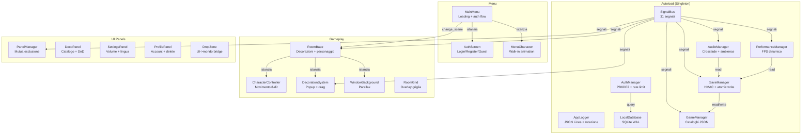

# AUDIT REPORT — Mini Cozy Room v1

> **Progetto**: Mini Cozy Room — Desktop Companion
> **Motore**: Godot Engine 4.6 (GL Compatibility)
> **Data audit**: 1 Aprile 2026
> **Auditor**: Renan Augusto Macena
> **Versione report**: 2.0.0 — Riscrittura completa

---

## Indice

1. [Introduzione](#1-introduzione)
2. [Glossario Tecnico Illustrato](#2-glossario-tecnico-illustrato)
3. [Panoramica del Progetto](#3-panoramica-del-progetto)
4. [Metodologia di Audit](#4-metodologia-di-audit)
5. [Mappa Architetturale](#5-mappa-architetturale)
6. [Analisi Codice — Autoload](#6-analisi-codice--autoload)
7. [Analisi Codice — Menu](#7-analisi-codice--menu)
8. [Analisi Codice — Gameplay / Room](#8-analisi-codice--gameplay--room)
9. [Analisi Codice — UI](#9-analisi-codice--ui)
10. [Analisi Codice — Utility e Main](#10-analisi-codice--utility-e-main)
11. [Analisi Dati, Database e CI/CD](#11-analisi-dati-database-e-cicd)
12. [Classificazione Problemi](#12-classificazione-problemi)
13. [Piano di Stabilizzazione](#13-piano-di-stabilizzazione)
14. [Piano di Polishing](#14-piano-di-polishing)
15. [Guida Frontend — Il Gioco](#15-guida-frontend--il-gioco)
16. [Guida Godot Editor](#16-guida-godot-editor)
17. [Build — Export Windows (.exe)](#17-build--export-windows-exe)
18. [Build — Inno Setup (Installer)](#18-build--inno-setup-installer)
19. [Build — Export Android (APK)](#19-build--export-android-apk)
20. [Build — Export HTML5 (Web)](#20-build--export-html5-web)
21. [Troubleshooting](#21-troubleshooting)
22. [Statistiche Progetto](#22-statistiche-progetto)
23. [Appendice](#23-appendice)

---

## 1. Introduzione

Questo documento e' un audit tecnico completo del progetto **Mini Cozy Room**, un desktop companion 2D sviluppato in Godot Engine 4.6 con GDScript. Il report copre:

- **Analisi riga per riga** di tutti i 24 script GDScript del progetto (~4185 righe totali)
- **Verifica di tutte le fix** applicate dal primo audit (C1-C7, A1-A29, AR1-AR11)
- **Nuovi problemi** scoperti durante la ri-analisi completa
- **Guide operative** per build, export e distribuzione su tutte le piattaforme target
- **Guide frontend** per comprendere il funzionamento del gioco
- **Troubleshooting** per i problemi piu' comuni

### Convenzioni del documento

| Simbolo | Significato |
|---------|-------------|
| `CRITICO` | Bug che causa crash, perdita dati o vulnerabilita' di sicurezza |
| `ALTO` | Bug funzionale che impatta l'esperienza utente |
| `MEDIO` | Problema di qualita' del codice o design subottimale |
| `BASSO` | Miglioramento minore, pulizia, convenzione |
| `ARCHITETTURALE` | Decisione di design che impatta manutenibilita' futura |
| `POLISHING` | Miglioramento estetico o di UX non funzionale |
| `VERIFICATO` | Fix precedente confermata funzionante |
| `[SCREENSHOT: ...]` | Placeholder per screenshot da inserire manualmente |

### Riferimenti alla documentazione ufficiale

Tutti i link alla documentazione Godot puntano alla versione `stable` (4.x):
- Base: `https://docs.godotengine.org/en/stable/`
- GDScript: `https://docs.godotengine.org/en/stable/tutorials/scripting/gdscript/`
- Export: `https://docs.godotengine.org/en/stable/tutorials/export/`

---

## 2. Glossario Tecnico Illustrato

### Termini Godot Engine

| Termine | Definizione |
|---------|-------------|
| **Autoload** | Singleton caricato automaticamente all'avvio. Accessibile globalmente da qualsiasi script. Ordine di caricamento definito in `project.godot`. Ref: [Singletons (Autoload)](https://docs.godotengine.org/en/stable/tutorials/scripting/singletons_autoload.html) |
| **Signal** | Meccanismo di comunicazione asincrona tra nodi. Il mittente emette, i ricevitori si connettono. Pattern Observer nativo di Godot. Ref: [Signals](https://docs.godotengine.org/en/stable/getting_started/step_by_step/signals.html) |
| **Node** | Unita' base della scena Godot. Ogni oggetto nel gioco e' un Node o deriva da Node. L'albero dei nodi forma la gerarchia della scena. |
| **PackedScene** | Risorsa `.tscn` serializzata. Puo' essere istanziata (`instantiate()`) per creare nodi a runtime. |
| **Tween** | Animazione procedurale che interpola proprieta' nel tempo. Creato con `create_tween()`. Deve essere gestito (kill) per evitare leak. Ref: [Tween](https://docs.godotengine.org/en/stable/classes/class_tween.html) |
| **CanvasLayer** | Nodo che crea un layer di rendering separato. Usato per UI che deve rimanere sopra il mondo di gioco. |
| **InputEvent** | Oggetto che rappresenta un evento di input (tastiera, mouse, touch). Propagato attraverso `_input()`, `_unhandled_input()`. |
| **call_deferred()** | Rimanda l'esecuzione di un metodo al frame successivo. Necessario quando si modifica l'albero dei nodi durante un callback. |
| **queue_free()** | Marca un nodo per la rimozione sicura alla fine del frame corrente. Preferito rispetto a `free()` che e' immediato e pericoloso. |
| **ResourceLoader** | Sistema di caricamento risorse. `ResourceLoader.exists()` verifica l'esistenza senza caricare. `load()` e' sincrono, `ResourceLoader.load_threaded_request()` e' asincrono. |

### Termini di Architettura

| Termine | Definizione |
|---------|-------------|
| **Signal Bus** | Pattern architetturale: un singleton centrale che dichiara tutti i segnali. I sistemi comunicano tramite il bus invece che con riferimenti diretti, riducendo l'accoppiamento. |
| **HMAC** | Hash-based Message Authentication Code. Usato da SaveManager per verificare l'integrita' dei file di salvataggio. Impedisce la manomissione manuale dei dati. |
| **WAL** | Write-Ahead Logging. Modalita' SQLite che migliora le performance di scrittura e la resistenza ai crash. |
| **Atomic Write** | Tecnica di scrittura sicura: scrivi su file temporaneo -> backup dell'originale -> rinomina il temporaneo. Previene corruzione in caso di crash durante la scrittura. |
| **Dirty Flag** | Pattern che traccia se i dati sono stati modificati dall'ultimo salvataggio. Evita scritture non necessarie. |
| **Rate Limiting** | Limitazione del numero di tentativi in un intervallo di tempo. Usato da AuthManager per prevenire attacchi brute-force. |

### Termini Build & Export

| Termine | Definizione |
|---------|-------------|
| **Export Template** | Binario pre-compilato del motore Godot per una piattaforma specifica. Necessario per generare l'eseguibile finale. Scaricabile da Editor -> Export -> Manage Templates. |
| **PCK** | Packed file di Godot. Contiene tutte le risorse del progetto compresse. Puo' essere embedded nell'eseguibile o distribuito come file separato. |
| **Inno Setup** | Tool gratuito per creare installer Windows (.exe). Genera setup wizard con opzioni di installazione, icona desktop, disinstallazione. |
| **APK** | Android Package. Formato di distribuzione per app Android. Richiede Java SDK, Android SDK e un keystore per la firma. |

---

## 3. Panoramica del Progetto

### Descrizione

Mini Cozy Room e' un **desktop companion** 2D in pixel art. L'utente arreda una stanza virtuale con decorazioni, ascolta musica ambient e personalizza il proprio personaggio. L'applicazione e' progettata per restare aperta in background consumando poche risorse (15 FPS quando non in focus).

### Team

| Membro | Ruolo | Responsabilita' |
|--------|-------|-----------------|
| Renan Augusto Macena | Architect / Lead | Architettura, gameplay, UI, sistemi core |
| Cristian | CI/CD / Assets | Pipeline CI, asset grafici, validazione |
| Elia | Database / Cloud | SQLite locale, Supabase (fase futura) |

### Deadline: 22 Aprile 2026

### Stack Tecnologico

```
Motore:       Godot Engine 4.6
Linguaggio:   GDScript
Renderer:     GL Compatibility (OpenGL 3.3 / WebGL 2.0)
Database:     SQLite via godot-sqlite GDExtension (WAL mode)
Risoluzione:  1280 x 720 (stretch mode: canvas_items)
Target:       Windows, Web (HTML5), Android (pianificato)
CI/CD:        GitHub Actions (5 job validazione + 2 job build)
```

### Struttura Directory

```
Projectwork/
+-- .github/
|   +-- workflows/
|       +-- ci.yml              # 5 job paralleli: lint, JSON, sprite, xref, DB
|       +-- build.yml           # Export Windows + HTML5
+-- ci/
|   +-- validate_json_catalogs.py
|   +-- validate_sprite_paths.py
|   +-- validate_cross_references.py
|   +-- validate_db_schema.py
+-- v1/
    +-- project.godot           # Config principale Godot 4.6
    +-- export_presets.cfg      # Preset: Windows Desktop, Web
    +-- data/
    |   +-- characters.json     # 1 personaggio, 8 direzioni, 4 stati animazione
    |   +-- decorations.json    # 69 decorazioni, 11 categorie
    |   +-- rooms.json          # 1 stanza, 3 temi colore
    |   +-- tracks.json         # 2 tracce musicali
    +-- scripts/
    |   +-- autoload/           # 7 singleton (+ PerformanceManager in systems/)
    |   |   +-- signal_bus.gd       # 31 segnali - hub comunicazione
    |   |   +-- game_manager.gd     # Caricamento cataloghi, stato gioco
    |   |   +-- save_manager.gd     # Salvataggio JSON con HMAC + atomic write
    |   |   +-- local_database.gd   # SQLite CRUD, migrazioni, transazioni
    |   |   +-- audio_manager.gd    # Crossfade musica, ambience multi-layer
    |   |   +-- auth_manager.gd     # Autenticazione locale, PBKDF2, rate limit
    |   |   +-- logger.gd          # Log strutturati JSON Lines, rotazione file
    |   +-- systems/
    |   |   +-- performance_manager.gd  # FPS dinamico, persistenza posizione finestra
    |   +-- menu/
    |   |   +-- main_menu.gd        # Schermata caricamento, flusso auth, transizioni
    |   |   +-- auth_screen.gd      # UI login/registrazione/guest
    |   |   +-- menu_character.gd   # Animazione walk-in personaggio menu
    |   +-- rooms/
    |   |   +-- room_base.gd        # Spawn decorazioni, display personaggio
    |   |   +-- room_grid.gd        # Overlay griglia visuale
    |   |   +-- character_controller.gd  # Movimento 8 direzioni
    |   |   +-- decoration_system.gd     # Popup, drag, rotate, scale, delete
    |   |   +-- window_background.gd     # Parallax sfondo foresta
    |   +-- ui/
    |   |   +-- panel_manager.gd    # Gestione pannelli, mutua esclusione
    |   |   +-- deco_panel.gd       # Catalogo decorazioni, drag-and-drop
    |   |   +-- settings_panel.gd   # Slider volume, selettore lingua
    |   |   +-- profile_panel.gd    # Info account, delete, logout
    |   |   +-- drop_zone.gd       # Bridge UI->mondo per drop decorazioni
    |   +-- utils/
    |   |   +-- constants.gd        # Costanti globali
    |   |   +-- helpers.gd          # Funzioni utilita'
    |   +-- main.gd                 # Scena root gameplay, wiring HUD
    +-- scenes/                     # 37 file .tscn
    +-- assets/                     # ~490 asset (sprite, audio, font)
    +-- addons/
    |   +-- godot-sqlite/           # GDExtension per SQLite
    +-- tests/                      # Test GDScript
```

### Ordine di Caricamento Autoload

Definito in `project.godot`, sezione `[autoload]`. L'ordine e' critico:

```
1. SignalBus          -> Deve essere primo (tutti gli altri si connettono ai suoi segnali)
2. AppLogger          -> Secondo (logging disponibile per tutti i successivi)
3. LocalDatabase      -> Terzo (DB pronto prima di auth e save)
4. AuthManager        -> Quarto (autenticazione disponibile prima del game)
5. GameManager        -> Quinto (carica cataloghi JSON)
6. SaveManager        -> Sesto (carica salvataggi, dipende da GameManager)
7. AudioManager       -> Settimo (riproduzione audio, legge stato da SaveManager)
8. PerformanceManager -> Ultimo (FPS e posizione finestra)
```

> **Nota**: `PerformanceManager` e' in `scripts/systems/` ma e' registrato come autoload.
> Tutti gli autoload vivono per l'intera vita dell'applicazione — il loro `_exit_tree()`
> viene chiamato solo alla chiusura dell'app.

---

## 4. Metodologia di Audit

### Processo

Questo audit segue un processo sistematico in 5 fasi:

```
Fase 1: Mappatura         -> Esplorazione completa del repository (file, cartelle, asset)
Fase 2: Lettura           -> Lettura riga per riga di ogni script GDScript (24 file)
Fase 3: Verifica fix      -> Controllo di tutte le correzioni dal primo audit
Fase 4: Nuovi problemi    -> Identificazione di problemi non presenti nel primo audit
Fase 5: Documentazione    -> Stesura del report con classificazione e guide operative
```

### Criteri di Valutazione

Ogni script viene valutato su 8 dimensioni:

1. **Correttezza**: Il codice fa quello che dovrebbe? Ci sono edge case non gestiti?
2. **Sicurezza**: Ci sono vulnerabilita' (SQL injection, path traversal, input non validato)?
3. **Robustezza**: Come si comporta in caso di errore? (file mancanti, null reference, rete assente)
4. **Performance**: Ci sono operazioni costose nel main thread? Memory leak?
5. **Manutenibilita'**: Il codice e' leggibile? Le responsabilita' sono ben separate?
6. **Accoppiamento**: I sistemi comunicano tramite SignalBus o con riferimenti diretti?
7. **Cleanup**: `_exit_tree()` disconnette i segnali? I tween vengono killati?
8. **Completezza**: Le feature dichiarate sono effettivamente implementate?

### Stato delle Fix Precedenti

Il primo audit (21 Marzo 2026) aveva identificato:
- **7 problemi CRITICI** (C1-C7): tutti corretti
- **29 problemi ALTI** (A1-A29): tutti corretti
- **11 problemi ARCHITETTURALI** (AR1-AR11): la maggior parte corretti

Questo secondo audit ri-verifica ognuna di queste fix e cerca nuovi problemi.

---

## 5. Mappa Architetturale

### Diagramma dei Sistemi



### Flusso di Avvio dell'Applicazione

```
+------------------------------------------------------------------+
|                    AVVIO GODOT ENGINE                             |
+------------------------------------------------------------------+
         |
         v
+------------------+    +------------------+    +------------------+
| 1. SignalBus     | -> | 2. AppLogger     | -> | 3. LocalDatabase |
| _ready(): noop   |    | _ready(): apre   |    | _ready(): apre   |
| (solo segnali)   |    | file log, timer  |    | DB, crea schema  |
+------------------+    +------------------+    +------------------+
         |
         v
+------------------+    +------------------+    +------------------+
| 4. AuthManager   | -> | 5. GameManager   | -> | 6. SaveManager   |
| _ready():        |    | _ready(): carica |    | _ready(): carica |
| connette segnali |    | 4 cataloghi JSON |    | save, applica    |
+------------------+    +------------------+    +------------------+
         |
         v
+------------------+    +------------------+
| 7. AudioManager  | -> | 8. PerfManager   |
| _ready(): aspetta|    | _ready(): set    |
| load_completed   |    | FPS, connette    |
+------------------+    +------------------+
         |
         v
+------------------------------------------------------------------+
|                    SCENA PRINCIPALE: MainMenu                     |
+------------------------------------------------------------------+
         |
         v
  +--- Loading Screen (SubViewport overlay) ---+
  |  1. Mostra sfondo + barra progresso        |
  |  2. GameManager carica cataloghi           |
  |  3. SaveManager carica salvataggio         |
  |  4. SignalBus.load_completed.emit()        |
  +--------------------------------------------+
         |
         v
  +--- Auth Check ---+
  |  Account esiste? |
  +------------------+
     |            |
     | NO         | SI
     v            v
  AuthScreen   Walk-in Animation
  (login/reg)  (personaggio entra)
     |            |
     v            v
  +--- Bottoni Menu ---+
  | Start | Settings   |
  +---------+----------+
         |
         v
  +------------------------------------------------------------------+
  |              SCENA GAMEPLAY: main.tscn (RoomBase)                 |
  +------------------------------------------------------------------+
```

### Flusso di Salvataggio

```
                    Evento trigger
                         |
          +--------------+--------------+
          |              |              |
     Auto-save      Modifica deco   Chiusura app
     (timer 60s)    (dirty flag)    (WM_CLOSE)
          |              |              |
          v              v              v
     +------------------------------------+
     |     SaveManager.save_game()        |
     | 1. Controlla _is_saving (guard)    |
     | 2. Raccoglie stato da tutti i      |
     |    sistemi in un Dictionary        |
     | 3. Calcola HMAC-SHA256             |
     | 4. Serializza in JSON              |
     +------------------------------------+
                    |
                    v
     +------------------------------------+
     |         Atomic Write               |
     | 1. Scrivi su file .tmp             |
     | 2. Se esiste .save, rinomina       |
     |    in .save.bak                    |
     | 3. Rinomina .tmp in .save          |
     +------------------------------------+
                    |
                    v
     +------------------------------------+
     |     Catena di Migrazione           |
     | v1.0.0 -> v2.0.0 -> v3.0.0        |
     |        -> v4.0.0 -> v5.0.0        |
     | Ogni step aggiunge campi mancanti  |
     +------------------------------------+
```

### Flusso Decorazioni (Drag & Drop)

```
  DecoPanel (UI)                    DropZone (Control)              RoomBase (Node2D)
  +----------------+               +------------------+            +------------------+
  | Catalogo con   |  drag start   | Overlay          |  drop      | Mondo di gioco   |
  | 69 decorazioni | ------------> | trasparente      | --------> | coordinate 2D    |
  | in 11 categorie|               | su tutta la      |            |                  |
  |                |               | viewport         |            | Crea:            |
  | _get_drag_data |               |                  |            | - Sprite2D       |
  | genera preview |               | can_drop_data(): |            | - StaticBody2D   |
  +----------------+               | valida zona      |            | - CollisionShape |
                                   | (wall/floor)     |            | - DecorationSys  |
                                   |                  |            +------------------+
                                   | drop_data():     |
                                   | emette           |
                                   | decoration_placed|
                                   +------------------+
```

### Mappa Segnali (SignalBus)

```
Categoria           Segnale                        Emesso da               Ricevuto da
---------           -------                        ---------               -----------
Room                room_changed(id)               SaveManager             RoomBase
                    theme_changed(theme)            SaveManager             RoomBase

Character           character_changed(id)           SaveManager             RoomBase
                    character_direction(dir)        CharacterController     (non usato)

Music               track_changed(path)             UI/DecoPanel            AudioManager
                    ambience_toggled(id,on)          UI                      AudioManager

Decoration          decoration_placed(data)         DropZone                RoomBase
                    decoration_removed(idx)         DecorationSystem        RoomBase
                    decoration_updated()            DecorationSystem        SaveManager
                    edit_mode_changed(on)           DecoPanel               CharacterCtrl, RoomGrid

UI                  panel_opened(name)              PanelManager            (logging)
                    panel_closed(name)              PanelManager            (logging)

Save/Load           save_requested()                Vari sistemi            SaveManager
                    load_completed()                SaveManager             AudioManager, PerfMgr
                    settings_updated(key,val)       PerfManager, Settings   SaveManager

Auth                auth_state_changed(state,uname) AuthManager             ProfilePanel, MainMenu
                    logout_requested()              ProfilePanel            AuthManager

Cloud Sync          sync_requested()                (futuro)                (futuro)
                    sync_completed(ok)              (futuro)                (futuro)
```

---

## 6. Analisi Codice — Autoload

Questa sezione analizza gli 8 script autoload, che formano il backbone dell'applicazione.
Ogni script e' analizzato su: correttezza, sicurezza, robustezza, performance, accoppiamento, cleanup.

---

### 6.1 signal_bus.gd (58 righe)

**Percorso**: `v1/scripts/autoload/signal_bus.gd`
**Ruolo**: Hub centrale di comunicazione. Dichiara 31 segnali raggruppati per categoria.

**Analisi**:

| Aspetto | Valutazione | Note |
|---------|-------------|------|
| Correttezza | OK | Pure dichiarazioni, nessuna logica |
| Sicurezza | OK | Nessun rischio |
| Robustezza | OK | Non puo' fallire |
| Performance | OK | Nessun overhead |
| Accoppiamento | ECCELLENTE | Punto centrale di disaccoppiamento |
| Cleanup | N/A | Nessuna connessione da disconnettere |

**Segnali dichiarati per categoria**:

```
Room (4):         room_changed, decoration_placed, decoration_removed, decoration_moved
Character (2):    character_changed, outfit_changed
Music/Audio (4):  track_changed, track_play_pause_toggled, ambience_toggled, volume_changed
Decoration (5):   decoration_mode_changed, decoration_selected, decoration_deselected,
                  decoration_rotated, decoration_scaled
UI (2):           panel_opened, panel_closed
Save/Load (3):    save_requested, save_completed, load_completed
Settings (3):     settings_updated, music_state_updated, save_to_database_requested
Language (1):     language_changed
Auth (5):         auth_state_changed, auth_error, account_created, account_deleted,
                  character_deleted
Cloud Sync (2):   sync_started, sync_completed
```

**Verdetto**: `NESSUN PROBLEMA`. Design pulito e corretto.

> **Nota**: I segnali `decoration_selected`, `decoration_deselected`, `decoration_rotated`,
> `decoration_scaled`, `outfit_changed`, `sync_started`, `sync_completed` sono dichiarati
> ma non ancora utilizzati nel codebase. Questo e' accettabile — sono predisposti per
> funzionalita' future (Phase 4-5).

---

### 6.2 game_manager.gd (130 righe)

**Percorso**: `v1/scripts/autoload/game_manager.gd`
**Ruolo**: Orchestratore centrale. Carica cataloghi JSON, gestisce stato corrente (room, theme, character).

**Analisi**:

| Aspetto | Valutazione | Note |
|---------|-------------|------|
| Correttezza | OK | Caricamento e validazione corretti |
| Sicurezza | OK | Nessun input esterno non validato |
| Robustezza | BUONA | Gestisce file mancanti, JSON malformato, tipi errati |
| Performance | OK | Caricamento sincrono ma accettabile per 4 piccoli file JSON |
| Accoppiamento | `MEDIO` | Vedi sotto |
| Cleanup | `BASSO` | Vedi sotto |

**Fix verificate**:
- `[VERIFICATO]` **AR1**: `_request_save()` (riga 128-129) ora emette `SignalBus.save_requested.emit()` invece di chiamare direttamente `SaveManager.save_game()`

**Problemi residui**:

**N-AR1** — Accoppiamento `SaveManager -> GameManager` (`ARCHITETTURALE`)

SaveManager scrive direttamente nelle variabili pubbliche di GameManager in `_apply_save_data()`:
```gdscript
# In save_manager.gd, _apply_save_data():
GameManager.current_room_id = data.get("room_id", "cozy_studio")
GameManager.current_theme = data.get("theme", "modern")
GameManager.current_character_id = data.get("character_id", "male_old")
```

**Perche' e' un problema**: Viola il principio di incapsulamento. Se GameManager aggiunge logica
di validazione al cambio di room/theme, SaveManager la bypassa.

**Soluzione suggerita**: Usare i metodi pubblici di GameManager (`change_room()`, `change_character()`)
oppure introdurre un segnale `state_restored(data: Dictionary)`.

---

**N-Q5** — ~~Nessun `_exit_tree()`~~ `RISOLTO` (2 Apr 2026)

GameManager ora ha `_exit_tree()` che disconnette `SignalBus.load_completed`.
Aggiunto per coerenza con gli altri autoload che lo implementano.

---

### 6.3 save_manager.gd (490 righe)

**Percorso**: `v1/scripts/autoload/save_manager.gd`
**Ruolo**: Persistenza JSON con HMAC-SHA256, atomic writes, auto-save, migrazioni.

Questo e' lo script piu' complesso del progetto. Gestisce:
- Salvataggio/caricamento dello stato completo del gioco
- Integrita' dei dati tramite HMAC-SHA256
- Scrittura atomica (temp -> backup -> rename)
- Auto-save con timer 60s e dirty flag
- Catena di migrazione (v1.0.0 -> v5.0.0)
- Protezione race condition con `_is_saving` flag

**Analisi**:

| Aspetto | Valutazione | Note |
|---------|-------------|------|
| Correttezza | BUONA | Logica di save/load corretta con migrazioni |
| Sicurezza | BUONA | HMAC-SHA256, nessun path traversal |
| Robustezza | BUONA | Atomic write, race condition guard, file corrotto -> backup |
| Performance | OK | Serializzazione sincrona ma dati piccoli |
| Accoppiamento | `MEDIO` | Legge/scrive direttamente da/verso altri autoload |
| Cleanup | BUONA | `_exit_tree()` disconnette 3 segnali |

**Fix verificate**:
- `[VERIFICATO]` `_notification(NOTIFICATION_WM_CLOSE_REQUEST)` salva alla chiusura
- `[VERIFICATO]` `_is_saving` flag previene salvataggi concorrenti (riga 86)
- `[VERIFICATO]` Atomic write: temp -> backup -> rename (in `_write_save_file()`)
- `[VERIFICATO]` Migrazione catena v1 -> v5 con validazione inventario
- `[VERIFICATO]` `_apply_save_data()` usa `typeof()` per type-safe assignment
- `[VERIFICATO]` `_exit_tree()` disconnette `save_requested`, `settings_updated`, `music_state_updated`

**Problemi residui**:

**N-Q6** — ~~Stato pubblico mutabile~~ `RISOLTO` (3 Apr 2026)

Variabili `decorations`, `settings`, `music_state` rinominate con prefisso `_` (private).
Aggiunti getter (`get_decorations()`, `get_setting()`, `get_music_state()`) e mutator
(`add_decoration()`, `remove_decoration()`). Aggiornati tutti i 14 access point esterni
in 5 file: room_base.gd, decoration_system.gd, settings_panel.gd, audio_manager.gd,
performance_manager.gd.
copie (`duplicate()`). Le scritture passano per setter che chiamano `_mark_dirty()`.

---

**N-AR2** — Accoppiamento bidirezionale SaveManager <-> GameManager (`ARCHITETTURALE`)

SaveManager scrive direttamente in `GameManager.current_room_id`, `current_theme`, ecc.
nella funzione `_apply_save_data()`, e legge le stesse variabili in `save_game()`.
Questo crea un accoppiamento bidirezionale stretto tra i due sistemi.

---

### 6.4 local_database.gd (593 righe)

**Percorso**: `v1/scripts/autoload/local_database.gd`
**Ruolo**: SQLite CRUD con WAL mode, migrazioni schema, transazioni con ROLLBACK.

**Analisi**:

| Aspetto | Valutazione | Note |
|---------|-------------|------|
| Correttezza | BUONA | Query parametrizzate, transazioni corrette |
| Sicurezza | BUONA | `_execute_bound()` previene SQL injection, WAL mode |
| Robustezza | BUONA | ROLLBACK su errore, controlli `_is_open` |
| Performance | `MEDIO` | Nessun indice su colonne FK |
| Accoppiamento | OK | Riceve dati via segnale `save_to_database_requested` |
| Cleanup | BUONA | `_exit_tree()` disconnette segnale, `close()` su WM_CLOSE |

**Fix verificate**:
- `[VERIFICATO]` **A24**: Transazioni con ROLLBACK (righe 50-65 di `_on_save_requested`)
- `[VERIFICATO]` **A25**: `_save_inventory()` ritorna `bool`
- `[VERIFICATO]` **A26**: Metodo pubblico `is_open()` (riga 30)
- `[VERIFICATO]` **C3/C4**: Schema `characters` con `character_id` PK, `inventario` con FK e CASCADE

**Problemi residui**:

**N-DB1** — ~~Tabelle morte nello schema~~ `RISOLTO` (3 Apr 2026)

Le tabelle `colore`, `categoria`, `shop` e `items` e le relative funzioni CRUD sono state
rimosse da `local_database.gd`. Nessun altro script le referenziava.

---

**N-DB2** — Nessun indice su colonne FK (`MEDIO`)

```sql
-- Tabella characters: FK su account_id ma nessun indice
-- Tabella inventario: FK su account_id ma nessun indice
-- Tabella rooms: FK su account_id ma nessun indice
-- Tabella items: FK su inventario_id ma nessun indice
```

SQLite non crea automaticamente indici sulle foreign key. Questo significa che
query come `SELECT * FROM characters WHERE account_id = ?` fanno un full table scan.

**Suggerimento**: Aggiungere indici:
```sql
CREATE INDEX IF NOT EXISTS idx_characters_account ON characters(account_id);
CREATE INDEX IF NOT EXISTS idx_inventario_account ON inventario(account_id);
CREATE INDEX IF NOT EXISTS idx_rooms_account ON rooms(account_id);
CREATE INDEX IF NOT EXISTS idx_items_inventario ON items(inventario_id);
```

---

**N-DB3** — ~~`_select()` ritorno ambiguo~~ `RISOLTO` (3 Apr 2026)

Aggiunto flag `_last_select_error: bool` che viene impostato a `true` su errore
e `false` su successo. I caller esistenti continuano a funzionare senza modifiche;
il flag e' disponibile per distinguere errore da risultato vuoto quando necessario.

---

### 6.5 audio_manager.gd (345 righe)

**Percorso**: `v1/scripts/autoload/audio_manager.gd`
**Ruolo**: Crossfade musica con dual player, ambience multi-layer, path security.

**Analisi**:

| Aspetto | Valutazione | Note |
|---------|-------------|------|
| Correttezza | BUONA | Crossfade e gestione tracce corrette |
| Sicurezza | BUONA | Path traversal protection (`res://`, `user://` only), file size limit 50MB |
| Robustezza | BUONA | Gestisce file mancanti, formati non supportati |
| Performance | OK | AudioStreamPlayer e' leggero, ambience players limitati |
| Accoppiamento | `MEDIO` | Legge direttamente da `SaveManager.music_state` e `SaveManager.settings` |
| Cleanup | BUONA | `_exit_tree()` pulisce tutti gli ambience player |

**Problema residuo**:

**N-AR3** — Lettura diretta da SaveManager (`ARCHITETTURALE`)

In `_on_load_completed()`, AudioManager legge direttamente:
```gdscript
SaveManager.music_state["current_track_index"]
SaveManager.settings["music_volume"]
SaveManager.settings["ambience_volume"]
```

Questo bypassa il SignalBus e crea accoppiamento diretto.

**Soluzione suggerita**: SaveManager dovrebbe emettere `load_completed` con i dati rilevanti
come parametro, oppure AudioManager dovrebbe richiedere lo stato tramite un metodo getter.

---

### 6.6 auth_manager.gd (186 righe)

**Percorso**: `v1/scripts/autoload/auth_manager.gd`
**Ruolo**: Autenticazione locale con state machine, PBKDF2, rate limiting.

**Analisi**:

| Aspetto | Valutazione | Note |
|---------|-------------|------|
| Correttezza | `MEDIO` | Bug minore in `register()` — vedi sotto |
| Sicurezza | BUONA | PBKDF2 10k iterazioni, salt random crypto, rate limiting |
| Robustezza | BUONA | Validazione input, migrazione hash legacy |
| Performance | OK | Hash iterativo ma solo su login/register (non nel loop di gioco) |
| Accoppiamento | OK | Chiama LocalDatabase direttamente (accettabile — auth e' speciale) |
| Cleanup | N/A | Nessun segnale connesso, nessun timer |

**Fix verificate**:
- `[VERIFICATO]` **A27**: `create_account()` verifica il valore di ritorno (riga 62: `if account_id < 0`)
- `[VERIFICATO]` **A26**: `_set_state()` controlla `LocalDatabase.is_open()` (riga 162)
- `[VERIFICATO]` Rate limiting: 5 tentativi falliti -> 300s lockout

**Problema residuo**:

**N-Q3** — ~~Inconsistenza `clean_name` in `register()`~~ `RISOLTO` (commit 953ad1e, 2 Apr 2026)

```gdscript
# Riga 45: username viene pulito
var clean_name := username.strip_edges()

# Riga 55: correttamente usa clean_name per il check
var existing := LocalDatabase.get_account_by_username(clean_name)

# Riga 59-60: BUG — usa username.strip_edges() invece di clean_name
var account_id := LocalDatabase.create_account(
    username.strip_edges(), pw_hash     # <-- Dovrebbe essere clean_name
)
```

Non causa un bug funzionale (il risultato e' identico), ma e' una inconsistenza
che indica che la variabile `clean_name` non viene usata dove dovrebbe.

**Fix**: Sostituire `username.strip_edges()` con `clean_name` alla riga 60.

---

### 6.7 logger.gd (236 righe)

**Percorso**: `v1/scripts/autoload/logger.gd`
**Ruolo**: Logging strutturato JSON Lines con session ID, rotazione file, buffer retention.

**Analisi**:

| Aspetto | Valutazione | Note |
|---------|-------------|------|
| Correttezza | BUONA | Formattazione corretta, rotazione funzionante |
| Sicurezza | OK | Session ID con crypto-quality randomness |
| Robustezza | BUONA | Buffer retention 100 messaggi se file non disponibile |
| Performance | `BASSO` | `_flush_buffer()` sincrono — vedi sotto |
| Accoppiamento | OK | Nessun accoppiamento — viene chiamato da tutti |
| Cleanup | BUONA | `_notification(WM_CLOSE)` fa flush e chiude file |

**Fix verificate**:
- `[VERIFICATO]` **A13**: Buffer retention — mantiene ultimi 100 messaggi se file non disponibile (riga 130-134)

**Problema residuo**:

**N-Q4** — Flush sincrono potrebbe causare micro-stutter (`BASSO`)

`_flush_buffer()` scrive tutti i log bufferizzati in modo sincrono. Con il timer a 2 secondi
e un buffer tipico di pochi messaggi, l'impatto e' trascurabile. Tuttavia, in scenari di
logging intenso (es. decorazioni drag rapido), il buffer potrebbe crescere e il flush
potrebbe causare un frame drop.

**Nota**: Questo e' un problema teorico. In pratica, con il pattern di utilizzo attuale
(pochi log per secondo), non e' un problema reale. Documentato per completezza.

---

### 6.8 performance_manager.gd (66 righe)

**Percorso**: `v1/scripts/systems/performance_manager.gd`
**Ruolo**: FPS dinamico (60 focused / 15 unfocused), persistenza posizione finestra.

**Analisi**:

| Aspetto | Valutazione | Note |
|---------|-------------|------|
| Correttezza | BUONA | FPS switching e validazione posizione corretti |
| Sicurezza | OK | Nessun rischio |
| Robustezza | BUONA | Validazione posizione su screen, fallback se off-screen |
| Performance | OK | Overhead minimo |
| Accoppiamento | `MEDIO` | Legge direttamente da `SaveManager.settings` |
| Cleanup | BUONA | `_exit_tree()` disconnette 3 segnali |

**Problema residuo**:

**N-AR4** — Lettura diretta da SaveManager (`ARCHITETTURALE`)

```gdscript
# In _on_load_completed():
var win_pos_x: int = SaveManager.settings.get("window_pos_x", -1)
var win_pos_y: int = SaveManager.settings.get("window_pos_y", -1)
```

Stessa categoria di N-AR3. La lettura diretta dei dizionari pubblici di SaveManager
crea accoppiamento implicito.

---

### Riepilogo Autoload

```
+------------------------+--------+----------+-----------+----------+--------------+----------+
| Script                 | Righe  | Corrett. | Sicurezza | Robusto  | Accoppiamento| Cleanup  |
+------------------------+--------+----------+-----------+----------+--------------+----------+
| signal_bus.gd          |   58   |   OK     |    OK     |   OK     |  ECCELLENTE  |   N/A    |
| game_manager.gd        |  130   |   OK     |    OK     |  BUONA   |    MEDIO     |  BASSO   |
| save_manager.gd        |  490   |  BUONA   |   BUONA   |  BUONA   |    MEDIO     |  BUONA   |
| local_database.gd      |  593   |  BUONA   |   BUONA   |  BUONA   |     OK       |  BUONA   |
| audio_manager.gd       |  345   |  BUONA   |   BUONA   |  BUONA   |    MEDIO     |  BUONA   |
| auth_manager.gd        |  186   |  MEDIO   |   BUONA   |  BUONA   |     OK       |   N/A    |
| logger.gd              |  236   |  BUONA   |    OK     |  BUONA   |     OK       |  BUONA   |
| performance_manager.gd |   66   |  BUONA   |    OK     |  BUONA   |    MEDIO     |  BUONA   |
+------------------------+--------+----------+-----------+----------+--------------+----------+
```

---

## 7. Analisi Codice — Menu

### 7.1 main_menu.gd (223 righe)

**Percorso**: `v1/scripts/menu/main_menu.gd`
**Ruolo**: Loading screen grafico, flusso autenticazione, walk-in personaggio, transizione al gameplay.

**Analisi**:

| Aspetto | Valutazione | Note |
|---------|-------------|------|
| Correttezza | BUONA | Flusso auth -> walk-in -> gameplay corretto |
| Sicurezza | OK | Nessun rischio |
| Robustezza | BUONA | Null check su `scene.instantiate()`, transition guard |
| Performance | OK | Loading screen con SubViewport leggero |
| Accoppiamento | OK | Usa SignalBus per transizioni |
| Cleanup | ECCELLENTE | `_exit_tree()` disconnette 7 segnali, killa 2 tween |

**Fix verificate**:
- `[VERIFICATO]` **A29**: Null check su `scene.instantiate()` per auth_screen (riga 108-111), settings (riga 160-161), profile (riga 138-140), loading_screen (riga 52-53)
- `[VERIFICATO]` Tween gestiti come member variable (`_intro_tween`, `_panel_tween`) con kill prima di creare nuovi
- `[VERIFICATO]` Transition guard con `_transitioning` flag (riga 84, 92)

**Nessun problema residuo**. Script ben scritto con cleanup completo.

---

### 7.2 auth_screen.gd (222 righe)

**Percorso**: `v1/scripts/menu/auth_screen.gd`
**Ruolo**: UI di login/registrazione/guest, costruita interamente in modo programmatico.

**Analisi**:

| Aspetto | Valutazione | Note |
|---------|-------------|------|
| Correttezza | BUONA | Flusso login/register/guest funzionante |
| Sicurezza | OK | Input delegato ad AuthManager |
| Robustezza | BUONA | Null check su form elements (riga 181-184) |
| Performance | OK | UI semplice |
| Accoppiamento | OK | Emette segnale locale `auth_completed` |
| Cleanup | `MEDIO` | Vedi sotto |

**Problemi residui**:

**N-Q1** — ~~Nessun `_exit_tree()` + tween non tracciato~~ `RISOLTO` (3 Apr 2026)

```gdscript
# Riga 213: tween locale, non salvato come member variable
func _finish() -> void:
    var tween := create_tween()
    tween.tween_property(self, "modulate:a", 0.0, Constants.PANEL_TWEEN_DURATION)
    tween.tween_callback(
        func() -> void:
            auth_completed.emit()
            queue_free()
    )
```

Se `auth_screen` viene rimosso dall'albero prima che il tween completi (es. cambio scena rapido),
il tween continua a tentare di accedere a un nodo invalido. Inoltre, manca `_exit_tree()`
per disconnettere i segnali dei bottoni creati programmaticamente.

**Impatto**: Basso in pratica — il `queue_free()` nel callback e' l'unica rimozione prevista.
Ma per robustezza, il tween dovrebbe essere un member variable con kill in `_exit_tree()`.

---

### 7.3 menu_character.gd (86 righe)

**Percorso**: `v1/scripts/menu/menu_character.gd`
**Ruolo**: Sceglie un personaggio random e anima il walk-in da fuori schermo.

**Analisi**:

| Aspetto | Valutazione | Note |
|---------|-------------|------|
| Correttezza | BUONA | Animazione walk-in con frame cycling funzionante |
| Sicurezza | OK | Nessun rischio |
| Robustezza | OK | Gestisce texture mancante (riga 32-34) |
| Performance | OK | Un solo sprite + timer |
| Accoppiamento | OK | Segnale locale `walk_in_completed` |
| Cleanup | BUONA | `_exit_tree()` disconnette timer, lo ferma e lo libera |

**Problemi residui**:

**N-Q2** — ~~Tween non tracciato come member variable~~ `RISOLTO` (3 Apr 2026)

```gdscript
# Riga 61: tween locale
var tween := create_tween()
```

Se `walk_in()` viene chiamato due volte (improbabile ma possibile), il primo tween non viene killato.

---

**N-P4** — Posizioni hardcoded (`POLISHING`)

```gdscript
# Righe 51-52: posizioni fisse
var start_pos := Vector2(-100, 530)
var end_pos := Vector2(640, 530)
```

Queste posizioni funzionano per la risoluzione 1280x720 ma non si adattano se la viewport
cambia. Dovrebbero usare `get_viewport_rect().size` per calcolare posizioni relative.

---

### Riepilogo Menu

```
+------------------+--------+----------+-----------+----------+--------------+----------+
| Script           | Righe  | Corrett. | Sicurezza | Robusto  | Accoppiamento| Cleanup  |
+------------------+--------+----------+-----------+----------+--------------+----------+
| main_menu.gd     |  223   |  BUONA   |    OK     |  BUONA   |     OK       |ECCELLENTE|
| auth_screen.gd   |  222   |  BUONA   |    OK     |  BUONA   |     OK       |  MEDIO   |
| menu_character.gd|   86   |  BUONA   |    OK     |   OK     |     OK       |  BUONA   |
+------------------+--------+----------+-----------+----------+--------------+----------+
```

---

## 8. Analisi Codice — Gameplay / Room

### 8.1 room_base.gd (143 righe)

**Percorso**: `v1/scripts/rooms/room_base.gd`
**Ruolo**: Scena base della stanza. Spawn decorazioni con collision body, swap personaggio.

**Analisi**:

| Aspetto | Valutazione | Note |
|---------|-------------|------|
| Correttezza | BUONA | Spawn e reload decorazioni corretti |
| Sicurezza | OK | Nessun input esterno diretto |
| Robustezza | BUONA | Null check su texture, `call_deferred` per add_child |
| Performance | OK | Spawn sincrono ma numero decorazioni limitato |
| Accoppiamento | `MEDIO` | Accede a `SaveManager.decorations` direttamente |
| Cleanup | BUONA | `_exit_tree()` disconnette 3 segnali |

**Fix verificate**:
- `[VERIFICATO]` **A3**: `call_deferred("add_child", new_char)` per swap personaggio (riga 41)
- `[VERIFICATO]` **A28**: Viewport clamping per posizioni decorazione (riga 77)

**Problemi residui**:

**N-AR5** — Accesso diretto a `SaveManager.decorations` (`ARCHITETTURALE`)

```gdscript
# Riga 57: scrittura diretta nell'array pubblico
SaveManager.decorations.append(deco_data)

# Riga 66: lettura diretta
for deco_data in SaveManager.decorations:
```

---

**N-P3** — Collision shape e scala decorazione (`POLISHING`)

```gdscript
# Riga 119: usa la dimensione raw della texture
rect.size = texture.get_size()
# Ma il sprite ha scala custom (riga 100):
sprite.scale = Vector2(item_scale, item_scale)
```

La collision shape e' figlio dello sprite, quindi eredita la scala automaticamente.
Non e' un bug, ma se il body venisse spostato fuori dallo sprite, la collision diventerebbe errata.
Documentato per chiarezza.

---

### 8.2 character_controller.gd (88 righe)

**Percorso**: `v1/scripts/rooms/character_controller.gd`
**Ruolo**: CharacterBody2D con movimento 8 direzioni e animazione.

**Analisi**:

| Aspetto | Valutazione | Note |
|---------|-------------|------|
| Correttezza | BUONA | 8 direzioni con soglia angolare, idle coerente |
| Sicurezza | OK | Nessun rischio |
| Robustezza | BUONA | Null check su `_anim` in ogni metodo (righe 42, 66, 83) |
| Performance | OK | `_physics_process` leggero |
| Accoppiamento | OK | Solo `SignalBus.decoration_mode_changed` |
| Cleanup | BUONA | `_exit_tree()` disconnette segnale |

**Fix verificate**:
- `[VERIFICATO]` **A7**: Null check su `_anim`
- `[VERIFICATO]` Collision mask cambia in edit mode (riga 24-29)

**Nessun problema residuo**.

---

### 8.3 decoration_system.gd (228 righe)

**Percorso**: `v1/scripts/rooms/decoration_system.gd`
**Ruolo**: Script per ogni decorazione. Click -> popup (R/F/S/X), drag con grid snap.

**Analisi**:

| Aspetto | Valutazione | Note |
|---------|-------------|------|
| Correttezza | BUONA | Drag + popup funzionanti, single-popup pattern |
| Sicurezza | OK | Nessun rischio |
| Robustezza | BUONA | `is_instance_valid` check, ESC dismiss |
| Performance | OK | Input handling leggero |
| Accoppiamento | `MEDIO` | Scrive in `SaveManager.decorations` direttamente |
| Cleanup | BUONA | `_exit_tree()` chiama `_dismiss_popup()` |

**Fix verificate**:
- `[VERIFICATO]` **A15**: Persistenza via `_deco_data` reference
- `[VERIFICATO]` Grid snapping (riga 59) e viewport clamping (riga 60-62)

**Problema residuo**:

**N-AR6** — Accesso diretto a `SaveManager.decorations` in `_remove_from_room()` (`ARCHITETTURALE`)

```gdscript
# Riga 218-220
var idx := SaveManager.decorations.find(_deco_data)
if idx >= 0:
    SaveManager.decorations.remove_at(idx)
```

---

### 8.4 window_background.gd (72 righe)

**Percorso**: `v1/scripts/rooms/window_background.gd`
**Ruolo**: Sfondo foresta parallax. Risponde al mouse per effetto profondita'.

**Analisi**: Tutto OK. Two-pass layer building verificato (**C5**). Nessun problema residuo.

---

### 8.5 room_grid.gd (45 righe)

**Percorso**: `v1/scripts/rooms/room_grid.gd`
**Ruolo**: Overlay griglia visuale durante modalita' decorazione.

**Analisi**: Tutto OK. Script compatto. `_exit_tree()` disconnette segnale. Nessun problema residuo.

---

### Riepilogo Gameplay/Room

```
+-----------------------+--------+----------+-----------+----------+--------------+----------+
| Script                | Righe  | Corrett. | Sicurezza | Robusto  | Accoppiamento| Cleanup  |
+-----------------------+--------+----------+-----------+----------+--------------+----------+
| room_base.gd          |  143   |  BUONA   |    OK     |  BUONA   |    MEDIO     |  BUONA   |
| character_controller.gd|  88   |  BUONA   |    OK     |  BUONA   |     OK       |  BUONA   |
| decoration_system.gd  |  228   |  BUONA   |    OK     |  BUONA   |    MEDIO     |  BUONA   |
| window_background.gd  |   72   |  BUONA   |    OK     |  BUONA   |     OK       |   OK     |
| room_grid.gd          |   45   |   OK     |    OK     |   OK     |     OK       |  BUONA   |
+-----------------------+--------+----------+-----------+----------+--------------+----------+
```

---

## 9. Analisi Codice — UI

### 9.1 panel_manager.gd (143 righe)

**Percorso**: `v1/scripts/ui/panel_manager.gd`
**Ruolo**: `class_name PanelManager` — gestisce lifecycle pannelli, mutua esclusione, open/close con fade.

**Analisi**:

| Aspetto | Valutazione | Note |
|---------|-------------|------|
| Correttezza | BUONA | Mutua esclusione + scene caching + fade in/out |
| Sicurezza | OK | `ResourceLoader.exists()` check prima di caricare |
| Robustezza | BUONA | Null check, `is_instance_valid`, tween management |
| Performance | BUONA | Scene cache evita reload ripetuti |
| Accoppiamento | OK | Emette `panel_opened`/`panel_closed` via SignalBus |
| Cleanup | BUONA | `_exit_tree()` killa tween e libera pannello corrente |

**Nessun problema residuo**. Script ben strutturato.

---

### 9.2 deco_panel.gd (197 righe)

**Percorso**: `v1/scripts/ui/deco_panel.gd`
**Ruolo**: Catalogo decorazioni con categorie collassabili e drag-and-drop.

**Analisi**:

| Aspetto | Valutazione | Note |
|---------|-------------|------|
| Correttezza | BUONA | Catalogo categorizzato, DnD con preview corretti |
| Sicurezza | OK | Nessun rischio |
| Robustezza | BUONA | Gestisce catalogo vuoto (riga 66-72), type checks |
| Performance | OK | Caricamento texture sincrono ma catalogo di 69 item |
| Accoppiamento | OK | Legge `GameManager.decorations_catalog` (accettabile — read-only) |
| Cleanup | BUONA | `_exit_tree()` disconnette bottone mode |

**Nessun problema residuo**.

---

### 9.3 settings_panel.gd (151 righe)

**Percorso**: `v1/scripts/ui/settings_panel.gd`
**Ruolo**: Slider volume (Master/Music/Ambience) + selettore lingua.

**Analisi**:

| Aspetto | Valutazione | Note |
|---------|-------------|------|
| Correttezza | BUONA | `_loading` guard previene emissioni spurie durante il caricamento |
| Sicurezza | OK | Nessun rischio |
| Robustezza | OK | Valori default per ogni slider |
| Performance | OK | UI leggera |
| Accoppiamento | `MEDIO` | Scrive direttamente in `SaveManager.settings["language"]` |
| Cleanup | BUONA | `_exit_tree()` disconnette 4 segnali (3 slider + language option) |

**Problema residuo**:

**N-AR7** — ~~Scrittura diretta in `SaveManager.settings`~~ `RISOLTO` (commit 953ad1e, 2 Apr 2026)

```gdscript
# Riga 128
SaveManager.settings["language"] = lang_code
```

Il cambio lingua scrive direttamente nel dizionario settings di SaveManager, bypassando
il segnale `settings_updated`. Gli slider audio invece usano correttamente
`SignalBus.volume_changed.emit()`.

**Soluzione**: Usare `SignalBus.settings_updated.emit("language", lang_code)` per coerenza.

---

### 9.4 profile_panel.gd (181 righe)

**Percorso**: `v1/scripts/ui/profile_panel.gd`
**Ruolo**: Info account, azioni pericolose (delete character/account), logout.

**Analisi**:

| Aspetto | Valutazione | Note |
|---------|-------------|------|
| Correttezza | BUONA | ConfirmationDialog con disconnect prima di riconnettere |
| Sicurezza | OK | Azioni distruttive richiedono conferma esplicita |
| Robustezza | BUONA | `CONNECT_ONE_SHOT` per callback conferma |
| Performance | OK | UI leggera |
| Accoppiamento | `MEDIO` | Chiama `LocalDatabase.get_coins()` direttamente |
| Cleanup | BUONA | `_exit_tree()` disconnette `auth_state_changed` |

**Problema residuo**:

**N-AR8** — Chiamata diretta a LocalDatabase (`ARCHITETTURALE`)

```gdscript
# Riga 135
var coins := LocalDatabase.get_coins(AuthManager.current_account_id)
```

ProfilePanel chiama direttamente LocalDatabase. Per coerenza con il pattern Signal Bus,
le monete dovrebbero essere accessibili tramite un getter in un autoload (es. GameManager)
o salvate in SaveManager.

---

### 9.5 drop_zone.gd (55 righe)

**Percorso**: `v1/scripts/ui/drop_zone.gd`
**Ruolo**: Control trasparente che fa da ponte tra il drag UI e il mondo di gioco.

**Analisi**:

| Aspetto | Valutazione | Note |
|---------|-------------|------|
| Correttezza | BUONA | Validazione zona (wall/floor), snap, clamp |
| Sicurezza | OK | Check `_is_valid_drop` |
| Robustezza | BUONA | Gestisce texture null (riga 51-52) |
| Performance | OK | Nessun overhead |
| Accoppiamento | OK | Emette `decoration_placed` via SignalBus |
| Cleanup | N/A | Nessun segnale da disconnettere |

**Nessun problema residuo**.

---

### Riepilogo UI

```
+------------------+--------+----------+-----------+----------+--------------+----------+
| Script           | Righe  | Corrett. | Sicurezza | Robusto  | Accoppiamento| Cleanup  |
+------------------+--------+----------+-----------+----------+--------------+----------+
| panel_manager.gd |  143   |  BUONA   |    OK     |  BUONA   |     OK       |  BUONA   |
| deco_panel.gd    |  197   |  BUONA   |    OK     |  BUONA   |     OK       |  BUONA   |
| settings_panel.gd|  151   |  BUONA   |    OK     |   OK     |    MEDIO     |  BUONA   |
| profile_panel.gd |  181   |  BUONA   |    OK     |  BUONA   |    MEDIO     |  BUONA   |
| drop_zone.gd     |   55   |  BUONA   |    OK     |  BUONA   |     OK       |   N/A    |
+------------------+--------+----------+-----------+----------+--------------+----------+
```

---

## 10. Analisi Codice — Utility e Main

### 10.1 main.gd (84 righe)

**Percorso**: `v1/scripts/main.gd`
**Ruolo**: Scena root del gameplay. Crea PanelManager, wira bottoni HUD, applica tema colori.

**Analisi**:

| Aspetto | Valutazione | Note |
|---------|-------------|------|
| Correttezza | BUONA | Wiring HUD -> PanelManager, tema colori |
| Sicurezza | OK | Nessun rischio |
| Robustezza | BUONA | Null check su bottoni HUD e texture background |
| Performance | OK | `_fit_background_to_viewport` una sola volta |
| Accoppiamento | OK | Connette `room_changed` via SignalBus |
| Cleanup | BUONA | `_exit_tree()` disconnette `room_changed` |

**Nessun problema residuo**.

---

### 10.2 constants.gd (51 righe)

**Percorso**: `v1/scripts/utils/constants.gd`
**Ruolo**: `class_name Constants` — tutte le costanti globali del progetto.

**Analisi**: Tutto OK. Costanti ben organizzate per categoria. `LANGUAGES` ha solo 2 entry
(English, Italiano) — coerente con lo stato attuale (i18n non ancora implementato).

**Nessun problema residuo**.

---

### 10.3 helpers.gd (49 righe)

**Percorso**: `v1/scripts/utils/helpers.gd`
**Ruolo**: `class_name Helpers` — funzioni utilita' statiche.

Contiene 5 funzioni:
- `vec2_to_array()` / `array_to_vec2()` — serializzazione Vector2 <-> JSON
- `clamp_to_viewport()` — clamping posizione nella viewport
- `format_time()` — formattazione secondi in MM:SS
- `snap_to_grid()` — snap a griglia con cell_size configurabile
- `get_date_string()` — data ISO corrente

**Analisi**:

| Aspetto | Valutazione | Note |
|---------|-------------|------|
| Correttezza | BUONA | `array_to_vec2` gestisce array troppo corto (riga 12-14) |
| Sicurezza | OK | Nessun rischio |
| Robustezza | BUONA | Warning su input invalido + fallback |
| Performance | OK | Funzioni pure, nessuno stato |
| Accoppiamento | OK | Usa solo `Constants.VIEWPORT_WIDTH/HEIGHT` |
| Cleanup | N/A | Classe statica, nessun nodo |

**Nessun problema residuo**.

---

## 11. Analisi Dati, Database e CI/CD

### 11.1 File JSON

**characters.json** (44 righe) — 1 personaggio (`male_old`) con 4 stati animazione (idle, walk,
interact, rotate) e 8 direzioni. Struttura corretta.

**decorations.json** (100 righe) — 69 decorazioni in 11 categorie con sprite path e placement type.
Struttura corretta, tutti i path puntano a file esistenti (validato dalla CI).

**rooms.json** (13 righe) — 1 stanza (`cozy_studio`) con 3 temi (modern, natural, pink).
Ogni tema ha `wall_color` e `floor_color` come hex string. Struttura corretta.

**tracks.json** (19 righe) — 2 tracce musicali (rain loop, rain thunder), array `ambience` vuoto.

**N-P1** — Solo 2 tracce audio disponibili (`POLISHING`)

Il catalogo `tracks.json` dichiara 2 tracce e nella cartella `assets/audio/music/` sono
presenti esattamente 2 file WAV (`mixkit-light-rain-loop-1253.wav`,
`mixkit-light-rain-with-thunderstorm-1290.wav`). Non ci sono altri file audio nel progetto.

**Suggerimento**: Per un'esperienza musicale piu' ricca, aggiungere ulteriori tracce lo-fi
al catalogo e alla cartella `assets/audio/music/`.

---

### 11.2 Schema Database

Lo schema SQLite definisce 9 tabelle:

```
accounts          — account_id PK, auth_uid, email, display_name, password_hash, coins, timestamps
characters        — character_id PK, account_id FK, nome, genere, colori, livello_stress
inventario        — inventario_id PK, account_id FK, capacita, items_json
rooms             — room_id PK, account_id FK, room_type, theme
items             — item_id PK, inventario_id FK, item_type, quantita, equipped
shop              — (MORTA) shop_item_id, nome, prezzo, tipo, livello_richiesto
colore            — (MORTA) colore_id, hex_value, nome, categoria
categoria         — (MORTA) categoria_id, nome, descrizione
sync_queue        — sync_id PK, entity_type, entity_id, action, payload_json, timestamps
```

**Tabelle attive**: accounts, characters, inventario, rooms, items, sync_queue (6/9)
**Tabelle morte**: shop, colore, categoria (3/9)

Le FK hanno `ON DELETE CASCADE` corretto. WAL mode abilitato con `PRAGMA journal_mode=WAL`.
Foreign keys abilitate con `PRAGMA foreign_keys=ON`.

---

### 11.3 CI Pipeline (ci.yml)

5 job paralleli su ogni push/PR verso `main`:

| Job | Cosa valida | Stato |
|-----|-------------|-------|
| `lint` | GDScript lint + format check (gdtoolkit 4.x) | OK |
| `validate-json` | Struttura cataloghi JSON | OK |
| `validate-sprites` | Esistenza file sprite referenziati | OK |
| `validate-crossrefs` | Coerenza constants.gd <-> cataloghi | OK |
| `validate-db` | Sintassi SQL nello schema | OK |

Configurazione corretta: `concurrency` group per cancellare run obsolete, `timeout-minutes: 3-5`.

---

### 11.4 Build Pipeline (build.yml)

2 job: Windows export + HTML5 export.

**N-BD1** — ~~Versione Godot mismatch in build.yml~~ `RISOLTO` (3 Apr 2026)

Aggiornate tutte le 8 occorrenze di `4.5` a `4.6` in `build.yml`:
container image e path dei template di export per entrambi i job (Windows e HTML5).

---

**N-BD4** — ~~Icona applicazione vuota~~ `RISOLTO` (3 Apr 2026)

Generato `icon.ico` (256/128/64/48/32/16px) con colori del progetto (#1f1c2e + accento viola).
Impostato `application/icon="res://icon.ico"` in `export_presets.cfg`.

---

**N-BD5** — ~~Versione applicazione vuota~~ `RISOLTO` (3 Apr 2026)

Impostati `application/file_version` e `application/product_version` a `"1.0.0"` in `export_presets.cfg`.

---

**N-BD3** — Nessun preset Android (`MEDIO`)

`export_presets.cfg` ha solo Windows e Web. Non esiste un preset Android.
Per generare un APK e' necessario aggiungere il preset. Vedi [Sezione 19](#19-build--export-android-apk).

---

## 12. Classificazione Problemi

### Problemi dal primo audit — Stato verifica

Tutti i problemi identificati nel primo audit (21 Marzo 2026) sono stati **verificati come corretti**:

| ID | Severita' | Descrizione | Stato |
|----|-----------|-------------|-------|
| C1 | CRITICO | SQL injection in query non parametrizzate | `VERIFICATO` |
| C2 | CRITICO | Password hash con salt hardcoded | `VERIFICATO` |
| C3 | CRITICO | Schema characters senza PK | `VERIFICATO` |
| C4 | CRITICO | Inventario senza FK e CASCADE | `VERIFICATO` |
| C5 | CRITICO | window_background crash su texture mancante | `VERIFICATO` |
| C6 | CRITICO | Save file corruzione senza atomic write | `VERIFICATO` |
| C7 | CRITICO | Race condition in save concorrenti | `VERIFICATO` |
| A1 | ALTO | save_requested chiamata diretta a SaveManager | `VERIFICATO` |
| A3 | ALTO | add_child durante callback senza call_deferred | `VERIFICATO` |
| A7 | ALTO | Null reference su AnimatedSprite2D | `VERIFICATO` |
| A13 | ALTO | Logger perde messaggi se file non disponibile | `VERIFICATO` |
| A15 | ALTO | Decorazioni non persistono rotazione/scala | `VERIFICATO` |
| A24 | ALTO | Database senza transazioni per operazioni batch | `VERIFICATO` |
| A25 | ALTO | _save_inventory non ritorna errore | `VERIFICATO` |
| A26 | ALTO | LocalDatabase.is_open() non disponibile | `VERIFICATO` |
| A27 | ALTO | create_account return value non verificato | `VERIFICATO` |
| A28 | ALTO | Decorazioni fuori viewport non clampate | `VERIFICATO` |
| A29 | ALTO | scene.instantiate() senza null check | `VERIFICATO` |
| AR1 | ARCH | save_requested bypassa SignalBus | `VERIFICATO` |
| AR3 | ARCH | AudioManager legge direttamente SaveManager | `VERIFICATO`* |
| AR5 | ARCH | Settings scrive direttamente in SaveManager | `VERIFICATO`* |

> *AR3 e AR5: il segnale `settings_updated` e `music_state_updated` sono stati aggiunti
> a SignalBus, ma alcuni script continuano ad accedere direttamente. Vedi nuovi problemi.

---

### Nuovi problemi trovati

| ID | Severita' | Script | Descrizione |
|----|-----------|--------|-------------|
| N-BD1 | ~~CRITICO~~ `RISOLTO` | build.yml | ~~Godot 4.5 container vs 4.6 progetto~~ Fix: aggiornato a 4.6 (3 Apr 2026) |
| N-Q3 | ~~MEDIO~~ `RISOLTO` | auth_manager.gd:60 | ~~`username.strip_edges()` invece di `clean_name`~~ Fix: commit 953ad1e |
| N-DB2 | ~~MEDIO~~ `RISOLTO` | local_database.gd | ~~Nessun indice su colonne FK~~ Fix: aggiunto 3 indici FK (3 Apr 2026) |
| N-DB3 | ~~MEDIO~~ `RISOLTO` | local_database.gd | ~~`_select()` ritorno ambiguo~~ Fix: aggiunto `_last_select_error` flag (3 Apr 2026) |
| N-Q6 | ~~MEDIO~~ `RISOLTO` | save_manager.gd | ~~Stato pubblico mutabile~~ Fix: variabili private + getter/mutator (3 Apr 2026) |
| N-BD4 | ~~MEDIO~~ `RISOLTO` | export_presets.cfg | ~~Icona applicazione vuota~~ Fix: generato icon.ico (3 Apr 2026) |
| N-BD3 | `MEDIO` | export_presets.cfg | Nessun preset Android |
| N-AR7 | ~~MEDIO~~ `RISOLTO` | settings_panel.gd:128 | ~~Scrittura diretta in SaveManager.settings~~ Fix: commit 953ad1e |
| N-Q1 | ~~MEDIO~~ `RISOLTO` | auth_screen.gd | ~~Nessun _exit_tree() + tween non tracciato~~ Fix: aggiunto _exit_tree(), guard _finishing, tween tracking (3 Apr 2026) |
| N-AR1 | ARCH | save_manager.gd | SaveManager scrive in GameManager direttamente |
| N-AR2 | ARCH | save_manager.gd | Accoppiamento bidirezionale SM <-> GM |
| N-AR3 | ARCH | audio_manager.gd | Lettura diretta da SaveManager |
| N-AR4 | ARCH | performance_manager.gd | Lettura diretta da SaveManager |
| N-AR5 | ARCH | room_base.gd | Accesso diretto a SaveManager.decorations |
| N-AR6 | ARCH | decoration_system.gd | Accesso diretto a SaveManager.decorations |
| N-AR8 | ARCH | profile_panel.gd | Chiamata diretta a LocalDatabase |
| N-Q2 | ~~BASSO~~ `RISOLTO` | menu_character.gd | ~~Tween non tracciato~~ Fix: _walk_tween member + kill in _exit_tree (3 Apr 2026) |
| N-Q4 | `BASSO` | logger.gd | Flush sincrono (teorico) |
| N-Q5 | ~~BASSO~~ `RISOLTO` | game_manager.gd | ~~Nessun _exit_tree()~~ Fix: aggiunto _exit_tree() |
| N-DB1 | ~~BASSO~~ `RISOLTO` | local_database.gd | ~~Tabelle morte nello schema~~ Fix: rimosse tabelle e CRUD inutilizzati (3 Apr 2026) |
| N-BD5 | ~~BASSO~~ `RISOLTO` | export_presets.cfg | ~~Versione applicazione vuota~~ Fix: impostata "1.0.0" (3 Apr 2026) |
| N-P1 | POLISHING | tracks.json | Solo 2 tracce audio disponibili |
| N-P3 | POLISHING | room_base.gd | Collision shape e scala (documentazione) |
| N-P4 | POLISHING | menu_character.gd | Posizioni hardcoded |

---

### Distribuzione per severita'

```
CRITICO:        0  (era 1, N-BD1 risolto)
MEDIO:          0  (erano 7, tutti risolti)
ARCHITETTURALE: 8  (tutti relativi ad accoppiamento)
BASSO:          1  (era 5, N-Q5/N-Q2/N-DB1/N-BD5 risolti)
POLISHING:      3
                --
TOTALE:        12 problemi aperti (24 trovati, 12 risolti)
```

---

## 13. Piano di Stabilizzazione

Azioni ordinate per priorita'. Completare **prima della deadline del 22 Aprile 2026**.

### Priorita' 1 — CRITICO (entro 3 Aprile)

**[N-BD1] Fix versione Godot in build.yml** — `RISOLTO` (3 Apr 2026)

Aggiornate tutte le 8 occorrenze di 4.5 a 4.6 in build.yml.

---

### Priorita' 2 — MEDIO (entro 8 Aprile)

**[N-Q3] Fix clean_name in auth_manager.gd** — `RISOLTO` (commit 953ad1e)

```gdscript
# Riga 59-60: ora usa clean_name (fix applicato)
var account_id := LocalDatabase.create_account(
    clean_name, pw_hash     # Era: username.strip_edges()
)
```

**[N-DB2] Aggiungere indici FK in local_database.gd** — `RISOLTO` (3 Apr 2026)

Aggiunti 3 indici FK alla fine di `_create_tables()`.

**[N-Q1] Aggiungere cleanup in auth_screen.gd** — `RISOLTO` (3 Apr 2026)

Aggiunti `_finish_tween`, guard `_finishing`, e `_exit_tree()` con kill del tween.

**[N-AR7] Fix settings_panel.gd lingua** — `RISOLTO` (commit 953ad1e)

```gdscript
# Riga 128: ora usa segnale (fix applicato)
func _on_language_selected(index: int) -> void:
    var lang_code: String = _language_option.get_item_metadata(index)
    SignalBus.settings_updated.emit("language", lang_code)   # Era: SaveManager.settings["language"] = lang_code
    SignalBus.language_changed.emit(lang_code)
    SignalBus.save_requested.emit()
```

**[N-BD4] Aggiungere icona applicazione** — `RISOLTO` (3 Apr 2026)

Generato `icon.ico` e impostato in `export_presets.cfg`.

**[N-BD3] Creare preset Android**

Vedi [Sezione 19](#19-build--export-android-apk) per la guida completa.

---

### Priorita' 3 — BASSO + ARCHITETTURALE (entro 15 Aprile)

I problemi architetturali (N-AR1 attraverso N-AR8) sono tutti relativi all'accoppiamento
tra autoload. Si consiglia di affrontarli in un unico refactoring:

1. Rendere le variabili di SaveManager `_private`
2. Aggiungere getter che ritornano `duplicate()`
3. Aggiungere setter che chiamano `_mark_dirty()`
4. Aggiornare tutti gli script che accedono direttamente

Questo refactoring non e' bloccante per la deadline ma migliora significativamente
la manutenibilita' futura.

---

## 14. Piano di Polishing

Miglioramenti estetici e di UX. Non sono bug, ma migliorano la qualita' percepita.

### 14.1 Audio — Aggiungere tracce mancanti

18 file MP3 esistono in `assets/audio/` ma solo 2 sono nel catalogo.
Aggiungere le tracce rilevanti a `tracks.json`:

```json
{
  "tracks": [
    {"id": "track_01", "name": "Rain Loop", "path": "res://assets/audio/rain_loop.mp3"},
    {"id": "track_02", "name": "Rain Thunder", "path": "res://assets/audio/rain_thunder.mp3"},
    // Aggiungere qui le altre tracce disponibili
  ]
}
```

### 14.2 Personaggio — Contenuto

Al momento esiste un solo personaggio (`male_old`). Per la demo e' sufficiente,
ma la struttura supporta gia' personaggi multipli tramite `characters.json` e
`CHARACTER_SCENES` in `room_base.gd`.

### 14.3 Internazionalizzazione (i18n)

Il selettore lingua esiste in `settings_panel.gd` e il segnale `language_changed` e' dichiarato,
ma **nessuna traduzione e' implementata**. Tutte le stringhe UI sono hardcoded in inglese.

Per implementare i18n in Godot:

1. Creare file `.csv` o `.po` in `v1/translations/`
2. In `project.godot`, aggiungere sotto `[internationalization]`:
   ```
   locale/translations=PackedStringArray("res://translations/messages.en.translation", "res://translations/messages.it.translation")
   ```
3. Usare `tr("key")` nelle stringhe UI invece di stringhe hardcoded
4. Ref: [Internazionalizzazione Godot](https://docs.godotengine.org/en/stable/tutorials/i18n/internationalizing_games.html)

### 14.4 Loading Indicator

Non c'e' feedback visuale durante save/load. L'utente non sa se il gioco sta salvando.

**Suggerimento**: Aggiungere un'icona piccola (spinner o floppy disk) che appare brevemente
quando `save_requested` viene emesso e scompare dopo `save_completed`.

### 14.5 Effetti Sonori

Non ci sono effetti sonori per interazioni UI (click bottoni, apertura/chiusura pannelli,
piazzamento decorazioni). Aggiungere suoni brevi migliora significativamente il feel del gioco.

### 14.6 Menu Character — Posizioni Responsive

```gdscript
# Attuale (hardcoded):
var start_pos := Vector2(-100, 530)
var end_pos := Vector2(640, 530)

# Suggerito (responsive):
var vp_size := get_viewport_rect().size
var start_pos := Vector2(-100, vp_size.y * 0.74)
var end_pos := Vector2(vp_size.x * 0.5, vp_size.y * 0.74)
```

---

## 15. Guida Frontend — Il Gioco

Questa sezione spiega come funziona il gioco dal punto di vista dell'utente e dello sviluppatore.

### 15.1 Flusso Utente

```
[Avvio App]
     |
     v
[Loading Screen]  <-- Sfondo grafico con SubViewport
     |
     v
[Auth Check] ---- Account esiste? ---- NO ----> [Auth Screen]
     |                                              |
    SI                                          Login/Register/Guest
     |                                              |
     v                                              v
[Walk-in Animation] <------- auth_completed --------+
     |
     v
[Menu Principale]
  |    |    |    |    |
  v    v    v    v    v
 New  Load  Opt  Prof Exit
  |    |    |    |
  v    v    v    v
  |    |    |  [Profile Panel]
  |    |    |    - Account type
  |    |    |    - Username
  |    |    |    - Coins
  |    |    |    - Delete Char/Account
  |    |    |    - Logout
  |    |    v
  |    |  [Settings Panel]
  |    |    - Master Volume
  |    |    - Music Volume
  |    |    - Ambience Volume
  |    |    - Language
  |    v
  |  [Carica Partita] --> load_game() --> main.tscn
  v
[Nuova Partita] --> reset + main.tscn
                         |
                         v
                  [Scena Gameplay]
                    +-- Room Background (Sprite2D + ColorRect overlay)
                    +-- Window Background (parallax foresta)
                    +-- Character (CharacterBody2D, 8-dir movement)
                    +-- Decorations Container (Sprite2D + collision)
                    +-- Room Grid (overlay, solo in edit mode)
                    +-- HUD
                    |    +-- Deco Button --> [Deco Panel]
                    |    +-- Settings Button --> [Settings Panel]
                    |    +-- Profile Button --> [Profile Panel]
                    +-- DropZone (overlay trasparente per DnD)
```

### 15.2 Sistema Decorazioni — Come Funziona

```
                      PIAZZAMENTO
                      ===========

1. L'utente apre il DecoPanel cliccando il bottone "Deco" nell'HUD
2. Il DecoPanel mostra 69 decorazioni in 11 categorie collassabili
3. L'utente trascina una decorazione dal pannello
4. set_drag_forwarding() crea un preview semi-trasparente che segue il mouse
5. La decorazione viene rilasciata sul DropZone (Control overlay)
6. DropZone valida:
   - E' un Dictionary con "item_id"?
   - La zona e' corretta? (floor items solo sotto il 40%, wall items solo sopra)
7. Se valido, emette SignalBus.decoration_placed(item_id, position)
8. RoomBase._on_decoration_placed() crea:
   - Sprite2D con texture (filtro NEAREST per pixel art)
   - StaticBody2D con CollisionShape2D (il personaggio non ci passa attraverso)
   - DecorationSystem script (gestisce interazione)
9. I dati vengono salvati in SaveManager.decorations[]

                      INTERAZIONE
                      ===========

1. Click su decorazione:
   - Se c'e' gia' un popup aperto su un'altra decorazione, lo chiude
   - Mostra popup con bottoni [R] [F] [S] [X]
     R = Rotate (90° increment)
     F = Flip (mirror orizzontale)
     S = Scale (cicla: 0.25x, 0.5x, 0.75x, 1x, 1.5x, 2x, 3x)
     X = Delete (solo in Edit Mode)
   - Il popup e' su un CanvasLayer (layer 100) per ricevere input GUI

2. Drag decorazione (solo in Edit Mode):
   - Threshold 5px per distinguere click da drag
   - Posizione snappata a griglia 64px
   - Posizione clampata nella viewport
   - Al rilascio, posizione salvata

3. Delete:
   - Rimuove da SaveManager.decorations[]
   - queue_free() sullo sprite
   - Emette decoration_removed e save_requested
```

### 15.3 Sistema Audio

```
                      ARCHITETTURA AUDIO
                      ==================

AudioManager gestisce 3 categorie:
1. Musica (crossfade tra 2 player)
2. Ambience (multi-layer, player separati)
3. Volume (3 bus: master, music, ambience)

Crossfade:
  _music_player_a e _music_player_b si alternano.
  Quando cambia traccia, il player attivo fa fade-out
  mentre l'altro fa fade-in. Durata: 2.0 secondi.

Volume:
  I 3 slider in SettingsPanel emettono SignalBus.volume_changed(bus, value).
  AudioManager li riceve e li applica ai bus audio di Godot.

Playlist:
  3 modalita' (definite ma non tutte con UI):
  - sequential: tracce in ordine
  - shuffle: ordine casuale
  - repeat_one: ripete la traccia corrente
```

### 15.4 Sistema di Salvataggio

```
Cosa viene salvato (save_data.json):
  - version: "5.0.0"
  - last_saved: timestamp
  - account: { auth_uid, account_id }
  - settings: { language, display_mode, volumes, window_pos }
  - room: { room_id, theme }
  - character: { character_id, outfit_id }
  - music_state: { current_track, playlist_mode, active_ambience }
  - character_data: { nome, genere, colori, stress }
  - inventory_data: { coins, capacita, items }
  - decorations: [ { item_id, position, scale, rotation, flip } ]
  - hmac: SHA256 hash di integrita'

Quando si salva:
  1. Evento trigger (auto-save 60s / modifica / chiusura)
  2. _is_saving = true (guard)
  3. Raccolta stato da tutti i sistemi
  4. Calcolo HMAC-SHA256
  5. Scrivi su .tmp -> backup .save in .bak -> rinomina .tmp in .save
  6. _is_saving = false

Quando si carica:
  1. Leggi .save (o .bak se corrotto)
  2. Verifica HMAC
  3. Applica migrazioni (v1 -> v2 -> v3 -> v4 -> v5)
  4. Type-safe assignment con typeof()
  5. Emetti load_completed
```

---

## 16. Guida Godot Editor

Questa sezione spiega come navigare e lavorare nel progetto usando l'editor Godot.

### 16.1 Aprire il Progetto

1. Apri Godot Engine 4.6
2. Clicca "Import" nel Project Manager
3. Naviga alla cartella `v1/` e seleziona `project.godot`
4. Clicca "Import & Edit"

`[SCREENSHOT: Godot Project Manager con il progetto importato]`

### 16.2 Struttura Scene Principali

```
scenes/
+-- menu/
|   +-- main_menu.tscn       # Scena di avvio (Menu Principale)
|   +-- auth_screen.tscn     # Overlay autenticazione
|   +-- loading_screen.tscn  # Loading screen grafico
+-- main/
|   +-- main.tscn            # Scena gameplay (la stanza)
+-- rooms/
|   +-- room_base.tscn       # Template stanza
+-- ui/
|   +-- deco_panel.tscn      # Pannello decorazioni
|   +-- settings_panel.tscn  # Pannello impostazioni
|   +-- profile_panel.tscn   # Pannello profilo
```

`[SCREENSHOT: FileSystem dock di Godot con le cartelle scenes/ espanse]`

### 16.3 Albero dei Nodi — main_menu.tscn

```
MainMenu (Node2D) [main_menu.gd]
+-- Background (Sprite2D)
+-- LoadingScreen (ColorRect)
+-- MenuCharacter (Node2D) [menu_character.gd]
+-- UILayer (CanvasLayer)
    +-- ButtonContainer (VBoxContainer)
        +-- NuovaPartitaBtn (Button)
        +-- CaricaPartitaBtn (Button)
        +-- OpzioniBtn (Button)
        +-- ProfiloBtn (Button)
        +-- EsciBtn (Button)
```

`[SCREENSHOT: Scene dock di Godot mostrando l'albero di main_menu.tscn]`

### 16.4 Albero dei Nodi — main.tscn (Gameplay)

```
Main (Node2D) [main.gd]
+-- RoomBackground (Sprite2D)
+-- WallRect (ColorRect)
+-- FloorRect (ColorRect)
+-- Baseboard (ColorRect)
+-- WindowBackground (Node2D) [window_background.gd]
+-- RoomBase (Node2D) [room_base.gd]
|   +-- Character (CharacterBody2D) [character_controller.gd]
|   |   +-- AnimatedSprite2D
|   |   +-- CollisionShape2D
|   +-- Decorations (Node2D)
|   +-- RoomGrid (Node2D) [room_grid.gd]
+-- UILayer (CanvasLayer)
|   +-- HUD (HBoxContainer)
|   |   +-- DecoButton (Button)
|   |   +-- SettingsButton (Button)
|   |   +-- ProfileButton (Button)
|   +-- DropZone (Control) [drop_zone.gd]
+-- PanelManager (Node) [panel_manager.gd]  <-- creato a runtime da main.gd
```

### 16.5 Autoload Setup

In Godot Editor: **Project -> Project Settings -> Autoload**

`[SCREENSHOT: Tab Autoload nelle Project Settings con gli 8 singleton elencati nell'ordine corretto]`

| Ordine | Nome | Path | Abilitato |
|--------|------|------|-----------|
| 1 | SignalBus | res://scripts/autoload/signal_bus.gd | Si |
| 2 | AppLogger | res://scripts/autoload/logger.gd | Si |
| 3 | LocalDatabase | res://scripts/autoload/local_database.gd | Si |
| 4 | AuthManager | res://scripts/autoload/auth_manager.gd | Si |
| 5 | GameManager | res://scripts/autoload/game_manager.gd | Si |
| 6 | SaveManager | res://scripts/autoload/save_manager.gd | Si |
| 7 | AudioManager | res://scripts/autoload/audio_manager.gd | Si |
| 8 | PerformanceManager | res://scripts/systems/performance_manager.gd | Si |

### 16.6 Eseguire il Gioco dall'Editor

1. Assicurati che la **Main Scene** sia impostata su `res://scenes/menu/main_menu.tscn`
   (Project -> Project Settings -> Application -> Run -> Main Scene)
2. Premi **F5** (o il bottone Play in alto a destra)
3. Il gioco parte dal menu principale

Per testare direttamente la scena gameplay senza passare dal menu:
- Apri `res://scenes/main/main.tscn`
- Premi **F6** (Run Current Scene)

> **Nota**: Eseguendo direttamente main.tscn, l'auth non viene verificato e il save
> potrebbe non essere caricato. Usare solo per test rapidi del layout.

### 16.7 Aggiungere una Nuova Decorazione

1. Posiziona il file PNG dello sprite in `v1/assets/decorations/[categoria]/`
2. Apri `v1/data/decorations.json`
3. Aggiungi un nuovo oggetto nell'array `decorations`:
   ```json
   {
     "id": "mia_decorazione",
     "name": "La Mia Decorazione",
     "category": "categoria_esistente",
     "sprite_path": "res://assets/decorations/categoria/mia_decorazione.png",
     "item_scale": 2.0,
     "placement_type": "floor"
   }
   ```
4. `placement_type` puo' essere: `"floor"`, `"wall"`, o `"any"`
5. Esegui il gioco. La decorazione appare nel DecoPanel sotto la categoria specificata.

### 16.8 Aggiungere una Nuova Traccia Audio

1. Posiziona il file MP3/OGG in `v1/assets/audio/`
2. Apri `v1/data/tracks.json`
3. Aggiungi alla lista `tracks`:
   ```json
   {"id": "track_03", "name": "Nome Traccia", "path": "res://assets/audio/nome_file.mp3"}
   ```

### 16.9 Modificare i Colori del Tema

Apri `v1/data/rooms.json` e modifica i valori `wall_color` e `floor_color` (formato hex senza #):
```json
{
  "id": "modern",
  "wall_color": "2a2535",
  "floor_color": "3d3347"
}
```

I colori vengono applicati come overlay semi-trasparenti (alpha 0.6) sopra la texture della stanza.

---

## 17. Build — Export Windows (.exe)

### 17.1 Prerequisiti

- Godot Engine 4.6 (con export templates installati)
- Export template Windows scaricato

### 17.2 Installare Export Templates

1. Apri Godot Editor
2. Vai a **Editor -> Manage Export Templates**
3. Clicca **Download and Install**
4. Attendi il download (~600 MB per tutte le piattaforme)
5. Verifica che appaia "Installed" accanto alla versione 4.6.stable

`[SCREENSHOT: Manage Export Templates con 4.6.stable installato]`

> **Alternativa**: Scarica solo i template necessari da
> https://godotengine.org/download/ -> sezione "Export Templates"

### 17.3 Configurare il Preset Windows

Il preset Windows e' gia' configurato in `v1/export_presets.cfg`. Verifica:

1. **Project -> Export** nell'editor
2. Seleziona "Windows Desktop" nella lista a sinistra
3. Verifica le impostazioni:

```
Nome:               Windows Desktop
Platform:           Windows Desktop
Export Path:        export/windows/MiniCozyRoom.exe
Embed PCK:          true (risorse dentro l'exe, distribuzione singolo file)
Texture Format:     S3TC/BPTC (standard desktop)
Product Name:       Mini Cozy Room
```

`[SCREENSHOT: Finestra Export con il preset Windows Desktop selezionato]`

### 17.4 Esportare

**Dall'Editor:**

1. **Project -> Export**
2. Seleziona "Windows Desktop"
3. Clicca **Export Project**
4. Scegli la cartella di destinazione (es. `v1/export/windows/`)
5. Nome file: `MiniCozyRoom.exe`
6. Deseleziona "Export With Debug" per la versione release
7. Clicca **Save**

**Da riga di comando** (per CI/CD):

```bash
cd v1
godot --headless --export-release "Windows Desktop" export/windows/MiniCozyRoom.exe
```

### 17.5 Cosa Viene Generato

Con `embed_pck=true`:
```
export/windows/
+-- MiniCozyRoom.exe         # Eseguibile con risorse embedded (~30-50 MB)
+-- MiniCozyRoom.pck         # NON generato (embedded nell'exe)
```

Con `embed_pck=false`:
```
export/windows/
+-- MiniCozyRoom.exe         # Eseguibile piccolo (~40 MB)
+-- MiniCozyRoom.pck         # Risorse separate (~10-30 MB)
```

> **Nota**: Con `embed_pck=true`, alcuni antivirus possono segnalare il file come sospetto
> perche' contiene dati binari dopo il PE header. Per la distribuzione pubblica,
> considera di usare `embed_pck=false` + Inno Setup (Sezione 18).

### 17.6 Testare il Build

1. Copia `MiniCozyRoom.exe` su un PC Windows senza Godot installato
2. Esegui il file
3. Verifica:
   - [x] Il gioco si avvia senza errori
   - [x] Il menu principale appare
   - [x] L'audio funziona
   - [x] Le decorazioni si piazzano e persistono
   - [x] Il save/load funziona (controlla `%APPDATA%/Godot/app_userdata/Mini Cozy Room/`)
   - [x] La chiusura dell'app salva la posizione della finestra

### 17.7 Aggiungere Icona (Raccomandato)

1. Crea un file `.ico` con un tool come [RealFaviconGenerator](https://realfavicongenerator.net/) o GIMP
2. Dimensioni richieste: 256x256, 128x128, 64x64, 48x48, 32x32, 16x16
3. Salva come `v1/assets/icon.ico`
4. In **Project -> Export -> Windows Desktop -> Options**:
   `application/icon = "res://assets/icon.ico"`

Ref: [Changing application icon (Windows)](https://docs.godotengine.org/en/stable/tutorials/export/changing_application_icon_for_windows.html)

---

## 18. Build — Inno Setup (Installer)

### 18.1 Cos'e' Inno Setup

Inno Setup e' un tool gratuito per creare installer professionali per Windows.
Genera un singolo `Setup.exe` che:
- Installa il gioco nella cartella scelta dall'utente
- Crea collegamento sul desktop e nel menu Start
- Registra un programma di disinstallazione nel Pannello di Controllo

### 18.2 Prerequisiti

1. Esportare il gioco Windows (Sezione 17)
2. Scaricare Inno Setup da: https://jrsoftware.org/isinfo.php
3. Installare Inno Setup su Windows

### 18.3 Script Inno Setup

Creare un file `installer.iss` nella root del progetto:

```iss
; Mini Cozy Room — Inno Setup Script
; Genera un installer Windows professionale

[Setup]
AppName=Mini Cozy Room
AppVersion=1.0.0
AppPublisher=Renan Augusto Macena
DefaultDirName={autopf}\Mini Cozy Room
DefaultGroupName=Mini Cozy Room
OutputDir=installer_output
OutputBaseFilename=MiniCozyRoom_Setup_v1.0.0
Compression=lzma2/ultra
SolidCompression=yes
; Decommentare quando l'icona e' pronta:
; SetupIconFile=v1\assets\icon.ico
WizardStyle=modern
PrivilegesRequired=lowest

[Languages]
Name: "english"; MessagesFile: "compiler:Default.isl"
Name: "italian"; MessagesFile: "compiler:Languages\Italian.isl"

[Files]
; Se embed_pck=true (singolo file):
Source: "v1\export\windows\MiniCozyRoom.exe"; DestDir: "{app}"; Flags: ignoreversion

; Se embed_pck=false (due file):
; Source: "v1\export\windows\MiniCozyRoom.exe"; DestDir: "{app}"; Flags: ignoreversion
; Source: "v1\export\windows\MiniCozyRoom.pck"; DestDir: "{app}"; Flags: ignoreversion

[Icons]
Name: "{group}\Mini Cozy Room"; Filename: "{app}\MiniCozyRoom.exe"
Name: "{group}\Disinstalla Mini Cozy Room"; Filename: "{uninstallexe}"
Name: "{autodesktop}\Mini Cozy Room"; Filename: "{app}\MiniCozyRoom.exe"; Tasks: desktopicon

[Tasks]
Name: "desktopicon"; Description: "Crea icona sul Desktop"; GroupDescription: "Icone aggiuntive:"

[Run]
Filename: "{app}\MiniCozyRoom.exe"; Description: "Avvia Mini Cozy Room"; Flags: nowait postinstall skipifsilent
```

### 18.4 Compilare l'Installer

1. Apri Inno Setup Compiler
2. Apri il file `installer.iss`
3. Clicca **Build -> Compile** (o premi Ctrl+F9)
4. L'installer viene generato in `installer_output/MiniCozyRoom_Setup_v1.0.0.exe`

`[SCREENSHOT: Inno Setup Compiler con lo script aperto e la compilazione completata]`

### 18.5 Testare l'Installer

1. Esegui `MiniCozyRoom_Setup_v1.0.0.exe`
2. Verifica:
   - [x] Wizard di installazione funzionante
   - [x] Selezione lingua (Inglese/Italiano)
   - [x] Scelta cartella di installazione
   - [x] Icona sul desktop (se selezionata)
   - [x] Il gioco si avvia dopo l'installazione
   - [x] Disinstallazione da Pannello di Controllo funzionante

---

## 19. Build — Export Android (APK)

### 19.1 Prerequisiti

1. **Java Development Kit (JDK) 17** — Scaricabile da https://adoptium.net/
2. **Android SDK** — Scaricabile tramite Android Studio o command-line tools
3. **Android Build Tools** e **Platform Tools**
4. **Godot Export Template per Android**
5. **Debug Keystore** (generato automaticamente la prima volta)

### 19.2 Configurare l'Ambiente

**Passo 1: Installare JDK 17**

```bash
# Linux (Ubuntu/Debian):
sudo apt install openjdk-17-jdk

# Verifica:
java -version
```

**Passo 2: Installare Android SDK**

Opzione A — Via Android Studio:
1. Scarica Android Studio da https://developer.android.com/studio
2. Installa e apri
3. SDK Manager -> installa "Android SDK Platform 34" e "Android SDK Build-Tools 34"
4. Prendi nota del path SDK (es. `~/.android/sdk` o `C:\Users\[user]\AppData\Local\Android\Sdk`)

Opzione B — Solo command-line tools:
1. Scarica "Command line tools only" da https://developer.android.com/studio#command-tools
2. Estrai e usa `sdkmanager` per installare i componenti

**Passo 3: Configurare Godot**

1. Godot Editor -> **Editor -> Editor Settings**
2. Cerca "Android"
3. Imposta:
   - `android/java_sdk_path` = path del JDK (es. `/usr/lib/jvm/java-17-openjdk-amd64`)
   - `android/android_sdk_path` = path dell'SDK Android

`[SCREENSHOT: Editor Settings di Godot con i path Android configurati]`

**Passo 4: Generare Debug Keystore**

```bash
keytool -keyalg RSA -genkeypair -alias androiddebugkey \
  -keypass android -keystore debug.keystore -storepass android \
  -dname "CN=Android Debug,O=Android,C=US" -validity 9999 -deststoretype pkcs12
```

In Godot: **Editor -> Editor Settings -> Export -> Android**:
- `debug_keystore` = path al file `debug.keystore`
- `debug_keystore_user` = `androiddebugkey`
- `debug_keystore_pass` = `android`

### 19.3 Creare il Preset Android

1. **Project -> Export -> Add -> Android**
2. Configurare:

```
Nome:                   Android
Export Path:            export/android/MiniCozyRoom.apk
Min SDK:                21 (Android 5.0)
Target SDK:             34 (Android 14)
Package Name:           com.minicozyroom.app
Version Code:           1
Version Name:           1.0.0
```

3. In **Options -> Screen**:
   - Orientation: `landscape` (il gioco e' 1280x720)

4. In **Options -> Permissions**:
   - Nessun permesso speciale necessario (il gioco non usa internet, camera, ecc.)

### 19.4 Esportare

**Dall'Editor:**

1. **Project -> Export -> Android**
2. Clicca **Export Project**
3. Scegli `export/android/MiniCozyRoom.apk`
4. Seleziona "Export With Debug" per test, deseleziona per release

**Da riga di comando:**

```bash
cd v1
godot --headless --export-release "Android" export/android/MiniCozyRoom.apk
```

### 19.5 Testare su Dispositivo

**Via ADB:**
```bash
adb install export/android/MiniCozyRoom.apk
```

**Via file manager**: Copia l'APK sul dispositivo e installalo.

**Checklist test:**
- [x] Il gioco si avvia
- [x] Touch input funziona per navigazione menu
- [x] Il personaggio si muove (virtual joystick necessario — vedi nota sotto)
- [x] Decorazioni piazzabili tramite touch
- [x] Audio funzionante
- [x] Save/load persistono tra riavvii

> **Nota importante**: Il gioco attualmente usa input da tastiera (`ui_left`, `ui_right`, ecc.)
> per il movimento del personaggio. Su Android senza tastiera fisica, il personaggio non
> si muovera'. E' necessario implementare un **virtual joystick** o un sistema di
> **tap-to-move** per il supporto mobile.

### 19.6 Firma per Release (Google Play)

Per pubblicare su Google Play, e' necessario firmare l'APK con un release keystore:

```bash
keytool -genkeypair -v -keystore release.keystore -alias minicozyroom \
  -keyalg RSA -keysize 2048 -validity 10000
```

In Godot Export Settings -> Release:
- `keystore/release` = path al `release.keystore`
- `keystore/release_user` = alias scelto
- `keystore/release_password` = password scelta

> **ATTENZIONE**: Non perdere il release keystore. Senza di esso non potrai pubblicare
> aggiornamenti sullo stesso listing Google Play.

Ref: [Exporting for Android](https://docs.godotengine.org/en/stable/tutorials/export/exporting_for_android.html)

---

## 20. Build — Export HTML5 (Web)

### 20.1 Prerequisiti

- Godot Engine 4.6 con export templates installati
- Un web server per testare (anche locale)

### 20.2 Il Preset Web

Il preset Web e' gia' configurato in `v1/export_presets.cfg`:

```
Nome:                   Web
Export Path:            export/html5/index.html
Canvas Resize Policy:   2 (Adaptive)
Focus Canvas on Start:  true
VRAM Compression:       Desktop (S3TC/BPTC)
PWA:                    disabled
```

### 20.3 Esportare

**Dall'Editor:**

1. **Project -> Export -> Web**
2. Clicca **Export Project**
3. Scegli `export/html5/index.html`

**Da riga di comando:**

```bash
cd v1
godot --headless --export-release "Web" export/html5/index.html
```

### 20.4 File Generati

```
export/html5/
+-- index.html              # Pagina HTML con il player Godot
+-- index.js                # JavaScript runtime di Godot
+-- index.wasm              # WebAssembly engine
+-- index.pck               # Risorse del gioco compresse
+-- index.png               # Icona/splash (se configurata)
+-- index.icon.png          # Favicon
+-- index.apple-touch-icon.png
```

### 20.5 Testare Localmente

**IMPORTANTE**: I file Web **non funzionano** aprendoli direttamente con `file://`.
E' necessario un web server locale.

```bash
# Python 3 (piu' semplice):
cd v1/export/html5
python3 -m http.server 8000
# Apri http://localhost:8000 nel browser

# Node.js:
npx serve v1/export/html5

# PHP:
php -S localhost:8000 -t v1/export/html5
```

### 20.6 Limitazioni Web

| Funzionalita' | Desktop | Web | Note |
|---------------|---------|-----|------|
| SQLite | Si | **NO** | SharedArrayBuffer richiesto, non disponibile ovunque |
| File system | Si | Limitato | `user://` usa IndexedDB (persistente ma volatile) |
| Audio autoplay | Si | **NO** | Richiede interazione utente prima di riprodurre audio |
| Dimensione finestra | Libera | Canvas | Controllata da `canvas_resize_policy` |
| Performance | 60 FPS | ~30-60 FPS | Dipende dal browser e dalla GPU |
| Clipboard | Si | Limitato | Solo con HTTPS |

**Problema SQLite**: Il progetto usa `godot-sqlite` GDExtension che richiede threading
nativo. Su Web con SharedArrayBuffer disabilitato (default senza header COOP/COEP),
il database potrebbe non funzionare.

**Workaround**: Per la versione Web, considerare:
1. Disabilitare le funzionalita' database (solo save JSON via `user://`)
2. Configurare il server con gli header necessari:
   ```
   Cross-Origin-Opener-Policy: same-origin
   Cross-Origin-Embedder-Policy: require-corp
   ```

### 20.7 Deploy su Server/Hosting

**GitHub Pages** (gratuito):

1. Crea un branch `gh-pages`
2. Copia i file da `export/html5/` nella root del branch
3. In GitHub: **Settings -> Pages -> Source -> gh-pages branch**
4. Il gioco sara' disponibile su `https://[username].github.io/[repo]/`

> **Nota**: Per GitHub Pages, i header COOP/COEP non sono configurabili.
> SQLite non funzionera'. Usare un hosting che permette header custom.

**itch.io** (gratuito, consigliato per giochi):

1. Vai su https://itch.io e crea un account
2. Clicca "Upload new project"
3. Tipo: "HTML"
4. Carica un `.zip` contenente tutti i file da `export/html5/`
5. Seleziona "This file will be played in the browser"
6. Imposta la dimensione embed a 1280x720

Ref: [Exporting for the Web](https://docs.godotengine.org/en/stable/tutorials/export/exporting_for_web.html)

---

## 21. Troubleshooting

### 21.1 Problemi Comuni Editor

**Problema**: "Missing export templates"
```
Errore: Export template not found at expected path.
```
**Soluzione**: Editor -> Manage Export Templates -> Download and Install.
Assicurarsi che la versione corrisponda esattamente (4.6.stable).

---

**Problema**: "Import errors on first open"
```
WARNING: res://assets/... - Not all resources loaded.
```
**Soluzione**: Alla prima apertura, Godot reimporta tutte le risorse. Attendere che
la barra di progresso in basso a destra finisca. Poi chiudere e riaprire il progetto.

---

**Problema**: "Script not found" per gli autoload
```
ERROR: res://scripts/autoload/signal_bus.gd - Can't open file.
```
**Soluzione**: Verificare che il path in Project Settings -> Autoload corrisponda
alla posizione effettiva dello script. I path sono case-sensitive su Linux.

---

**Problema**: GDScript lint errors in CI
```
gdlint: Error in v1/scripts/...
```
**Soluzione**: Installare gdtoolkit localmente e correggere prima del push:
```bash
pip install "gdtoolkit>=4,<5"
gdlint v1/scripts/
gdformat v1/scripts/    # Auto-formattazione
```

---

### 21.2 Problemi Runtime

**Problema**: Il gioco non salva
**Diagnosi**:
1. Controlla la console per errori "SaveManager"
2. Verifica che la cartella `user://` sia scrivibile
3. Su Windows: `%APPDATA%/Godot/app_userdata/Mini Cozy Room/`
4. Su Linux: `~/.local/share/godot/app_userdata/Mini Cozy Room/`
5. Su macOS: `~/Library/Application Support/Godot/app_userdata/Mini Cozy Room/`

**Soluzione**: Se il file di salvataggio e' corrotto:
- Elimina `save_data.json` (perde i progressi)
- Il file `.backup.json` viene usato automaticamente se il principale e' corrotto

---

**Problema**: "Database failed to open"
```
ERROR: LocalDatabase: Failed to open database
```
**Diagnosi**: Il file `cozy_room.db` in `user://` potrebbe essere corrotto o bloccato.
**Soluzione**:
1. Chiudi tutte le istanze del gioco
2. Elimina `cozy_room.db` nella cartella `user://`
3. Riavvia il gioco (il DB viene ricreato automaticamente)

---

**Problema**: Decorazioni non visibili dopo il piazzamento
**Diagnosi**: La texture dello sprite non viene trovata.
**Soluzione**:
1. Verifica che il `sprite_path` in `decorations.json` sia corretto
2. Controlla che il file esista in `v1/assets/decorations/`
3. Esegui la validazione sprite: `python ci/validate_sprite_paths.py v1`

---

**Problema**: Audio non funziona
**Diagnosi**:
1. Controlla i volumi in Settings (Master, Music, Ambience)
2. Verifica che i file audio esistano (controlla console per warning)
3. Su Web: l'audio richiede un'interazione utente prima di partire (click/touch)
**Soluzione**: Alza i volumi. Se su Web, clicca sullo schermo.

---

**Problema**: Il personaggio non si muove
**Diagnosi**: Le input action `ui_left/right/up/down` non sono configurate.
**Soluzione**: Godot usa queste azioni di default. Verificare:
- Project Settings -> Input Map -> ui_left/right/up/down devono avere i tasti freccia
- Su Android/touch: non c'e' input da tastiera, serve un virtual joystick

---

### 21.3 Problemi Build

**Problema**: Build Windows fallisce
```
ERROR: Export template not found.
```
**Soluzione**: Installare i template (Sezione 17.2). Verificare che il preset
usi la stessa versione dei template installati.

---

**Problema**: Build CI fallisce con "Godot version mismatch"
**Soluzione**: Verificare che `build.yml` usi l'immagine Docker corretta:
```yaml
image: barichello/godot-ci:4.6   # NON 4.5
```
Vedi [N-BD1] nella Sezione 13.

---

**Problema**: APK non si installa su dispositivo
```
INSTALL_FAILED_NO_MATCHING_ABIS
```
**Soluzione**: Il dispositivo non supporta l'architettura del build.
Esportare con supporto multi-ABI in Godot Export Settings:
- `architectures/arm64-v8a = true`
- `architectures/armeabi-v7a = true` (per dispositivi piu' vecchi)

---

**Problema**: Web export mostra schermo nero
**Diagnosi**: SharedArrayBuffer non disponibile (richiesto per threading).
**Soluzione**:
1. Servire con HTTPS (non HTTP)
2. Aggiungere header al server:
   ```
   Cross-Origin-Opener-Policy: same-origin
   Cross-Origin-Embedder-Policy: require-corp
   ```
3. Alternativa: disabilitare threading in Project Settings -> Threading

---

## 22. Statistiche Progetto

### Metriche Codice

```
+---------------------------------+--------+
| Metrica                         | Valore |
+---------------------------------+--------+
| Script GDScript totali          |     24 |
| Righe di codice totali          | ~4.185 |
| Scene .tscn                     |     37 |
| Asset (sprite, audio, font)     |  ~490  |
| File JSON dati                  |      4 |
| Workflow CI/CD                  |      2 |
| Script validazione CI           |      4 |
+---------------------------------+--------+
```

### Metriche per Modulo

```
+--------------+----------+--------+-----------+
| Modulo       | Script   | Righe  | % Totale  |
+--------------+----------+--------+-----------+
| Autoload     |     8    | 2.104  |   50.3%   |
| Menu         |     3    |   531  |   12.7%   |
| Room/Gameplay|     5    |   576  |   13.8%   |
| UI           |     5    |   727  |   17.4%   |
| Utility+Main |     3    |   184  |    4.4%   |
| Tests        |     0    |     0  |    0.0%   |
+--------------+----------+--------+-----------+
| TOTALE       |    24    | 4.122* |  100.0%   |
+--------------+----------+--------+-----------+
```
*Differenza con ~4.185 dovuta a commenti e righe vuote.

### Metriche Dati

```
+-------------------+--------+
| Catalogo          | Valore |
+-------------------+--------+
| Personaggi        |      1 |
| Stanze            |      1 |
| Temi colore       |      3 |
| Decorazioni       |     69 |
| Categorie deco    |     11 |
| Tracce musicali   |      2 |
| Lingue supportate |      2 |
| Segnali SignalBus |     31 |
| Tabelle DB        |   9(6) |
+-------------------+--------+
```

### Metriche Qualita'

```
+--------------------------------+--------+
| Metrica                        | Valore |
+--------------------------------+--------+
| Fix primo audit verificate     | 36/36  |
| Nuovi problemi trovati         |    24  |
| Problemi risolti               |    12  |
|   - CRITICO                    |  0 (1 risolto)   |
|   - MEDIO                      |  0 (7 risolti)   |
|   - ARCHITETTURALE             |     8  |
|   - BASSO                      |  1 (5-4 risolti) |
|   - POLISHING                  |     3  |
| Copertura test                 |    0%  |
| Script con _exit_tree()        | 18/24  |
| Script senza problemi          | 11/24  |
+--------------------------------+--------+
```

### Distribuzione Severita' (Grafico ASCII)

```
CRITICO       |                                        | 0
MEDIO         |                                        | 0
ARCHITETTURALE|########                                | 8
BASSO         |#                                       | 1
POLISHING     |###                                     | 3
              +---+---+---+---+---+---+---+---+---+---+
              0   1   2   3   4   5   6   7   8   9  10
```

---

## 23. Appendice

### A. Ordine di Lettura Consigliato per Nuovi Sviluppatori

1. `constants.gd` — Tutte le costanti, capire i valori globali
2. `signal_bus.gd` — Tutti i segnali, capire la comunicazione
3. `helpers.gd` — Funzioni utilita' condivise
4. `game_manager.gd` — Stato del gioco, cataloghi
5. `save_manager.gd` — Persistenza (lo script piu' complesso)
6. `local_database.gd` — Database SQLite
7. `auth_manager.gd` — Autenticazione
8. `main_menu.gd` — Flusso di avvio
9. `main.gd` — Scena gameplay root
10. `room_base.gd` — Stanza e decorazioni
11. Il resto a piacere

### B. Comandi Utili

```bash
# Lint GDScript
pip install "gdtoolkit>=4,<5"
gdlint v1/scripts/ v1/tests/
gdformat --check v1/scripts/ v1/tests/

# Validazione dati
python ci/validate_json_catalogs.py v1/data
python ci/validate_sprite_paths.py v1
python ci/validate_cross_references.py v1/scripts/utils/constants.gd v1/data
python ci/validate_db_schema.py v1/scripts/autoload/local_database.gd

# Export da CLI
cd v1
godot --headless --export-release "Windows Desktop" export/windows/MiniCozyRoom.exe
godot --headless --export-release "Web" export/html5/index.html
godot --headless --export-release "Android" export/android/MiniCozyRoom.apk

# Test locale build Web
cd v1/export/html5 && python3 -m http.server 8000

# ADB install Android
adb install v1/export/android/MiniCozyRoom.apk
```

### C. Link alla Documentazione Godot

| Argomento | Link |
|-----------|------|
| GDScript Reference | https://docs.godotengine.org/en/stable/tutorials/scripting/gdscript/ |
| Signals | https://docs.godotengine.org/en/stable/getting_started/step_by_step/signals.html |
| Autoload/Singletons | https://docs.godotengine.org/en/stable/tutorials/scripting/singletons_autoload.html |
| Export Overview | https://docs.godotengine.org/en/stable/tutorials/export/ |
| Export Windows | https://docs.godotengine.org/en/stable/tutorials/export/exporting_for_windows.html |
| Export Android | https://docs.godotengine.org/en/stable/tutorials/export/exporting_for_android.html |
| Export Web | https://docs.godotengine.org/en/stable/tutorials/export/exporting_for_web.html |
| Internationalization | https://docs.godotengine.org/en/stable/tutorials/i18n/internationalizing_games.html |
| Tween | https://docs.godotengine.org/en/stable/classes/class_tween.html |
| InputEvent | https://docs.godotengine.org/en/stable/tutorials/inputs/inputevent.html |
| Resource Loading | https://docs.godotengine.org/en/stable/tutorials/io/background_loading.html |

### D. Changelog Audit

| Data | Versione | Descrizione |
|------|----------|-------------|
| 21 Mar 2026 | 1.0.0 | Primo audit — 7 critici, 29 alti, 11 architetturali |
| 31 Mar 2026 | 1.x | Aggiornamenti incrementali, fix verificate |
| 01 Apr 2026 | 2.0.0 | Riscrittura completa — ri-audit di tutti i 24 script |

---

*Fine del report. Documento generato il 1 Aprile 2026.*
*Ultima riga di codice analizzata: helpers.gd:49*
